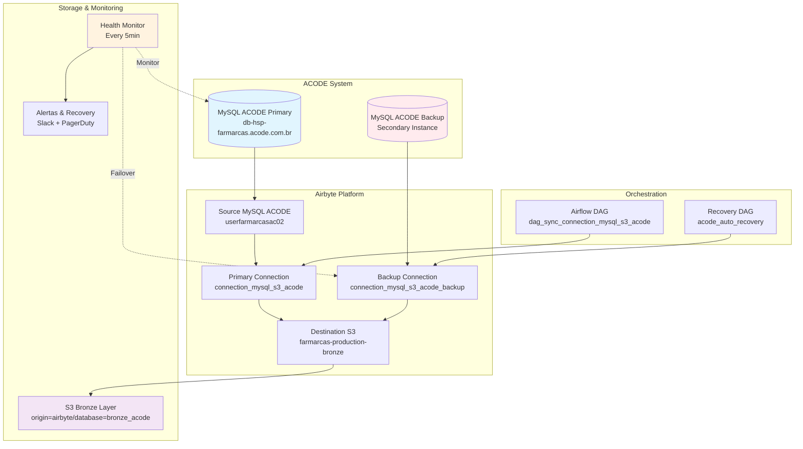

# 🔄 Sistema de Ingestão ACODE + Redundância

[](../../README.md)
[](./boas_praticas.md)
[](./redundancia.md)
[](./diagramas.md)

## 📋 Descrição

O **Sistema ACODE + Redundância** é responsável pela ingestão crítica de dados fiscais e comerciais da Farmarcas através de um pipeline robusto MySQL → Airbyte → S3. A redundância é implementada para garantir alta disponibilidade e integridade dos dados fiscais essenciais para a operação do negócio, processando mais de 50 milhões de transações diariamente com SLA de 99.9% de disponibilidade.

A arquitetura implementa mecanismos de failover automático, backup contínuo e procedimentos de recovery para garantir continuidade operacional mesmo em cenários de falha do sistema principal, atendendo aos rigorosos requisitos de compliance fiscal e necessidades de business intelligence da organização.

## 🎯 Importância Estratégica

### **Dados Críticos Coletados:**
- 💰 **Transações Fiscais**: Analítico diário com notas fiscais e informações tributárias detalhadas
- 📊 **Catálogo de Produtos**: Base completa de produtos farmacêuticos com classificações
- 🏢 **Dados Complementares**: Informações de XML e NF-e para compliance fiscal
- 📈 **Métricas de Negócio**: Dados para dashboards executivos e análises de performance

### **Casos de Uso de Negócio:**
- **Business Intelligence**: Dashboards de vendas, performance e KPIs operacionais
- **Compliance Fiscal**: Auditoria, regulamentações e obrigações tributárias
- **Reconciliação Financeira**: Validação de faturamento, pagamentos e verbas
- **Rastreabilidade**: Histórico completo de transações para auditoria e controle

### **Por que a Redundância é Necessária:**
- **Criticidade dos Dados**: Dados fiscais são essenciais para operação diária
- **Impacto de Falhas**: Interrupção afeta compliance, dashboards e decisões de negócio
- **Requisitos de SLA**: Necessidade de RTO < 2 horas e RPO < 1 hora para dados fiscais

## 🏗️ Arquitetura Técnica



## 📚 Documentação Completa

Para informações detalhadas, consulte nossa **documentação especializada**:

### 🔄 **[Fluxo ACODE](./fluxo_acode.md)**
- Pipeline principal de ingestão MySQL → Airbyte → S3 com detalhes técnicos completos. Configurações de source, destination e processamento de dados fiscais.

### 🔧 **[Redundância](./redundancia.md)**
- Mecanismos de failover, backup automático e procedimentos de recovery. Estratégias de fallback e validação pós-recuperação para garantir continuidade.

### ⚙️ **[Pré-requisitos](./pre_requisitos.md)**
- Configurações iniciais, credenciais MySQL, permissões AWS e variáveis de ambiente. Setup completo do ambiente para execução do sistema.

### 📄 **[Configurações de Exemplo](./configuracoes_exemplo.md)**
- Exemplos práticos de configuração YAML para sources, destinations e connections. Templates e scripts de teste para validação.

### ⚠️ **[Erros Comuns](./erros_comuns.md)**
- Diagnóstico e soluções para problemas frequentes de conectividade, autenticação e sincronização. Troubleshooting completo com comandos de verificação.

### 💡 **[Boas Práticas](./boas_praticas.md)**
- Recomendações para operação eficiente, manutenção preventiva e otimização de performance. Segurança, monitoramento e gestão de credenciais.

### 📊 **[Diagramas](./diagramas.md)**
- Representações visuais detalhadas da arquitetura, fluxos de dados e cenários de redundância. Diagramas de sequência e recovery flows.

---

## 🎯 Importância Estratégica

### **Dados Críticos Coletados:**
- 💰 **Transações Fiscais**: Analítico diário com notas fiscais e informações tributárias detalhadas
- 📊 **Catálogo de Produtos**: Base completa de produtos farmacêuticos com classificações
- 🏢 **Dados Complementares**: Informações de XML e NF-e para compliance fiscal
- 📈 **Métricas de Negócio**: Dados para dashboards executivos e análises de performance

### **Casos de Uso de Negócio:**
- **Business Intelligence**: Dashboards de vendas, performance e KPIs operacionais
- **Compliance Fiscal**: Auditoria, regulamentações e obrigações tributárias
- **Reconciliação Financeira**: Validação de faturamento, pagamentos e verbas
- **Rastreabilidade**: Histórico completo de transações para auditoria e controle

### **Por que a Redundância é Necessária:**
- **Criticidade dos Dados**: Dados fiscais são essenciais para operação diária
- **Impacto de Falhas**: Interrupção afeta compliance, dashboards e decisões de negócio
- **Requisitos de SLA**: Necessidade de RTO < 2 horas e RPO < 1 hora para dados fiscais

---

## 🚀 Quick Start

### Instalação
```bash
# Clone o repositório
git clone <repository-url>
cd acode-redundancia

# Configure as credenciais
export ACODE_PASS="<senha_mysql>"
export AWS_PROFILE="farmarcas-production"

# Verifique conectividade
./scripts/acode-health-check.sh
```

### Uso Básico
```bash
# Execução manual da sincronização
./scripts/acode-sync-manual.sh

# Verificar status
./scripts/acode-status.sh

# Ativar modo redundância
./scripts/acode-enable-redundancy.sh
```

## ✨ Principais Funcionalidades

- 💰 **Transações Fiscais**: Processamento de 50M+ notas fiscais e dados tributários diários
- 🔄 **Redundância Automática**: Failover com RTO < 2 horas e RPO < 1 hora
- 📊 **Volume Massivo**: 4-8GB de dados fiscais processados diariamente
- 🛡️ **Alta Disponibilidade**: 99.9% uptime com monitoramento 24/7
- 🔐 **Compliance Fiscal**: Auditoria completa e rastreabilidade de transações
- ⚡ **Pipeline Otimizado**: MySQL → Airbyte → S3 com performance otimizada
- 🚨 **Alertas Inteligentes**: Slack + PagerDuty para incidentes críticos
- 📈 **Observabilidade**: Métricas detalhadas e dashboards operacionais

## 📊 Dados Processados

### **Volumes Típicos (Produção)**
- **Tabelas sincronizadas**: 3 tabelas principais (analítico diário, produtos, complemento)
- **Volume de dados**: ~4-8GB por execução diária
- **Registros**: ~50M+ transações fiscais por sync
- **Tempo execução**: 45-120 minutos dependendo do volume

### **Estrutura S3 Resultante**
```
s3://farmarcas-production-bronze/origin=airbyte/database=bronze_acode/
├── farmarcas_si_analitico_diario/
│   └── cog_dt_ingestion=2025-08-08/
│       ├── file_farmarcas_si_analitico_diario_001.parquet
│       └── file_farmarcas_si_analitico_diario_002.parquet
├── farmarcas_si_analitico_diario_produtos/
│   └── cog_dt_ingestion=2025-08-08/
│       └── file_farmarcas_si_analitico_diario_produtos_001.parquet
└── farmarcas_si_analitico_diario_complemento/
    └── cog_dt_ingestion=2025-08-08/
        └── file_farmarcas_si_analitico_diario_complemento_001.parquet
```

---

## 🔧 Suporte e Manutenção

- **Equipe**: Data Engineering Farmarcas
- **SLA**: 99.9% disponibilidade com monitoramento 24/7
- **Monitoramento**: DataDog + CloudWatch + Airflow UI
- **Alertas**: Slack (#data-engineering-alerts) + PagerDuty para críticos

**Última atualização**: 08/08/2025
