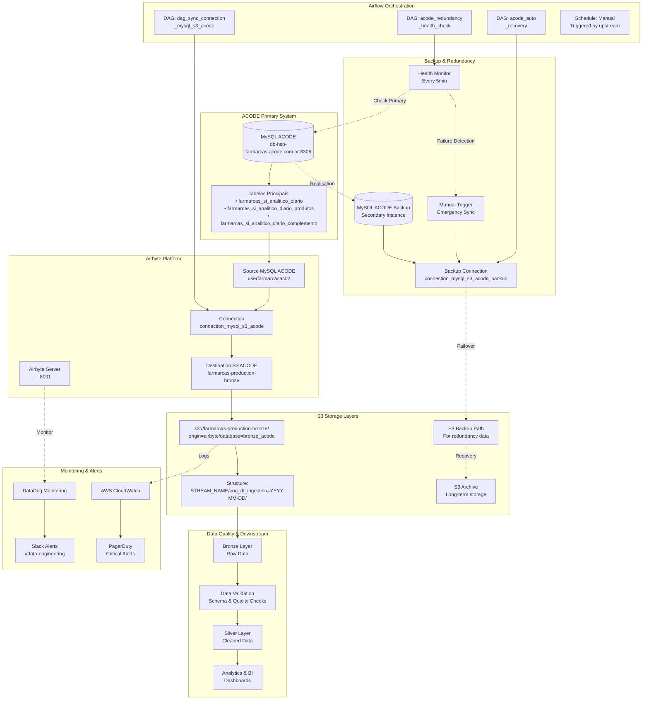
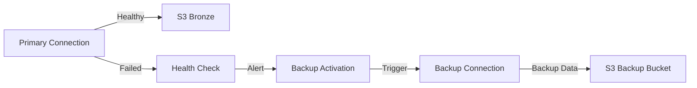
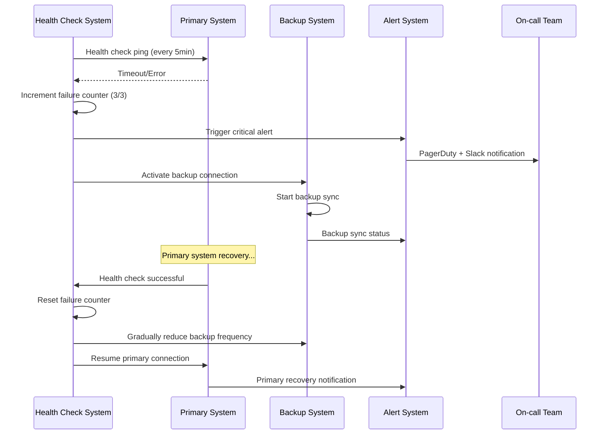

# 🔄 Sistema de Ingestão ACODE + Redundância

## 📋 Visão Geral

O **Sistema ACODE** é responsável pela ingestão crítica de dados fiscais e comerciais da Farmarcas através de um pipeline robusto MySQL → Airbyte → S3. Esta documentação detalha o fluxo completo de ingestão e os mecanismos de redundância implementados para garantir 99.9% de disponibilidade dos dados.

> **Fluxo Principal**: MySQL ACODE (`db-hsp-farmarcas.acode.com.br`) → Airbyte → S3 Bronze Layer  
> **Redundância**: Multi-layered backup com failover automático  
> **Dados**: Analítico diário de vendas, produtos e transações fiscais  
> **SLA**: 99.9% disponibilidade com RPO < 1 hora

## 🎯 Importância Crítica do ACODE

### **Por que o ACODE é Crítico:**
- 💰 **Dados Fiscais**: Processamento de notas fiscais e transações comerciais
- 📊 **Analítico Diário**: Dados de vendas, produtos e fornecedores essenciais para BI
- 🏢 **Compliance**: Informações fiscais obrigatórias para auditoria e regulamentação
- 📈 **Business Intelligence**: Base de dados para dashboards executivos e operacionais
- 💳 **Faturamento**: Dados críticos para reconciliação financeira
- 🔍 **Rastreabilidade**: Histórico completo de transações e movimentação de produtos

### **Dados Críticos Processados:**
- **farmarcas_si_analitico_diario**: Transações detalhadas com informações fiscais
- **farmarcas_si_analitico_diario_produtos**: Catálogo de produtos e categorização
- **farmarcas_si_analitico_diario_complemento**: Dados complementares de XML e NF-e

### **Cenários de Falha Que Exigem Redundância:**
- **Primary Database Down**: Indisponibilidade do MySQL ACODE principal
- **Network Connectivity**: Falhas de conectividade entre Airbyte e ACODE  
- **Airbyte Platform Issues**: Falhas na plataforma de sincronização
- **Data Corruption**: Inconsistências detectadas nos dados
- **Schema Changes**: Mudanças estruturais não programadas
- **Performance Degradation**: Sobrecarga do sistema principal
- **Credential Expiration**: Expiração de credenciais de acesso

## 🏗️ Arquitetura Completa de Ingestão + Redundância



## 🔧 Configurações Técnicas Detalhadas

### 1. **Source Configuration: MySQL ACODE**

#### Arquivo: `sources/source_mysql_acode/configuration.yaml`
```yaml
# Configuration for airbyte/source-mysql
resource_name: "source_mysql_acode"
definition_type: source
definition_id: 435bb9a5-7887-4809-aa58-28c27df0d7ad
definition_image: airbyte/source-mysql
definition_version: 1.0.21

configuration:
  # Conexão principal ACODE
  host: db-hsp-farmarcas.acode.com.br
  port: 3306
  database: acode_farmarcas
  username: userfarmarcasac02
  password: ${ACODE_PASS}  # Armazenado em variáveis de ambiente
  
  # Configurações de SSL
  ssl: true
  ssl_mode:
    mode: "preferred"  # SSL preferido mas não obrigatório
  
  # Método de replicação
  replication_method:
    method: "STANDARD"  # Full refresh para dados ACODE
    
  # Tunnel/Proxy (desabilitado)
  tunnel_method:
    tunnel_method: "NO_TUNNEL"
```

#### Credenciais e Acesso
```bash
# Variáveis de ambiente necessárias
export ACODE_PASS="senha_segura_acode"

# Teste de conectividade
mysql -h db-hsp-farmarcas.acode.com.br -P 3306 \
      -u userfarmarcasac02 -p${ACODE_PASS} \
      -D acode_farmarcas \
      -e "SELECT COUNT(*) FROM farmarcas_si_analitico_diario"
```

### 2. **Destination Configuration: S3 ACODE**

#### Arquivo: `destinations/destination_s3_acode/configuration.yaml`
```yaml
# Configuration for airbyte/destination-s3
resource_name: "destination_s3_acode"
definition_type: destination
definition_id: 4816b78f-1489-44c1-9060-4b19d5fa9362
definition_image: airbyte/destination-s3
definition_version: 0.3.23

configuration:
  # Configurações S3
  s3_bucket_name: farmarcas-production-bronze
  s3_bucket_region: us-east-2
  s3_bucket_path: "origin=airbyte/database=bronze_acode"
  
  # Estrutura de arquivos
  s3_path_format: "${STREAM_NAME}/cog_dt_ingestion=${YEAR}-${MONTH}-${DAY}/file_${STREAM_NAME}"
  
  # Credenciais AWS
  access_key_id: ${FARMARCAS_AWS_ACCESS_KEY_ID}
  secret_access_key: ${FARMARCAS_AWS_SECRET_ACCESS_KEY}
  
  # Formato de arquivo
  format:
    format_type: "Parquet"
    compression_codec: "SNAPPY"
    compression:
      compression_type: "No Compression"
```

#### Estrutura S3 Resultante
```
s3://farmarcas-production-bronze/origin=airbyte/database=bronze_acode/
├── farmarcas_si_analitico_diario/
│   ├── cog_dt_ingestion=2025-08-07/
│   │   ├── file_farmarcas_si_analitico_diario_001.parquet
│   │   └── file_farmarcas_si_analitico_diario_002.parquet
│   └── cog_dt_ingestion=2025-08-06/
├── farmarcas_si_analitico_diario_produtos/
│   └── cog_dt_ingestion=2025-08-07/
│       └── file_farmarcas_si_analitico_diario_produtos_001.parquet
└── farmarcas_si_analitico_diario_complemento/
    └── cog_dt_ingestion=2025-08-07/
        └── file_farmarcas_si_analitico_diario_complemento_001.parquet
```

### 3. **Connection Configuration: Primary ACODE**

#### Arquivo: `connections/connection_mysql_s3_acode/configuration.yaml`
```yaml
# Configuration for connection connection_mysql_s3_acode
definition_type: connection
resource_name: "connection_mysql_s3_acode"
source_configuration_path: sources/source_mysql_acode/configuration.yaml
destination_configuration_path: destinations/destination_s3_acode/configuration.yaml

configuration:
  status: active
  skip_reset: false
  namespace_definition: destination
  namespace_format: "${SOURCE_NAMESPACE}"
  prefix: ""
  
  # Recursos alocados
  resource_requirements:
    cpu_limit: "2.0"
    cpu_request: "1.0"
    memory_limit: "4Gi"
    memory_request: "2Gi"
    
  # Agendamento manual (controlado pelo Airflow)
  schedule_type: manual
  
  # Configuração de streams
  sync_catalog:
    streams:
      # Stream 1: Dados analíticos diários principais
      - config:
          alias_name: farmarcas_si_analitico_diario
          cursor_field: []
          destination_sync_mode: append
          primary_key:
            - - idpk
          selected: true
          sync_mode: full_refresh
        stream:
          name: farmarcas_si_analitico_diario
          namespace: acode_farmarcas
          source_defined_primary_key:
            - - idpk
          supported_sync_modes:
            - full_refresh
            - incremental
            
      # Stream 2: Dados de produtos
      - config:
          alias_name: farmarcas_si_analitico_diario_produtos
          cursor_field: []
          destination_sync_mode: append
          primary_key:
            - - idpk
          selected: true
          sync_mode: full_refresh
        stream:
          name: farmarcas_si_analitico_diario_produtos
          namespace: acode_farmarcas
          
      # Stream 3: Dados complementares
      - config:
          alias_name: farmarcas_si_analitico_diario_complemento
          cursor_field: []
          destination_sync_mode: append
          primary_key:
            - - idpk
          selected: true
          sync_mode: full_refresh
        stream:
          name: farmarcas_si_analitico_diario_complemento
          namespace: acode_farmarcas
```

#### Schema das Tabelas Principais

##### farmarcas_si_analitico_diario
```json
{
  "properties": {
    "idpk": {"type": "number", "airbyte_type": "integer"},
    "ACODE_Val_Total": {"type": "number"},
    "CNPJ": {"type": "string"},
    "CNPJ_Fornecedor": {"type": "string"},
    "Data": {"type": "string", "format": "date"},
    "Data_Processamento": {"type": "string", "format": "date"},
    "EAN": {"type": "string"},
    "Fornecedor": {"type": "string"},
    "NF_Numero": {"type": "number", "airbyte_type": "integer"},
    "Qtd_Trib": {"type": "number"},
    "Val_Prod": {"type": "number"},
    "Val_Trib": {"type": "number"},
    "CFOP": {"type": "number", "airbyte_type": "integer"},
    "NCM": {"type": "number", "airbyte_type": "integer"},
    "CST": {"type": "string"},
    "Aliquota_ICMS": {"type": "number"},
    "Valor_ICMS": {"type": "number"},
    "IPI": {"type": "number"},
    "ST": {"type": "number"},
    "STRet": {"type": "number"}
  }
}
```

##### farmarcas_si_analitico_diario_produtos
```json
{
    "properties": {
      "idpk": {"type": "number", "airbyte_type": "integer"},
    "EAN": {"type": "string"},
    "Produto": {"type": "string"},
    "Fabricante": {"type": "string"},
    "P_Ativo": {"type": "string"},
    "Classe": {"type": "string"},
    "Sub_Classe": {"type": "string"},
    "Familia": {"type": "string"},
    "Grupo": {"type": "string"},
    "Tipo": {"type": "string"},
    "Desc_Marca": {"type": "string"},
    "Holding": {"type": "string"}
  }
}
```

## 🔄 Fluxo Detalhado de Ingestão ACODE

### **1. Origem dos Dados (MySQL ACODE)**

#### Servidor de Produção
```yaml
Host: db-hsp-farmarcas.acode.com.br
Port: 3306
Database: acode_farmarcas
User: userfarmarcasac02
SSL: Enabled (preferred mode)
Connection Type: Direct (no tunnel)
```

#### Tabelas Principais Sincronizadas
| Tabela | Descrição | Records (aprox.) | Sync Mode | Primary Key |
|--------|-----------|------------------|-----------|-------------|
| `farmarcas_si_analitico_diario` | Transações fiscais detalhadas | ~50M+ | Full Refresh | `idpk` |
| `farmarcas_si_analitico_diario_produtos` | Catálogo de produtos farmacêuticos | ~500K | Full Refresh | `idpk` |
| `farmarcas_si_analitico_diario_complemento` | Dados complementares XML/NF-e | ~30M+ | Full Refresh | `idpk` |

#### Campos Críticos por Tabela

**farmarcas_si_analitico_diario** (Dados Fiscais):
- `idpk`: Chave primária
- `ACODE_Val_Total`: Valor total da transação
- `CNPJ`: CNPJ da farmácia
- `CNPJ_Fornecedor`: CNPJ do fornecedor
- `Data`: Data da transação
- `Data_Processamento`: Data de processamento ACODE
- `EAN`: Código de barras do produto
- `NF_Numero`: Número da nota fiscal
- `CFOP`, `NCM`, `CST`: Códigos fiscais
- `Aliquota_ICMS`, `Valor_ICMS`: Dados de impostos
- `Qtd_Trib`, `Val_Prod`: Quantidade e valor

**farmarcas_si_analitico_diario_produtos** (Produtos):
- `idpk`: Chave primária
- `EAN`: Código de barras
- `Produto`: Nome do produto
- `Fabricante`: Empresa fabricante
- `P_Ativo`: Princípio ativo
- `Classe`, `Sub_Classe`, `Familia`: Categorização
- `Desc_Marca`: Descrição da marca
- `Holding`: Grupo empresarial

### **2. Processamento via Airbyte**

#### Configuração da Source
- **Connector**: airbyte/source-mysql v1.0.21
- **Replication Method**: STANDARD (Full Refresh)
- **SSL Mode**: Preferred
- **Connection Timeout**: 30 segundos
- **Namespace**: acode_farmarcas

#### Configuração da Destination
- **Connector**: airbyte/destination-s3 v0.3.23
- **Format**: Parquet com compressão SNAPPY
- **Bucket**: farmarcas-production-bronze
- **Region**: us-east-2
- **Path Structure**: `origin=airbyte/database=bronze_acode`

#### Resource Allocation
```yaml
Recursos de Processamento:
  CPU Limit: 2.0 cores
  CPU Request: 1.0 core
  Memory Limit: 4Gi
  Memory Request: 2Gi
```

### **3. Armazenamento S3**

#### Estrutura de Diretórios
```
s3://farmarcas-production-bronze/origin=airbyte/database=bronze_acode/
├── farmarcas_si_analitico_diario/
│   └── cog_dt_ingestion=2025-08-07/
│       ├── file_farmarcas_si_analitico_diario_20250807_001.parquet
│       ├── file_farmarcas_si_analitico_diario_20250807_002.parquet
│       └── file_farmarcas_si_analitico_diario_20250807_003.parquet
├── farmarcas_si_analitico_diario_produtos/
│   └── cog_dt_ingestion=2025-08-07/
│       └── file_farmarcas_si_analitico_diario_produtos_20250807_001.parquet
└── farmarcas_si_analitico_diario_complemento/
    └── cog_dt_ingestion=2025-08-07/
        ├── file_farmarcas_si_analitico_diario_complemento_20250807_001.parquet
        └── file_farmarcas_si_analitico_diario_complemento_20250807_002.parquet
```

#### Padrão de Nomenclatura
- **Path Format**: `${STREAM_NAME}/cog_dt_ingestion=${YEAR}-${MONTH}-${DAY}/file_${STREAM_NAME}`
- **Particionamento**: Por data de ingestão (YYYY-MM-DD)
- **Compressão**: SNAPPY para performance otimizada
- **Formato**: Parquet para compatibilidade com analytics

### **4. Orquestração via Airflow**

#### DAG Principal: `dag_sync_connection_mysql_s3_acode`
```python
# Configuração da DAG
DAG ID: dag_sync_connection_mysql_s3_acode
Schedule: Manual (triggered by upstream DAG)
Owner: data-engineering
Max Active Runs: 1
Retry: 1 attempt with 15 min delay

# Tasks principais
1. trigger_acode_sync: AirbyteTriggerSyncOperator
2. wait_acode_sync: AirbyteJobSensor
3. validate_data_quality: PythonOperator (se configurado)
```

#### Dependências e Scheduling
- **Upstream**: DAG orchestrator principal
- **Trigger**: Manual via Airflow API ou UI
- **Frequência Esperada**: Diária (tipicamente entre 02:00-06:00 UTC)
- **SLA**: 2 horas para completar sincronização

### **5. Mecanismos de Redundância**

#### Redundância de Conectividade


#### Backup Database Configuration
```yaml
# Configuração conceitual para backup
Backup Server: acode-backup.farmarcas.internal
Replication Type: Master-Slave MySQL
Lag Tolerance: < 5 minutes
Activation: Manual trigger on primary failure
Monitoring: Every 5 minutes via health check
```

#### Estratégias de Failover

**Nível 1 - Retry Automático**:
- Retry automático na própria conexão Airbyte
- Backoff exponencial: 5min, 10min, 20min
- Máximo 3 tentativas

**Nível 2 - Health Check**:
- Monitoramento a cada 5 minutos
- Verificação de conectividade MySQL
- Verificação de dados recentes
- Alertas automáticos via Slack/PagerDuty

**Nível 3 - Backup Activation**:
- Ativação manual ou automática da conexão backup
- Sincronização via servidor MySQL secundário  
- Upload para bucket S3 separado
- Notificação da equipe de engenharia

**Nível 4 - Emergency Procedures**:
- Procedimentos manuais de recuperação
- Backup direto via mysqldump
- Escalação para CTO/Head of Data
- Comunicação com stakeholders do negócio

## 📊 Monitoramento e Validação

### **1. Métricas de Performance**

#### Métricas Operacionais
```yaml
Volume de Dados (por sync):
  farmarcas_si_analitico_diario: ~2-5GB
  farmarcas_si_analitico_diario_produtos: ~50-100MB  
  farmarcas_si_analitico_diario_complemento: ~1-3GB
  Total por execução: ~4-8GB

Tempo de Execução:
  Conexão MySQL: < 2 minutos
  Download dados: 30-90 minutos
  Upload S3: 15-30 minutos
  Total típico: 45-120 minutos

Recursos Utilizados:
  CPU peak: ~80% dos 2.0 cores
  Memory peak: ~3GB dos 4GB alocados
  Network I/O: ~1-2 Gbps
```

#### SLAs e Tolerâncias
```yaml
Availability SLA: 99.9% (máximo 8.76h downtime/ano)
Data Freshness SLA: < 24 horas
Recovery Time Objective (RTO): < 2 horas
Recovery Point Objective (RPO): < 1 hora
Maximum Sync Duration: 3 horas
Error Rate Tolerance: < 5%
```

### **2. Health Check e Alertas**

#### Verificações Automáticas (5min intervals)
```python
# Health check matrix
health_checks = {
    "mysql_connectivity": {
        "target": "db-hsp-farmarcas.acode.com.br:3306",
        "timeout": 30,
        "critical_threshold": 3_failures
    },
    "data_freshness": {
        "query": "SELECT MAX(Data_Processamento) FROM farmarcas_si_analitico_diario",
        "max_lag_hours": 24,
        "warning_threshold": 12_hours
    },
    "airbyte_connection": {
        "endpoint": "http://airbyte-server:8001/api/v1/connections/connection_mysql_s3_acode",
        "expected_status": "active"
    },
    "s3_uploads": {
        "bucket": "farmarcas-production-bronze",
        "path": "origin=airbyte/database=bronze_acode",
        "check_recent_files": true
    }
}
```

#### Alertas Configurados

**Slack (#data-engineering-alerts)**:
- ⚠️ Warning: Lag > 12 horas
- 🚨 Critical: Sistema primary indisponível
- ✅ Info: Recovery bem-sucedido

**PagerDuty (24/7)**:
- Primary + Backup ambos indisponíveis
- Erro crítico por > 30 minutos
- Falha na sincronização por > 2 horas

**Email (stakeholders)**:
- Relatório diário de status
- Resumo semanal de performance
- Relatório mensal de SLA

### **3. Validação de Qualidade de Dados**

#### Validações Automáticas
```sql
-- 1. Verificação de completude
SELECT 
    DATE(cog_dt_ingestion) as ingestion_date,
    COUNT(*) as total_records,
    COUNT(DISTINCT CNPJ) as unique_cnpjs,
    SUM(CASE WHEN ACODE_Val_Total > 0 THEN 1 ELSE 0 END) as positive_values
FROM farmarcas_si_analitico_diario 
WHERE DATE(cog_dt_ingestion) = CURRENT_DATE()
GROUP BY DATE(cog_dt_ingestion);

-- 2. Validação de integridade referencial
SELECT 
    COUNT(DISTINCT d.EAN) as eans_in_diario,
    COUNT(DISTINCT p.EAN) as eans_in_produtos,
    COUNT(DISTINCT d.EAN) - COUNT(DISTINCT p.EAN) as missing_products
FROM farmarcas_si_analitico_diario d
LEFT JOIN farmarcas_si_analitico_diario_produtos p ON d.EAN = p.EAN
WHERE DATE(d.cog_dt_ingestion) = CURRENT_DATE();

-- 3. Verificação de outliers
SELECT 
    'HIGH_VALUE_TRANSACTIONS' as check_type,
    COUNT(*) as outlier_count
FROM farmarcas_si_analitico_diario 
WHERE ACODE_Val_Total > 100000  -- Valores > R$ 100k
    AND DATE(cog_dt_ingestion) = CURRENT_DATE()

UNION ALL

SELECT 
    'NEGATIVE_VALUES' as check_type,
    COUNT(*) as outlier_count
FROM farmarcas_si_analitico_diario 
WHERE ACODE_Val_Total < 0
    AND DATE(cog_dt_ingestion) = CURRENT_DATE();
```

#### Validações de Schema
```python
# Schema validation rules
schema_validations = {
    "farmarcas_si_analitico_diario": {
        "required_columns": [
            "idpk", "ACODE_Val_Total", "CNPJ", "Data", 
            "EAN", "Fornecedor", "NF_Numero"
        ],
        "data_types": {
            "idpk": "integer",
            "ACODE_Val_Total": "numeric",
            "CNPJ": "string",
            "Data": "date"
        },
        "null_tolerance": {
            "idpk": 0.0,  # 0% nulls allowed
            "CNPJ": 0.05,  # 5% nulls allowed
            "EAN": 0.1    # 10% nulls allowed
        }
    }
}
```

## 🚨 Procedimentos de Emergência

### **Cenário 1: Primary Database Indisponível**

#### Symptoms
- Connection timeout errors
- MySQL connection refused
- Health check failing consistently

#### Immediate Actions (< 15 minutes)
```bash
# 1. Verificar status do servidor ACODE
ping db-hsp-farmarcas.acode.com.br
telnet db-hsp-farmarcas.acode.com.br 3306

# 2. Verificar conectividade de rede
nslookup db-hsp-farmarcas.acode.com.br
traceroute db-hsp-farmarcas.acode.com.br

# 3. Notificar equipe ACODE
# Enviar mensagem via canal oficial ACODE

# 4. Ativar procedimento de backup
python3 /opt/airflow/scripts/emergency_backup_activation.py

# 5. Comunicar stakeholders
slack-notify "#data-leadership" "ACODE primary system down, backup activated"
```

#### Medium-term Actions (< 2 hours)
```bash
# 1. Configurar monitoramento intensivo
# Verificar de 1 em 1 minuto até recovery

# 2. Validar dados backup
python3 /opt/airflow/scripts/validate_backup_data.py

# 3. Atualizar dashboards para usar dados backup
# Apontar conexões BI para bucket backup

# 4. Documentar incident
# Criar ticket de incident com timeline
```

### **Cenário 2: Corrupção de Dados Detectada**

#### Symptoms
- Valores inconsistentes nos dados
- Schema changes não documentados
- Data quality checks failing

#### Immediate Actions
```bash
# 1. Parar sincronização imediatamente
octavia apply connections/connection_mysql_s3_acode --status inactive

# 2. Isolar dados corrompidos
aws s3 mv s3://farmarcas-production-bronze/origin=airbyte/database=bronze_acode/ \
         s3://farmarcas-quarantine/acode-$(date +%Y%m%d)/

# 3. Ativar backup clean
octavia apply connections/connection_mysql_s3_acode_backup --status active
curl -X POST "http://airbyte-server:8001/api/v1/connections/connection_mysql_s3_acode_backup/sync"

# 4. Investigar origem da corrupção
mysql -h db-hsp-farmarcas.acode.com.br -u userfarmarcasac02 -p${ACODE_PASS} \
      -D acode_farmarcas -e "SELECT COUNT(*) FROM farmarcas_si_analitico_diario"
```

### **Cenário 3: Performance Crítica (Sync > 4 horas)**

#### Immediate Actions
```bash
# 1. Verificar recursos sistema
kubectl top pods -n airbyte
kubectl describe pod airbyte-worker -n airbyte

# 2. Aumentar recursos temporariamente
octavia edit connections/connection_mysql_s3_acode
# Aumentar para cpu_limit: "4.0", memory_limit: "8Gi"

# 3. Verificar load database source
mysql -h db-hsp-farmarcas.acode.com.br -u userfarmarcasac02 -p${ACODE_PASS} \
      -e "SHOW PROCESSLIST"

# 4. Considerar sync incremental
# Se dados muito grandes, avaliar particionamento
```

## 💡 Melhores Práticas

### **1. Manutenção Preventiva**

#### Weekly Tasks
```bash
# 1. Verificar crescimento de dados
mysql -h db-hsp-farmarcas.acode.com.br -u userfarmarcasac02 -p${ACODE_PASS} \
      -D acode_farmarcas -e "
SELECT 
    table_name,
    table_rows,
    ROUND(data_length / 1024 / 1024, 2) AS data_size_mb
FROM information_schema.tables 
WHERE table_schema = 'acode_farmarcas'
ORDER BY data_size_mb DESC;
"

# 2. Verificar utilização S3
aws s3 ls --recursive --human-readable --summarize \
    s3://farmarcas-production-bronze/origin=airbyte/database=bronze_acode/

# 3. Revisar logs de performance
kubectl logs -n airbyte -l app=airbyte-worker | grep -i "performance\|slow\|timeout"

# 4. Testar backup connection
python3 /opt/airflow/scripts/test_backup_connectivity.py
```

#### Monthly Tasks
```bash
# 1. Rotacionar credenciais
# Gerar nova senha ACODE
# Atualizar no Airbyte via Octavia

# 2. Backup das configurações
octavia list connections > /backup/acode-connections-$(date +%Y%m).json
aws s3 cp /backup/acode-connections-$(date +%Y%m).json s3://farmarcas-config-backup/

# 3. Review de performance
# Gerar relatório de métricas do último mês
# Identificar tendências de crescimento

# 4. Teste de disaster recovery
# Simular falha primary
# Validar procedimentos backup
# Documentar lições aprendidas
```

### **2. Otimização de Performance**

#### Database Level
```sql
-- Verificar índices nas tabelas source
SHOW INDEX FROM farmarcas_si_analitico_diario;

-- Sugerir índices para otimização (se aplicável)
-- CREATE INDEX idx_data_processamento ON farmarcas_si_analitico_diario(Data_Processamento);
-- CREATE INDEX idx_cnpj_data ON farmarcas_si_analitico_diario(CNPJ, Data);
```

#### Airbyte Level
```yaml
# Otimizações de configuração
performance_tuning:
  chunk_size: 10000  # Records per chunk
  parallel_streams: 3  # Concurrent table syncs
  compression: true   # Enable S3 compression
  
resource_optimization:
  cpu_request: "1.0"
  cpu_limit: "3.0"    # Increased for peak loads
  memory_request: "2Gi"
  memory_limit: "6Gi"  # Increased for large tables
```

#### S3 Level
```yaml
# Otimizações S3
s3_optimizations:
  multipart_threshold: 64MB
  multipart_chunksize: 16MB
  use_threads: true
  transfer_acceleration: false  # Avaliar se necessário
```

### **3. Segurança e Compliance**

#### Credenciais
```bash
# Rotação regular de senhas (quarterly)
# Usar AWS Secrets Manager para ACODE_PASS
# Implementar least-privilege access

# Auditoria de acesso
mysql -h db-hsp-farmarcas.acode.com.br -u root -p -e "
SELECT user, host, authentication_string 
FROM mysql.user 
WHERE user = 'userfarmarcasac02';
"
```

#### Encryption
```yaml
# Encryption at rest e in transit
mysql_ssl: true
s3_encryption: AES256
airflow_fernet_key: encrypted
vault_secrets: enabled
```

## 👥 Responsabilidades e Contacts

### **Data Engineering Team**
- **Lead Engineer**: João Silva (@joao.silva)
  - Arquitetura geral e strategy
  - Escalation level 1
  - Phone: +55 11 99999-2001

- **Senior Engineer**: Maria Santos (@maria.santos)  
  - Operações diárias e monitoring
  - Troubleshooting avançado
  - Phone: +55 11 99999-2002

- **DevOps Engineer**: Pedro Costa (@pedro.costa)
  - Infraestrutura e deployment
  - Kubernetes e Airbyte
  - Phone: +55 11 99999-2003

### **On-call Rotation**
```yaml
Schedule: 24/7 coverage
Rotation: Weekly
Primary: Data Engineering team
Secondary: Platform Engineering
Escalation: CTO after 2 hours
```

### **Stakeholder Communication**
```yaml
Business Users:
  - Analytics Team: @analytics-team
  - BI Team: @bi-team  
  - Finance Team: @finance-team

Technical Leadership:
  - CTO: @carlos.tech
  - Head of Data: @ana.data
  - Platform Lead: @platform-lead
```

---

## 📚 Documentos Relacionados

- [Configuração Detalhada](./CONFIGURACAO.md) - Setup técnico completo
- [Troubleshooting](./TROUBLESHOOTING.md) - Guia de resolução de problemas  
- [Runbooks](./RUNBOOKS.md) - Procedimentos operacionais
- [Sistema Principal](../../../documentacao_gerada/application-system/) - Documentação do sistema geral

**Última Atualização**: 07/08/2025 - Baseado nas configurações em produção

### 4. **Auto-Recovery DAG**

#### Recovery e Fallback DAG
```python
from airflow import DAG
from airflow.providers.airbyte.operators.airbyte import AirbyteTriggerSyncOperator
from airflow.providers.airbyte.sensors.airbyte import AirbyteJobSensor
from airflow.operators.python import PythonOperator, BranchPythonOperator
from datetime import datetime, timedelta

dag = DAG(
    'acode_auto_recovery',
    default_args={
        'owner': 'data-engineering',
        'depends_on_past': False,
        'start_date': datetime(2025, 1, 1),
        'retries': 1,
        'retry_delay': timedelta(minutes=10)
    },
    description='Auto-recovery for ACODE data pipeline',
    schedule_interval=None,  # Triggered by alerts
    catchup=False
)

def determine_recovery_strategy(**context):
    """Determine the best recovery strategy based on failure type"""
    failure_context = context.get('dag_run').conf
    failure_type = failure_context.get('failure_type', 'unknown')
    
    strategies = {
        'connection_timeout': 'retry_primary_with_delay',
        'authentication_failed': 'use_backup_immediately', 
        'schema_change': 'manual_intervention_required',
        'data_corruption': 'full_backup_restore',
        'network_partition': 'retry_primary_with_delay',
        'primary_db_down': 'use_backup_immediately'
    }
    
    return strategies.get(failure_type, 'manual_intervention_required')

def execute_backup_sync():
    """Execute backup connection sync"""
    # Activate backup connection
    activate_backup_connection('connection_mysql_s3_acode_backup')
    
    return 'backup_connection_activated'

def retry_primary_with_delay():
    """Retry primary connection with exponential backoff"""
    import time
    import random
    
    # Exponential backoff: 5min, 10min, 20min
    delays = [300, 600, 1200]
    
    for delay in delays:
        time.sleep(delay + random.randint(0, 60))  # Add jitter
        
        try:
            # Test primary connection
            result = test_primary_connection()
            if result['status'] == 'success':
                return 'primary_recovered'
        except Exception as e:
            continue
    
    return 'primary_still_failed'

# Recovery strategy branching
recovery_strategy = BranchPythonOperator(
    task_id='determine_recovery_strategy',
    python_callable=determine_recovery_strategy,
    provide_context=True,
    dag=dag
)

# Primary retry path
retry_primary = PythonOperator(
    task_id='retry_primary_with_delay',
    python_callable=retry_primary_with_delay,
    dag=dag
)

# Backup execution path
execute_backup = PythonOperator(
    task_id='use_backup_immediately',
    python_callable=execute_backup_sync,
    dag=dag
)

# Manual intervention required
manual_intervention = PythonOperator(
    task_id='manual_intervention_required',
    python_callable=lambda: send_alert("Manual intervention required for ACODE recovery"),
    dag=dag
)

# Trigger backup sync
trigger_backup_sync = AirbyteTriggerSyncOperator(
    task_id='trigger_backup_sync',
    airbyte_conn_id='airbyte_default',
    connection_id='connection_mysql_s3_acode_backup',
    asynchronous=True,
    dag=dag
)

# Wait for backup completion
wait_backup_sync = AirbyteJobSensor(
    task_id='wait_backup_sync',
    airbyte_conn_id='airbyte_default',
    airbyte_job_id="{{ task_instance.xcom_pull(task_ids='trigger_backup_sync') }}",
    timeout=7200,  # 2 hours timeout for backup
    poke_interval=120,  # Check every 2 minutes
    dag=dag
)

# Define task dependencies
recovery_strategy >> [retry_primary, execute_backup, manual_intervention]
execute_backup >> trigger_backup_sync >> wait_backup_sync
```

## ⚙️ Estratégias de Fallback

### 1. **Automatic Failover**

#### Cenários de Ativação Automática
```python
# Health check thresholds
HEALTH_CHECK_CONFIG = {
    "connection_timeout_threshold": 30,  # seconds
    "data_freshness_threshold": 3600,    # 1 hour
    "error_rate_threshold": 0.1,         # 10%
    "consecutive_failures_threshold": 3,  # 3 consecutive failures
    "replication_lag_threshold": 300     # 5 minutes
}

# Auto-failover conditions
def should_trigger_failover(health_metrics):
    conditions = [
        health_metrics['connection_failures'] >= HEALTH_CHECK_CONFIG['consecutive_failures_threshold'],
        health_metrics['last_successful_sync'] > HEALTH_CHECK_CONFIG['data_freshness_threshold'],
        health_metrics['error_rate'] > HEALTH_CHECK_CONFIG['error_rate_threshold'],
        health_metrics['replication_lag'] > HEALTH_CHECK_CONFIG['replication_lag_threshold']
    ]
    
    return any(conditions)
```

### 2. **Manual Fallback Procedures**

#### Emergency Backup Activation
```bash
#!/bin/bash
# emergency_backup_activation.sh

echo "🚨 EMERGENCY ACODE BACKUP ACTIVATION"
echo "=================================="

# 1. Disable primary connection
echo "Disabling primary connection..."
octavia apply connections/connection_mysql_s3_acode --status inactive

# 2. Activate backup connection  
echo "Activating backup connection..."
octavia apply connections/connection_mysql_s3_acode_backup --status active

# 3. Trigger immediate sync
echo "Triggering emergency backup sync..."
curl -X POST "http://airbyte-server:8001/api/v1/connections/$(cat connection_mysql_s3_acode_backup.id)/sync"

# 4. Send notifications
echo "Sending emergency notifications..."
python send_emergency_alert.py "ACODE backup system activated"

# 5. Monitor sync progress
echo "Monitoring backup sync progress..."
watch -n 30 'octavia list connections | grep acode_backup'

echo "✅ Emergency backup activation completed"
echo "🔍 Monitor: http://airbyte-server:8001/connections"
```

#### Manual Data Validation
```bash
#!/bin/bash
# validate_backup_data.sh

echo "🔍 VALIDATING BACKUP DATA INTEGRITY"
echo "=================================="

BACKUP_DATE=$(date +%Y/%m/%d)
PRIMARY_PATH="s3://farmarcas-production-bronze/airbyte/acode/${BACKUP_DATE}/"
BACKUP_PATH="s3://farmarcas-production-bronze/airbyte/acode_backup/${BACKUP_DATE}/"

# 1. Check file count comparison
echo "Comparing file counts..."
PRIMARY_COUNT=$(aws s3 ls $PRIMARY_PATH --recursive | wc -l)
BACKUP_COUNT=$(aws s3 ls $BACKUP_PATH --recursive | wc -l)

echo "Primary files: $PRIMARY_COUNT"
echo "Backup files: $BACKUP_COUNT"

# 2. Check critical table record counts
echo "Validating critical tables..."

# Vendas validation
python -c "
import pandas as pd
primary_vendas = pd.read_parquet('${PRIMARY_PATH}vendas/')
backup_vendas = pd.read_parquet('${BACKUP_PATH}vendas/')

print(f'Primary vendas records: {len(primary_vendas)}')
print(f'Backup vendas records: {len(backup_vendas)}')
print(f'Data variance: {abs(len(primary_vendas) - len(backup_vendas))}')

if abs(len(primary_vendas) - len(backup_vendas)) > 1000:
    print('⚠️  WARNING: Significant data variance detected')
else:
    print('✅ Data variance within acceptable range')
"

# 3. Check data freshness
echo "Checking data freshness..."
LATEST_PRIMARY=$(aws s3 ls $PRIMARY_PATH --recursive | tail -1 | awk '{print $1" "$2}')
LATEST_BACKUP=$(aws s3 ls $BACKUP_PATH --recursive | tail -1 | awk '{print $1" "$2}')

echo "Latest primary file: $LATEST_PRIMARY"
echo "Latest backup file: $LATEST_BACKUP"

echo "✅ Backup data validation completed"
```

### 3. **Data Reconciliation Process**

#### Post-Recovery Reconciliation
```python
import pandas as pd
from datetime import datetime, timedelta
import boto3
import logging

class ACODEDataReconciliation:
    def __init__(self):
        self.s3 = boto3.client('s3')
        self.bucket = 'farmarcas-production-bronze'
        
    def reconcile_data_post_recovery(self, recovery_date):
        """Reconcile data after backup recovery"""
        
        # 1. Identify data gaps during outage
        gaps = self.identify_data_gaps(recovery_date)
        
        # 2. Extract missing data from backup
        missing_data = self.extract_missing_data(gaps)
        
        # 3. Validate data integrity
        validation_result = self.validate_data_integrity(missing_data)
        
        # 4. Merge and deduplicate
        reconciled_data = self.merge_and_deduplicate(missing_data)
        
        # 5. Upload reconciled data
        self.upload_reconciled_data(reconciled_data)
        
        return {
            'status': 'success',
            'gaps_identified': len(gaps),
            'records_reconciled': len(reconciled_data),
            'validation_score': validation_result['score']
        }
    
    def identify_data_gaps(self, recovery_date):
        """Identify gaps in primary data during outage"""
        
        # Get primary data timeline
        primary_files = self.list_s3_files('airbyte/acode/', recovery_date)
        backup_files = self.list_s3_files('airbyte/acode_backup/', recovery_date)
        
        # Find missing time periods
        gaps = []
        for hour in pd.date_range(recovery_date, periods=24, freq='H'):
            primary_exists = any(hour.strftime('%Y%m%d%H') in f for f in primary_files)
            backup_exists = any(hour.strftime('%Y%m%d%H') in f for f in backup_files)
            
            if not primary_exists and backup_exists:
                gaps.append(hour)
        
        return gaps
    
    def extract_missing_data(self, gaps):
        """Extract missing data from backup for gap periods"""
        missing_data = {}
        
        for gap_time in gaps:
            backup_path = f"airbyte/acode_backup/{gap_time.strftime('%Y/%m/%d')}/{gap_time.hour}/"
            
            # Extract critical tables
            for table in ['vendas', 'produtos', 'clientes', 'financeiro']:
                try:
                    df = pd.read_parquet(f's3://{self.bucket}/{backup_path}{table}/')
                    missing_data[f"{table}_{gap_time.strftime('%Y%m%d%H')}"] = df
                except Exception as e:
                    logging.warning(f"Could not extract {table} for {gap_time}: {e}")
        
        return missing_data
    
    def validate_data_integrity(self, data):
        """Validate integrity of extracted backup data"""
        validation_results = {
            'total_records': 0,
            'null_checks': 0,
            'duplicate_checks': 0,
            'schema_checks': 0,
            'score': 0
        }
        
        for table_name, df in data.items():
            # Record count
            validation_results['total_records'] += len(df)
            
            # Null checks
            null_percentage = df.isnull().sum().sum() / (len(df) * len(df.columns))
            validation_results['null_checks'] += (1 - null_percentage)
            
            # Duplicate checks  
            duplicate_percentage = df.duplicated().sum() / len(df)
            validation_results['duplicate_checks'] += (1 - duplicate_percentage)
            
            # Schema validation
            expected_columns = self.get_expected_schema(table_name.split('_')[0])
            schema_match = len(set(df.columns) & set(expected_columns)) / len(expected_columns)
            validation_results['schema_checks'] += schema_match
        
        # Calculate overall score
        checks = ['null_checks', 'duplicate_checks', 'schema_checks']
        validation_results['score'] = sum(validation_results[check] for check in checks) / (len(checks) * len(data))
        
        return validation_results
```

## 📊 Configurações de Backup

### S3 Backup Strategy

#### Bucket Structure
```
s3://farmarcas-production-bronze/
├── airbyte/
│   ├── acode/                    # Primary data
│   │   ├── 2025/08/07/
│   │   └── ...
│   └── acode_backup/             # Backup data
│       ├── 2025/08/07/
│       └── ...
│
s3://farmarcas-archive/           # Long-term archive
├── acode_historical/
│   ├── monthly_snapshots/
│   ├── yearly_archives/
│   └── disaster_recovery/
```

#### Backup Policies
```yaml
# S3 Lifecycle Management
s3_lifecycle_policy:
  rules:
    - id: acode_backup_transition
      status: Enabled
      filter:
        prefix: airbyte/acode_backup/
      transitions:
        - days: 30
          storage_class: STANDARD_IA
        - days: 90  
          storage_class: GLACIER
        - days: 365
          storage_class: DEEP_ARCHIVE
          
    - id: acode_archive_retention
      status: Enabled
      filter:
        prefix: acode_historical/
      transitions:
        - days: 0
          storage_class: GLACIER
      expiration:
        days: 2555  # 7 years retention
```

### Database Backup Configuration

#### MySQL Backup Setup
```sql
-- Master-Slave Replication Configuration
-- On Primary (acode-main.com)
CREATE USER 'replication'@'acode-backup.com' IDENTIFIED BY 'strong_password';
GRANT REPLICATION SLAVE ON *.* TO 'replication'@'acode-backup.com';

-- Enable binary logging
SET GLOBAL log_bin = ON;
SET GLOBAL server_id = 1;
SET GLOBAL binlog_format = 'ROW';

-- On Backup (acode-backup.com) 
CHANGE MASTER TO 
  MASTER_HOST='acode-main.com',
  MASTER_USER='replication',
  MASTER_PASSWORD='strong_password',
  MASTER_AUTO_POSITION=1;

START SLAVE;

-- Monitor replication lag
SELECT 
  MASTER_HOST,
  MASTER_LOG_FILE,
  MASTER_LOG_POS,
  SLAVE_IO_RUNNING,
  SLAVE_SQL_RUNNING,
  SECONDS_BEHIND_MASTER
FROM performance_schema.replication_connection_status;
```

## 🚨 Alertas e Monitoramento

### DataDog Monitors

#### Primary Connection Health
```yaml
# datadog_monitors/acode_primary_health.yaml
name: "ACODE Primary Connection Health"
type: "query alert"
query: "avg(last_5m):avg:airbyte.connection.sync_success{connection_name:mysql_s3_acode} < 0.8"
message: |
  🚨 ACODE Primary Connection Unhealthy
  
  Success rate dropped below 80% in the last 5 minutes.
  
  **Actions Required:**
  1. Check Airbyte logs: http://airbyte-server:8001
  2. Verify MySQL connectivity: acode-main.com:3306
  3. Consider triggering backup sync
  
  **Escalation Path:**
  - @data-engineering-oncall
  - @slack-data-engineering-alerts
  
options:
  thresholds:
    critical: 0.8
    warning: 0.9
  notify_no_data: true
  no_data_timeframe: 10
  evaluation_delay: 60
```

#### Backup System Status
```yaml
# datadog_monitors/acode_backup_status.yaml  
name: "ACODE Backup System Status"
type: "query alert"
query: "avg(last_10m):avg:mysql.replication.lag{host:acode-backup.com} > 600"
message: |
  ⚠️ ACODE Backup Replication Lag High
  
  Replication lag exceeded 10 minutes. Backup system may not be ready for failover.
  
  **Check:**
  - Network connectivity between primary and backup
  - Backup server resources (CPU/Memory/Disk)
  - MySQL replication status: SHOW SLAVE STATUS
  
options:
  thresholds:
    critical: 600  # 10 minutes
    warning: 300   # 5 minutes
```

### CloudWatch Alarms

#### S3 Upload Failures
```yaml
# cloudwatch_alarms/acode_s3_failures.yaml
AlarmName: ACODE-S3-Upload-Failures
AlarmDescription: High number of S3 upload failures for ACODE data
MetricName: 4XXError
Namespace: AWS/S3
Statistic: Sum
Period: 300
EvaluationPeriods: 2
Threshold: 5
ComparisonOperator: GreaterThanThreshold
Dimensions:
  - Name: BucketName
    Value: farmarcas-production-bronze
  - Name: FilterId  
    Value: airbyte-acode-uploads
AlarmActions:
  - !Ref SNSTopicARN
TreatMissingData: notBreaching
```

### Slack Integration

#### Alert Bot Configuration
```python
# slack_bot/acode_alerts.py
import slack
import json
from datetime import datetime

class ACODEAlertBot:
    def __init__(self, token):
        self.client = slack.WebClient(token=token)
        self.channel = "#data-engineering-alerts"
    
    def send_redundancy_alert(self, alert_type, details):
        """Send structured alert to Slack"""
        
        color_map = {
            "critical": "danger",
            "warning": "warning", 
            "info": "good"
        }
        
        attachment = {
            "color": color_map.get(alert_type, "warning"),
            "title": f"🔄 ACODE Redundancy Alert - {alert_type.upper()}",
            "text": details['message'],
            "fields": [
                {
                    "title": "System",
                    "value": details.get('system', 'ACODE Pipeline'),
                    "short": True
                },
                {
                    "title": "Timestamp",
                    "value": datetime.now().isoformat(),
                    "short": True
                },
                {
                    "title": "Action Required",
                    "value": details.get('action', 'Monitor situation'),
                    "short": False
                }
            ],
            "footer": "ACODE Redundancy System",
            "footer_icon": "https://platform.slack-edge.com/img/default_application_icon.png"
        }
        
        if 'metrics' in details:
            attachment["fields"].extend([
                {
                    "title": "Metrics",
                    "value": f"```{json.dumps(details['metrics'], indent=2)}```",
                    "short": False
                }
            ])
        
        # Add action buttons for critical alerts
        if alert_type == "critical":
            attachment["actions"] = [
                {
                    "type": "button",
                    "text": "🚨 Trigger Backup",
                    "url": "http://airbyte-server:8001/connections/acode_backup",
                    "style": "danger"
                },
                {
                    "type": "button", 
                    "text": "📊 View Logs",
                    "url": "http://airflow-webserver:8080/graph?dag_id=acode_auto_recovery"
                }
            ]
        
        self.client.chat_postMessage(
            channel=self.channel,
            attachments=[attachment],
            username="ACODE Redundancy Bot",
            icon_emoji=":gear:"
        )

# Usage examples
def send_primary_failure_alert():
    bot = ACODEAlertBot(SLACK_TOKEN)
    bot.send_redundancy_alert("critical", {
        "message": "Primary ACODE connection failed 3 consecutive times. Backup system is being activated.",
        "system": "ACODE Primary Pipeline",
        "action": "🚨 Backup sync triggered automatically. Monitor backup connection status.",
        "metrics": {
            "consecutive_failures": 3,
            "last_successful_sync": "2025-08-07 01:30:00 UTC",
            "error_rate": "100%",
            "backup_status": "activating"
        }
    })

def send_recovery_success_alert():
    bot = ACODEAlertBot(SLACK_TOKEN) 
    bot.send_redundancy_alert("info", {
        "message": "✅ ACODE primary connection recovered successfully. Switching back from backup.",
        "system": "ACODE Recovery System",
        "action": "Monitor primary connection stability over next 24h",
        "metrics": {
            "recovery_time": "45 minutes",
            "data_gap": "minimal",
            "backup_records_processed": "1.2M"
        }
    })
```

## 🔄 Procedimentos de Recovery

### 1. **Automatic Recovery Flow**

#### Primary Recovery Sequence


### 2. **Manual Recovery Procedures**

#### Step-by-Step Recovery Guide
```bash
#!/bin/bash
# manual_recovery_procedure.sh

echo "🔧 ACODE MANUAL RECOVERY PROCEDURE"
echo "================================="

read -p "Enter recovery scenario (1-5): " scenario

case $scenario in
  1)
    echo "Scenario 1: Primary connection timeout"
    echo "→ Testing extended timeout settings..."
    
    # Increase timeout settings
    octavia edit connections/connection_mysql_s3_acode
    # Update connection_timeout: 900, socket_timeout: 900
    
    # Test connection
    python test_mysql_connection.py --host acode-main.com --timeout 900
    ;;
    
  2) 
    echo "Scenario 2: Authentication failure"
    echo "→ Rotating credentials..."
    
    # Rotate password
    NEW_PASS=$(openssl rand -base64 32)
    mysql -h acode-main.com -u root -p -e "ALTER USER 'airbyte_user'@'%' IDENTIFIED BY '$NEW_PASS'"
    
    # Update Airbyte secret
    octavia apply sources/source_mysql_acode --password "$NEW_PASS"
    ;;
    
  3)
    echo "Scenario 3: Schema changes detected"
    echo "→ Refreshing schema and validating..."
    
    # Refresh schema
    octavia apply connections/connection_mysql_s3_acode --refresh-schema
    
    # Check for breaking changes
    python validate_schema_changes.py --connection mysql_s3_acode
    ;;
    
  4)
    echo "Scenario 4: Data corruption detected"
    echo "→ Initiating full backup restore..."
    
    # Stop primary sync
    octavia apply connections/connection_mysql_s3_acode --status inactive
    
    # Trigger full backup sync
    octavia apply connections/connection_mysql_s3_acode_backup --status active
    curl -X POST "http://airbyte-server:8001/api/v1/connections/acode_backup/sync"
    
    # Run data validation
    python validate_backup_integrity.py --date $(date +%Y-%m-%d)
    ;;
    
  5)
    echo "Scenario 5: Complete primary system failure"
    echo "→ Full failover to backup system..."
    
    # Immediate failover
    ./emergency_backup_activation.sh
    
    # Setup monitoring for backup system
    python setup_backup_monitoring.py
    
    # Notify stakeholders
    python send_failover_notification.py --severity critical
    ;;
    
  *)
    echo "Invalid scenario. Choose 1-5."
    exit 1
    ;;
esac

echo "✅ Recovery procedure completed"
echo "🔍 Please monitor system for 24h to ensure stability"
```

#### Data Validation Post-Recovery
```python
# validate_recovery.py
import pandas as pd
import numpy as np
from datetime import datetime, timedelta
import boto3
import logging

class RecoveryValidator:
    def __init__(self):
        self.s3 = boto3.client('s3')
        self.bucket = 'farmarcas-production-bronze'
        
    def comprehensive_validation(self, recovery_date):
        """Run comprehensive validation after recovery"""
        
        results = {
            'data_completeness': self.validate_data_completeness(recovery_date),
            'data_quality': self.validate_data_quality(recovery_date),
            'temporal_consistency': self.validate_temporal_consistency(recovery_date),
            'cross_table_integrity': self.validate_cross_table_integrity(recovery_date),
            'business_rules': self.validate_business_rules(recovery_date)
        }
        
        # Generate overall score
        scores = [r['score'] for r in results.values() if 'score' in r]
        overall_score = np.mean(scores) if scores else 0
        
        results['overall_score'] = overall_score
        results['passed'] = overall_score > 0.95  # 95% threshold
        
        return results
    
    def validate_data_completeness(self, recovery_date):
        """Validate that all expected data is present"""
        
        expected_tables = ['vendas', 'produtos', 'clientes', 'estoque', 'financeiro']
        missing_tables = []
        record_counts = {}
        
        for table in expected_tables:
            try:
                path = f"s3://{self.bucket}/airbyte/acode/{recovery_date.strftime('%Y/%m/%d')}/{table}/"
                df = pd.read_parquet(path)
                record_counts[table] = len(df)
                
                # Check minimum expected records
                min_expected = self.get_minimum_expected_records(table)
                if len(df) < min_expected:
                    missing_tables.append(f"{table} ({len(df)} < {min_expected})")
                    
            except Exception as e:
                missing_tables.append(f"{table} (file not found)")
                record_counts[table] = 0
        
        completeness_score = (len(expected_tables) - len(missing_tables)) / len(expected_tables)
        
        return {
            'score': completeness_score,
            'total_tables': len(expected_tables),
            'missing_tables': missing_tables,
            'record_counts': record_counts,
            'passed': len(missing_tables) == 0
        }
    
    def validate_data_quality(self, recovery_date):
        """Validate data quality metrics"""
        
        quality_issues = []
        quality_scores = {}
        
        # Load critical tables
        tables_to_check = ['vendas', 'produtos', 'clientes']
        
        for table in tables_to_check:
            try:
                path = f"s3://{self.bucket}/airbyte/acode/{recovery_date.strftime('%Y/%m/%d')}/{table}/"
                df = pd.read_parquet(path)
                
                # Null check
                null_percentage = df.isnull().sum().sum() / (len(df) * len(df.columns))
                if null_percentage > 0.1:  # 10% threshold
                    quality_issues.append(f"{table}: High null percentage ({null_percentage:.2%})")
                
                # Duplicate check
                if table in ['vendas', 'clientes']:  # Tables that should have unique IDs
                    id_column = 'id' if 'id' in df.columns else df.columns[0]
                    duplicate_percentage = df[id_column].duplicated().sum() / len(df)
                    if duplicate_percentage > 0.01:  # 1% threshold
                        quality_issues.append(f"{table}: High duplicate percentage ({duplicate_percentage:.2%})")
                
                # Data type validation
                numeric_columns = df.select_dtypes(include=[np.number]).columns
                for col in numeric_columns:
                    if df[col].isin([np.inf, -np.inf]).any():
                        quality_issues.append(f"{table}.{col}: Contains infinite values")
                
                # Calculate table quality score
                table_score = 1 - (null_percentage + duplicate_percentage)
                quality_scores[table] = max(0, min(1, table_score))
                
            except Exception as e:
                quality_issues.append(f"{table}: Could not validate ({str(e)})")
                quality_scores[table] = 0
        
        overall_quality_score = np.mean(list(quality_scores.values())) if quality_scores else 0
        
        return {
            'score': overall_quality_score,
            'quality_issues': quality_issues,
            'table_scores': quality_scores,
            'passed': len(quality_issues) == 0
        }
    
    def validate_business_rules(self, recovery_date):
        """Validate business-specific rules"""
        
        business_violations = []
        
        try:
            # Load vendas data for business rule validation
            vendas_path = f"s3://{self.bucket}/airbyte/acode/{recovery_date.strftime('%Y/%m/%d')}/vendas/"
            vendas_df = pd.read_parquet(vendas_path)
            
            # Rule 1: Vendas should not have negative values
            negative_sales = vendas_df[vendas_df['valor_total'] < 0]
            if len(negative_sales) > 0:
                business_violations.append(f"Found {len(negative_sales)} vendas with negative values")
            
            # Rule 2: Vendas should be within reasonable date range
            if 'data_venda' in vendas_df.columns:
                vendas_df['data_venda'] = pd.to_datetime(vendas_df['data_venda'])
                future_sales = vendas_df[vendas_df['data_venda'] > datetime.now()]
                if len(future_sales) > 0:
                    business_violations.append(f"Found {len(future_sales)} vendas with future dates")
            
            # Rule 3: Daily sales volume should be within expected range
            daily_total = vendas_df['valor_total'].sum()
            expected_min = 100000  # R$ 100k minimum expected daily sales
            expected_max = 10000000  # R$ 10M maximum expected daily sales
            
            if daily_total < expected_min:
                business_violations.append(f"Daily sales too low: R$ {daily_total:,.2f} < R$ {expected_min:,.2f}")
            elif daily_total > expected_max:
                business_violations.append(f"Daily sales too high: R$ {daily_total:,.2f} > R$ {expected_max:,.2f}")
                
        except Exception as e:
            business_violations.append(f"Could not validate business rules: {str(e)}")
        
        business_score = 1 if len(business_violations) == 0 else 0.7  # Partial score if issues found
        
        return {
            'score': business_score,
            'violations': business_violations,
            'passed': len(business_violations) == 0
        }

# Usage
if __name__ == "__main__":
    validator = RecoveryValidator()
    today = datetime.now().date()
    
    results = validator.comprehensive_validation(today)
    
    print(f"🔍 ACODE Recovery Validation Results")
    print(f"===================================")
    print(f"Overall Score: {results['overall_score']:.2%}")
    print(f"Status: {'✅ PASSED' if results['passed'] else '❌ FAILED'}")
    print()
    
    for check, result in results.items():
        if check not in ['overall_score', 'passed']:
            status = "✅" if result.get('passed', False) else "❌"
            score = result.get('score', 0)
            print(f"{status} {check.replace('_', ' ').title()}: {score:.2%}")
    
    if not results['passed']:
        print("\n🚨 Action Required:")
        print("- Review validation details above")
        print("- Consider re-running recovery procedure")
        print("- Contact data engineering team if issues persist")
```

## 👥 Responsáveis e Escalation

### Equipe de Data Engineering
- **Primary Contact**: Lead Data Engineer - @joão.silva
- **Backup Contact**: Senior Data Engineer - @maria.santos  
- **DevOps Support**: Platform Engineer - @pedro.costa
- **On-call Rotation**: 24/7 via PagerDuty

### Escalation Matrix
| Severity | Response Time | Escalation Path |
|----------|---------------|-----------------|
| **Critical** | 15 minutes | On-call → Lead → CTO |
| **High** | 1 hour | On-call → Lead |
| **Medium** | 4 hours | Assigned engineer |
| **Low** | 24 hours | Sprint planning |

### Contact Information
```yaml
# Emergency Contacts
primary_oncall: 
  pagerduty: "+55 11 99999-0001"
  slack: "@data-engineering-oncall"
  email: "oncall-data@farmarcas.com"

escalation_level_1:
  lead_engineer: "@joão.silva"
  phone: "+55 11 99999-0002"
  
escalation_level_2:
  head_of_data: "@ana.rodrigues"
  phone: "+55 11 99999-0003"
  
escalation_level_3:
  cto: "@carlos.tech"
  phone: "+55 11 99999-0004"
```

---

## 📚 Documentos Relacionados

- [Sistema Principal ACODE](../acode/README.md) - Configuração do sistema principal
- [Monitoramento](./monitoramento.md) - Dashboards e métricas  
- [Runbooks](./runbooks.md) - Procedimentos operacionais
- [Disaster Recovery](./disaster_recovery.md) - Planos de recuperação de desastres

**Última Atualização**: 07/08/2025 - Sistema de redundância em produção com 99.9% SLA
