# 🎯 Boas Práticas - ACODE + Redundância

## 📋 Visão Geral

Este guia apresenta as melhores práticas para operação, manutenção e otimização do sistema ACODE com redundância. Inclui recomendações para performance, segurança, monitoramento e procedimentos operacionais.

```mermaid
mindmap
  root((🎯 Boas Práticas<br/>ACODE))
    🔒 Segurança
      Credenciais
      Criptografia
      Auditoria
      Acesso
    ⚡ Performance
      Otimização
      Monitoramento
      Recursos
      Tuning
    🔄 Operação
      Procedimentos
      Manutenção
      Deploy
      Backup
    📊 Monitoramento
      Métricas
      Alertas
      Logs
      Dashboards
    🛠️ Desenvolvimento
      Versionamento
      Testes
      Documentation
      CI/CD
```



## 🔒 Segurança e Compliance

### **1. Gerenciamento de Credenciais**

#### **✅ Recomendações:**

```bash
# ✅ BOM: Usar AWS Secrets Manager
aws secretsmanager create-secret \
    --name "acode/mysql/primary" \
    --description "ACODE MySQL primary credentials" \
    --secret-string '{
        "username": "userfarmarcasac02",
        "password": "secure_password_here",
        "host": "db-hsp-farmarcas.acode.com.br",
        "port": 3306,
        "database": "acode_farmarcas"
    }'

# ✅ BOM: Rotação automática de credenciais
aws secretsmanager rotate-secret \
    --secret-id "acode/mysql/primary" \
    --rotation-lambda-arn "arn:aws:lambda:region:account:function:rotate-mysql-credentials"
```

#### **❌ Evitar:**

```bash
# ❌ RUIM: Credenciais hardcoded
export ACODE_PASS="password123"

# ❌ RUIM: Credenciais em arquivos de configuração
password: "plaintext_password"

# ❌ RUIM: Credenciais em logs
echo "Connecting with password: $ACODE_PASS"
```

#### **🔐 Template de Segurança:**

```yaml
# security_template.yaml
apiVersion: v1
kind: Secret
metadata:
  name: acode-credentials
  namespace: airbyte
type: Opaque
data:
  mysql_primary_user: dXNlcmZhcm1hcmNhc2FjMDI=  # base64 encoded
  mysql_primary_pass: <base64_encoded_password>
  mysql_backup_user: dXNlcmZhcm1hcmNhc2FjMDJfYmFja3Vw
  mysql_backup_pass: <base64_encoded_password>
  aws_access_key: <base64_encoded_key>
  aws_secret_key: <base64_encoded_secret>

---
apiVersion: v1
kind: ConfigMap
metadata:
  name: acode-config
  namespace: airbyte
data:
  mysql_primary_host: "db-hsp-farmarcas.acode.com.br"
  mysql_primary_port: "3306"
  mysql_primary_database: "acode_farmarcas"
  mysql_backup_host: "acode-backup.farmarcas.internal"
  mysql_backup_port: "3306"
  mysql_backup_database: "acode_farmarcas_replica"
  s3_primary_bucket: "farmarcas-production-bronze"
  s3_backup_bucket: "farmarcas-backup-acode"
```

### **2. Auditoria e Compliance**

#### **Log de Auditoria:**

```python
# audit_logger.py
import json
import boto3
from datetime import datetime
from enum import Enum

class AuditEventType(Enum):
    CONNECTION_CREATED = "connection_created"
    CONNECTION_MODIFIED = "connection_modified"
    CONNECTION_DELETED = "connection_deleted"
    FAILOVER_EXECUTED = "failover_executed"
    CREDENTIALS_ROTATED = "credentials_rotated"
    DATA_ACCESS = "data_access"
    CONFIGURATION_CHANGED = "configuration_changed"

class ACODEAuditLogger:
    def __init__(self):
        self.s3_client = boto3.client('s3')
        self.audit_bucket = 'farmarcas-audit-logs'
        
    def log_event(self, event_type: AuditEventType, user_id: str, details: dict):
        """Log audit event with full traceability"""
        
        audit_record = {
            'timestamp': datetime.utcnow().isoformat(),
            'event_type': event_type.value,
            'user_id': user_id,
            'source_ip': self._get_source_ip(),
            'user_agent': self._get_user_agent(),
            'session_id': self._get_session_id(),
            'details': details,
            'compliance': {
                'retention_period_days': 2555,  # 7 anos LGPD
                'classification': 'sensitive',
                'encryption': 'AES-256'
            }
        }
        
        # Save to S3 with date partitioning
        date_path = datetime.utcnow().strftime('%Y/%m/%d')
        audit_key = f"acode_audit/{date_path}/{event_type.value}_{datetime.utcnow().strftime('%H%M%S')}.json"
        
        self.s3_client.put_object(
            Bucket=self.audit_bucket,
            Key=audit_key,
            Body=json.dumps(audit_record, indent=2),
            ServerSideEncryption='AES256'
        )
        
        print(f"📋 Audit event logged: {event_type.value}")
    
    def _get_source_ip(self):
        # Implementation to get source IP
        return "10.0.1.100"
    
    def _get_user_agent(self):
        # Implementation to get user agent
        return "octavia-cli/1.0"
    
    def _get_session_id(self):
        # Implementation to get session ID
        return "session_123456"

# Usage
audit_logger = ACODEAuditLogger()

# Log failover event
audit_logger.log_event(
    AuditEventType.FAILOVER_EXECUTED,
    "data_engineer_john",
    {
        "from_connection": "connection_mysql_s3_acode",
        "to_connection": "connection_mysql_s3_acode_backup",
        "reason": "primary_mysql_connection_timeout",
        "automated": True,
        "duration_seconds": 45
    }
)
```

### **3. Controle de Acesso (RBAC)**

```yaml
# rbac_acode.yaml
apiVersion: rbac.authorization.k8s.io/v1
kind: Role
metadata:
  namespace: airbyte
  name: acode-operator
rules:
- apiGroups: [""]
  resources: ["pods", "services", "configmaps"]
  verbs: ["get", "list", "watch"]
- apiGroups: ["apps"]
  resources: ["deployments", "replicasets"]
  verbs: ["get", "list", "watch", "patch", "update"]
- apiGroups: [""]
  resources: ["secrets"]
  verbs: ["get", "list"]  # Read-only access to secrets

---
apiVersion: rbac.authorization.k8s.io/v1
kind: RoleBinding
metadata:
  name: acode-operators
  namespace: airbyte
subjects:
- kind: User
  name: data-engineer-team
  apiGroup: rbac.authorization.k8s.io
roleRef:
  kind: Role
  name: acode-operator
  apiGroup: rbac.authorization.k8s.io

---
# AWS IAM Policy for ACODE operations
{
  "Version": "2012-10-17",
  "Statement": [
    {
      "Effect": "Allow",
      "Action": [
        "s3:GetObject",
        "s3:PutObject",
        "s3:DeleteObject",
        "s3:ListBucket"
      ],
      "Resource": [
        "arn:aws:s3:::farmarcas-production-bronze",
        "arn:aws:s3:::farmarcas-production-bronze/*",
        "arn:aws:s3:::farmarcas-backup-acode",
        "arn:aws:s3:::farmarcas-backup-acode/*"
      ]
    },
    {
      "Effect": "Allow",
      "Action": [
        "secretsmanager:GetSecretValue"
      ],
      "Resource": [
        "arn:aws:secretsmanager:*:*:secret:acode/*"
      ]
    },
    {
      "Effect": "Deny",
      "Action": [
        "s3:DeleteBucket",
        "secretsmanager:DeleteSecret"
      ],
      "Resource": "*"
    }
  ]
}
```

## ⚡ Otimização de Performance

### **1. Configurações MySQL Otimizadas**

```sql
-- ✅ Configurações otimizadas para ACODE
-- Aplicar no servidor MySQL de origem (se possível)

-- Buffer Pool (ajustar baseado na RAM disponível)
SET GLOBAL innodb_buffer_pool_size = 4294967296;  -- 4GB

-- Configurações de InnoDB
SET GLOBAL innodb_log_file_size = 536870912;      -- 512MB
SET GLOBAL innodb_log_buffer_size = 134217728;    -- 128MB
SET GLOBAL innodb_flush_log_at_trx_commit = 2;    -- Performance over durability
SET GLOBAL innodb_flush_method = 'O_DIRECT';      -- Avoid double buffering

-- Query Cache (se suportado)
SET GLOBAL query_cache_size = 268435456;          -- 256MB
SET GLOBAL query_cache_type = 1;                  -- ON

-- Connection settings
SET GLOBAL max_connections = 200;
SET GLOBAL connect_timeout = 60;
SET GLOBAL wait_timeout = 28800;                  -- 8 hours
SET GLOBAL interactive_timeout = 28800;

-- Temporary tables
SET GLOBAL tmp_table_size = 268435456;            -- 256MB
SET GLOBAL max_heap_table_size = 268435456;       -- 256MB

-- MyISAM settings (se usar MyISAM)
SET GLOBAL key_buffer_size = 134217728;           -- 128MB

-- Thread settings
SET GLOBAL thread_cache_size = 50;
SET GLOBAL table_open_cache = 4000;

-- Network settings
SET GLOBAL max_allowed_packet = 1073741824;       -- 1GB for large data
SET GLOBAL net_read_timeout = 120;
SET GLOBAL net_write_timeout = 120;
```

### **2. Índices Otimizados para ACODE**

```sql
-- 📊 Análise de queries mais comuns no ACODE
-- Criar índices baseados nos padrões de acesso

-- Índice principal para queries por data
CREATE INDEX idx_acode_data_performance 
ON farmarcas_si_analitico_diario(Data DESC, Data_Processamento DESC);

-- Índice para queries por CNPJ
CREATE INDEX idx_acode_cnpj_data 
ON farmarcas_si_analitico_diario(CNPJ, Data DESC);

-- Índice para queries por EAN (produtos)
CREATE INDEX idx_acode_ean_performance 
ON farmarcas_si_analitico_diario(EAN, Data DESC);

-- Índice composto para relatórios fiscais
CREATE INDEX idx_acode_fiscal 
ON farmarcas_si_analitico_diario(Data, CFOP, NCM, CST);

-- Índice para queries de volume/valor
CREATE INDEX idx_acode_values 
ON farmarcas_si_analitico_diario(Data, ACODE_Val_Total, Val_Prod);

-- Analisar tabelas após criação dos índices
ANALYZE TABLE farmarcas_si_analitico_diario;
ANALYZE TABLE farmarcas_si_analitico_diario_produtos;

-- Verificar eficiência dos índices
SELECT 
    TABLE_NAME,
    INDEX_NAME,
    CARDINALITY,
    PAGES,
    FILTER_EFFICIENCY
FROM information_schema.STATISTICS 
WHERE TABLE_SCHEMA = 'acode_farmarcas'
ORDER BY TABLE_NAME, CARDINALITY DESC;
```

### **3. Configurações Airbyte Otimizadas**

```yaml
# performance_optimized_config.yaml
configuration:
  # Configurações de performance para MySQL Source
  jdbc_url_params: |
    connectTimeout=120000&
    socketTimeout=900000&
    useSSL=true&
    useCompression=true&
    cachePrepStmts=true&
    prepStmtCacheSize=250&
    prepStmtCacheSqlLimit=2048&
    useServerPrepStmts=true&
    useCursorFetch=true&
    defaultFetchSize=10000&
    rewriteBatchedStatements=true&
    useLocalSessionState=true&
    useLocalTransactionState=true&
    zeroDateTimeBehavior=convertToNull&
    autoReconnect=true&
    maxReconnects=3&
    initialTimeout=2
  
  # Configurações de recursos otimizadas
  resource_requirements:
    cpu_limit: "4.0"
    cpu_request: "2.0"
    memory_limit: "8Gi"
    memory_request: "4Gi"
    
    # Configurações JVM específicas
    jvm_args: |
      -Xmx6g
      -Xms3g
      -XX:+UseG1GC
      -XX:MaxGCPauseMillis=200
      -XX:+UseStringDeduplication
      -XX:+OptimizeStringConcat
      -Djava.net.preferIPv4Stack=true
      -Dfile.encoding=UTF-8
  
  # Configurações S3 otimizadas
  format:
    format_type: "Parquet"
    compression_codec: "SNAPPY"  # Melhor balance performance/compressão
    
    # Configurações otimizadas de Parquet
    block_size: 268435456      # 256MB - otimizado para analytics
    page_size: 1048576         # 1MB
    dictionary_page_size: 1048576
    dictionary_encoding: true
    max_padding_size: 8388608  # 8MB
    
    # Row group size optimization
    row_group_size: 134217728  # 128MB
    
  # Upload otimizado
  s3_multipart_upload:
    threshold_bytes: 104857600  # 100MB
    part_size_bytes: 67108864   # 64MB parts
    max_parts: 1000
    
  # Buffer settings
  buffer_size: 134217728       # 128MB buffer
  flush_interval: 900          # 15 minutos
```

### **4. Monitoring de Performance**

```python
# performance_monitor.py
import time
import psutil
import mysql.connector
import boto3
from datetime import datetime, timedelta

class ACODEPerformanceOptimizer:
    def __init__(self):
        self.metrics = {
            'cpu_usage': [],
            'memory_usage': [],
            'disk_io': [],
            'network_io': [],
            'mysql_queries': [],
            's3_operations': []
        }
        
        self.thresholds = {
            'cpu_max': 80,      # 80% CPU max
            'memory_max': 85,   # 85% memory max
            'disk_io_max': 500, # 500 MB/s max
            'query_time_max': 30 # 30 seconds max
        }
    
    def collect_system_metrics(self):
        """Collect system performance metrics"""
        
        # CPU usage
        cpu_percent = psutil.cpu_percent(interval=1)
        self.metrics['cpu_usage'].append({
            'timestamp': datetime.now(),
            'value': cpu_percent
        })
        
        # Memory usage
        memory = psutil.virtual_memory()
        self.metrics['memory_usage'].append({
            'timestamp': datetime.now(),
            'value': memory.percent
        })
        
        # Disk I/O
        disk_io = psutil.disk_io_counters()
        self.metrics['disk_io'].append({
            'timestamp': datetime.now(),
            'read_mb_s': disk_io.read_bytes / 1024 / 1024,
            'write_mb_s': disk_io.write_bytes / 1024 / 1024
        })
        
        return {
            'cpu_percent': cpu_percent,
            'memory_percent': memory.percent,
            'disk_io': disk_io
        }
    
    def analyze_mysql_performance(self, connection_config):
        """Analyze MySQL query performance"""
        
        try:
            conn = mysql.connector.connect(**connection_config)
            cursor = conn.cursor()
            
            # Get slow query information
            cursor.execute("""
                SELECT 
                    sql_text,
                    exec_count,
                    avg_timer_wait/1000000000 as avg_duration_seconds,
                    sum_timer_wait/1000000000 as total_duration_seconds
                FROM performance_schema.events_statements_summary_by_digest 
                WHERE schema_name = 'acode_farmarcas'
                  AND avg_timer_wait/1000000000 > 5
                ORDER BY avg_timer_wait DESC
                LIMIT 10
            """)
            
            slow_queries = cursor.fetchall()
            
            # Get connection information
            cursor.execute("SHOW STATUS LIKE 'Threads_connected'")
            threads_connected = cursor.fetchone()[1]
            
            cursor.execute("SHOW STATUS LIKE 'Queries'")
            total_queries = cursor.fetchone()[1]
            
            cursor.close()
            conn.close()
            
            return {
                'slow_queries': slow_queries,
                'threads_connected': threads_connected,
                'total_queries': total_queries
            }
            
        except Exception as e:
            return {'error': str(e)}
    
    def optimize_based_on_metrics(self):
        """Provide optimization recommendations based on metrics"""
        
        recommendations = []
        
        # CPU optimization
        recent_cpu = [m['value'] for m in self.metrics['cpu_usage'][-10:]]
        avg_cpu = sum(recent_cpu) / len(recent_cpu) if recent_cpu else 0
        
        if avg_cpu > self.thresholds['cpu_max']:
            recommendations.append({
                'type': 'cpu',
                'severity': 'high',
                'message': f'High CPU usage detected: {avg_cpu:.1f}%',
                'action': 'Consider reducing batch size or increasing CPU resources'
            })
        
        # Memory optimization
        recent_memory = [m['value'] for m in self.metrics['memory_usage'][-10:]]
        avg_memory = sum(recent_memory) / len(recent_memory) if recent_memory else 0
        
        if avg_memory > self.thresholds['memory_max']:
            recommendations.append({
                'type': 'memory',
                'severity': 'high',
                'message': f'High memory usage detected: {avg_memory:.1f}%',
                'action': 'Consider reducing JVM heap size or increasing memory resources'
            })
        
        return recommendations
    
    def generate_performance_report(self):
        """Generate comprehensive performance report"""
        
        current_metrics = self.collect_system_metrics()
        recommendations = self.optimize_based_on_metrics()
        
        report = {
            'timestamp': datetime.now().isoformat(),
            'current_metrics': current_metrics,
            'recommendations': recommendations,
            'system_health': 'healthy' if not recommendations else 'needs_attention'
        }
        
        return report

# Usage
optimizer = ACODEPerformanceOptimizer()
performance_report = optimizer.generate_performance_report()
print(json.dumps(performance_report, indent=2))
```

## 🔄 Procedimentos Operacionais

### **1. Checklist de Deploy em Produção**

```markdown
# 🚀 ACODE Production Deployment Checklist

## Pre-Deployment (T-30min)
- [ ] **Backup Current Configuration**
  ```bash
  ./backup_acode_configurations.sh
  ```
- [ ] **Verify Environment Variables**
  - [ ] ACODE_PASS configured
  - [ ] ACODE_BACKUP_PASS configured
  - [ ] AWS credentials valid
  - [ ] All required secrets available

- [ ] **System Health Check**
  - [ ] Primary MySQL connectivity
  - [ ] Backup MySQL replication status
  - [ ] S3 bucket access
  - [ ] Airbyte platform status

- [ ] **Stakeholder Notification**
  - [ ] Business team informed
  - [ ] On-call engineer identified
  - [ ] Rollback plan reviewed

## Deployment (T-0)
- [ ] **Deploy Infrastructure Changes**
  ```bash
  octavia apply sources/source_mysql_acode
  octavia apply destinations/destination_s3_acode
  octavia apply connections/connection_mysql_s3_acode
  ```

- [ ] **Validate Deployment**
  ```bash
  python3 validate_acode_deployment.py
  ```

- [ ] **Run Smoke Tests**
  - [ ] Test connection activation
  - [ ] Verify small data sync
  - [ ] Check S3 file creation
  - [ ] Validate data format

## Post-Deployment (T+15min)
- [ ] **Monitor First Full Sync**
  - [ ] Track sync duration
  - [ ] Monitor resource usage
  - [ ] Verify data quality
  - [ ] Check error logs

- [ ] **Update Documentation**
  - [ ] Configuration changes documented
  - [ ] Deployment notes recorded
  - [ ] Lessons learned captured

- [ ] **Final Validation**
  ```bash
  ./acode_health_check_and_recovery.sh
  ```

## Rollback Procedure (If Needed)
- [ ] **Immediate Rollback**
  ```bash
  # Restore from backup
  tar -xzf acode_config_backup_[timestamp].tar.gz
  octavia apply [restored_configurations]
  ```

- [ ] **Verify Rollback**
  - [ ] Test original functionality
  - [ ] Verify data integrity
  - [ ] Check system performance

- [ ] **Post-Incident**
  - [ ] Root cause analysis
  - [ ] Update procedures
  - [ ] Plan remediation
```

### **2. Procedimento de Manutenção Semanal**

```bash
#!/bin/bash
# weekly_maintenance.sh

echo "🔧 ACODE Weekly Maintenance"
echo "=========================="

# 1. Performance Analysis
echo "1. Running performance analysis..."
python3 acode_performance_monitor.py

# 2. Data Quality Check
echo "2. Checking data quality..."
python3 data_quality_validator.py

# 3. Backup Validation
echo "3. Validating backup systems..."
mysql -h acode-backup.farmarcas.internal \
    -u userfarmarcasac02_backup \
    -p$ACODE_BACKUP_PASS \
    -e "SHOW SLAVE STATUS\G" | grep -E "Slave_IO_Running|Slave_SQL_Running|Seconds_Behind_Master"

# 4. Storage Cleanup
echo "4. Cleaning up old logs and temporary files..."
aws s3 rm s3://farmarcas-production-bronze/temp/ --recursive
kubectl delete pods -n airbyte -l status=Failed

# 5. Security Audit
echo "5. Running security audit..."
aws iam get-account-authorization-details > security_audit_$(date +%Y%m%d).json

# 6. Update Monitoring Dashboards
echo "6. Updating monitoring dashboards..."
# Push latest metrics to DataDog/Grafana

# 7. Generate Weekly Report
echo "7. Generating weekly report..."
python3 generate_weekly_report.py

echo "✅ Weekly maintenance completed"
```

### **3. Procedimento de Disaster Recovery**

```bash
#!/bin/bash
# disaster_recovery_procedure.sh

set -e

echo "🚨 ACODE Disaster Recovery Procedure"
echo "===================================="

# Assessment Phase
echo "Phase 1: Damage Assessment"
echo "-------------------------"

# Check primary systems
PRIMARY_STATUS="unknown"
BACKUP_STATUS="unknown"
S3_STATUS="unknown"

if timeout 30 mysql -h db-hsp-farmarcas.acode.com.br -P 3306 -u userfarmarcasac02 -p$ACODE_PASS -e "SELECT 1;" 2>/dev/null; then
    PRIMARY_STATUS="healthy"
    echo "✅ Primary MySQL: HEALTHY"
else
    PRIMARY_STATUS="failed"
    echo "❌ Primary MySQL: FAILED"
fi

if timeout 30 mysql -h acode-backup.farmarcas.internal -P 3306 -u userfarmarcasac02_backup -p$ACODE_BACKUP_PASS -e "SELECT 1;" 2>/dev/null; then
    BACKUP_STATUS="healthy"
    echo "✅ Backup MySQL: HEALTHY"
else
    BACKUP_STATUS="failed"
    echo "❌ Backup MySQL: FAILED"
fi

if aws s3 ls s3://farmarcas-production-bronze/ >/dev/null 2>&1; then
    S3_STATUS="healthy"
    echo "✅ S3 Storage: HEALTHY"
else
    S3_STATUS="failed"
    echo "❌ S3 Storage: FAILED"
fi

# Recovery Strategy Selection
echo ""
echo "Phase 2: Recovery Strategy Selection"
echo "-----------------------------------"

if [[ "$PRIMARY_STATUS" == "failed" && "$BACKUP_STATUS" == "healthy" && "$S3_STATUS" == "healthy" ]]; then
    echo "🔄 STRATEGY: Activate Backup MySQL"
    RECOVERY_STRATEGY="backup_mysql"
    
elif [[ "$PRIMARY_STATUS" == "healthy" && "$S3_STATUS" == "failed" ]]; then
    echo "🔄 STRATEGY: Alternative S3 Bucket"
    RECOVERY_STRATEGY="backup_s3"
    
elif [[ "$PRIMARY_STATUS" == "failed" && "$BACKUP_STATUS" == "failed" ]]; then
    echo "🚨 STRATEGY: Full Disaster Recovery"
    RECOVERY_STRATEGY="full_dr"
    
else
    echo "✅ STRATEGY: No Recovery Needed"
    RECOVERY_STRATEGY="none"
fi

# Execute Recovery
echo ""
echo "Phase 3: Recovery Execution"
echo "--------------------------"

case $RECOVERY_STRATEGY in
    "backup_mysql")
        echo "Activating backup MySQL connection..."
        octavia apply connections/connection_mysql_s3_acode --status inactive
        octavia apply connections/connection_mysql_s3_acode_backup --status active
        
        # Send alert
        curl -X POST -H 'Content-type: application/json' \
            --data '{"text":"🚨 DISASTER RECOVERY: Activated backup MySQL for ACODE"}' \
            $SLACK_WEBHOOK_URL
        ;;
        
    "backup_s3")
        echo "Switching to backup S3 bucket..."
        octavia apply destinations/destination_s3_acode_backup
        
        curl -X POST -H 'Content-type: application/json' \
            --data '{"text":"🚨 DISASTER RECOVERY: Switched to backup S3 for ACODE"}' \
            $SLACK_WEBHOOK_URL
        ;;
        
    "full_dr")
        echo "🚨 CRITICAL: Full disaster recovery required"
        echo "Manual intervention needed:"
        echo "1. Contact ACODE partner for system status"
        echo "2. Check network connectivity"
        echo "3. Consider using emergency backup data"
        echo "4. Escalate to management"
        
        curl -X POST -H 'Content-type: application/json' \
            --data '{"text":"🚨 CRITICAL DISASTER: ACODE systems fully down - manual intervention required"}' \
            $SLACK_WEBHOOK_URL
        
        # Use emergency backup if available
        if aws s3 ls s3://farmarcas-emergency-backup/acode/ >/dev/null 2>&1; then
            echo "📦 Emergency backup data available in S3"
            echo "Consider manual data restoration procedures"
        fi
        ;;
        
    "none")
        echo "✅ No recovery action needed"
        ;;
esac

# Validation Phase
echo ""
echo "Phase 4: Recovery Validation"
echo "---------------------------"

if [[ "$RECOVERY_STRATEGY" != "none" && "$RECOVERY_STRATEGY" != "full_dr" ]]; then
    echo "Validating recovery..."
    sleep 30  # Wait for activation
    
    # Test data flow
    if octavia list connections | grep -E "(mysql_s3_acode|mysql_s3_acode_backup)" | grep -q "active"; then
        echo "✅ Recovery successful - connection active"
        
        # Start test sync
        echo "Starting validation sync..."
        # octavia sync [connection_id]  # If API supports direct sync
        
    else
        echo "❌ Recovery validation failed"
        exit 1
    fi
fi

echo "🎯 Disaster recovery procedure completed"
echo "Status: PRIMARY=$PRIMARY_STATUS, BACKUP=$BACKUP_STATUS, S3=$S3_STATUS"
echo "Strategy: $RECOVERY_STRATEGY"
```

## 📊 Monitoramento Avançado

### **1. Custom Metrics Collection**

```python
# custom_metrics_collector.py
import time
import boto3
import mysql.connector
from datadog import initialize, statsd
from datetime import datetime

class ACODEMetricsCollector:
    def __init__(self):
        # Initialize DataDog
        initialize(
            api_key=os.getenv('DATADOG_API_KEY'),
            app_key=os.getenv('DATADOG_APP_KEY')
        )
        
        self.mysql_config = {
            'host': 'db-hsp-farmarcas.acode.com.br',
            'port': 3306,
            'database': 'acode_farmarcas',
            'user': 'userfarmarcasac02',
            'password': os.getenv('ACODE_PASS')
        }
        
        self.s3_client = boto3.client('s3')
    
    def collect_business_metrics(self):
        """Collect business-specific metrics"""
        try:
            conn = mysql.connector.connect(**self.mysql_config)
            cursor = conn.cursor()
            
            # Daily record count
            cursor.execute("""
                SELECT COUNT(*) 
                FROM farmarcas_si_analitico_diario 
                WHERE Data = CURDATE()
            """)
            daily_records = cursor.fetchone()[0]
            statsd.gauge('acode.daily_records', daily_records, tags=['source:primary'])
            
            # Daily transaction value
            cursor.execute("""
                SELECT COALESCE(SUM(ACODE_Val_Total), 0)
                FROM farmarcas_si_analitico_diario 
                WHERE Data = CURDATE()
            """)
            daily_value = cursor.fetchone()[0]
            statsd.gauge('acode.daily_transaction_value', float(daily_value), tags=['source:primary'])
            
            # Data freshness (hours since last record)
            cursor.execute("""
                SELECT TIMESTAMPDIFF(HOUR, MAX(Data_Processamento), NOW())
                FROM farmarcas_si_analitico_diario
            """)
            data_freshness_hours = cursor.fetchone()[0] or 0
            statsd.gauge('acode.data_freshness_hours', data_freshness_hours, tags=['source:primary'])
            
            # Unique pharmacies today
            cursor.execute("""
                SELECT COUNT(DISTINCT CNPJ)
                FROM farmarcas_si_analitico_diario 
                WHERE Data = CURDATE()
            """)
            unique_pharmacies = cursor.fetchone()[0]
            statsd.gauge('acode.daily_unique_pharmacies', unique_pharmacies, tags=['source:primary'])
            
            cursor.close()
            conn.close()
            
            print(f"📊 Business metrics collected: {daily_records} records, {unique_pharmacies} pharmacies")
            
        except Exception as e:
            statsd.increment('acode.metrics_collection_errors', tags=['type:business'])
            print(f"❌ Error collecting business metrics: {e}")
    
    def collect_technical_metrics(self):
        """Collect technical performance metrics"""
        try:
            # S3 bucket size
            response = self.s3_client.list_objects_v2(
                Bucket='farmarcas-production-bronze',
                Prefix='origin=airbyte/database=bronze_acode/'
            )
            
            total_size = 0
            file_count = 0
            
            if 'Contents' in response:
                for obj in response['Contents']:
                    total_size += obj['Size']
                    file_count += 1
            
            statsd.gauge('acode.s3_total_size_bytes', total_size, tags=['bucket:primary'])
            statsd.gauge('acode.s3_file_count', file_count, tags=['bucket:primary'])
            
            # Latest file age
            if 'Contents' in response and response['Contents']:
                latest_file = max(response['Contents'], key=lambda x: x['LastModified'])
                file_age_seconds = (datetime.now(latest_file['LastModified'].tzinfo) - latest_file['LastModified']).total_seconds()
                statsd.gauge('acode.latest_file_age_seconds', file_age_seconds, tags=['bucket:primary'])
            
            print(f"📊 Technical metrics collected: {file_count} files, {total_size/1024/1024/1024:.2f} GB")
            
        except Exception as e:
            statsd.increment('acode.metrics_collection_errors', tags=['type:technical'])
            print(f"❌ Error collecting technical metrics: {e}")
    
    def collect_health_metrics(self):
        """Collect system health metrics"""
        # MySQL primary health
        try:
            start_time = time.time()
            conn = mysql.connector.connect(**self.mysql_config, connect_timeout=30)
            conn.close()
            response_time = time.time() - start_time
            
            statsd.gauge('acode.mysql_primary_response_time', response_time, tags=['host:primary'])
            statsd.increment('acode.mysql_primary_health_checks', tags=['status:success'])
            
        except Exception as e:
            statsd.increment('acode.mysql_primary_health_checks', tags=['status:failure'])
            statsd.increment('acode.mysql_primary_errors', tags=[f'error:{type(e).__name__}'])
        
        # S3 health
        try:
            start_time = time.time()
            self.s3_client.head_bucket(Bucket='farmarcas-production-bronze')
            response_time = time.time() - start_time
            
            statsd.gauge('acode.s3_primary_response_time', response_time, tags=['bucket:primary'])
            statsd.increment('acode.s3_health_checks', tags=['status:success', 'bucket:primary'])
            
        except Exception as e:
            statsd.increment('acode.s3_health_checks', tags=['status:failure', 'bucket:primary'])
    
    def run_collection_cycle(self):
        """Run complete metrics collection cycle"""
        print(f"🔍 Starting metrics collection cycle at {datetime.now()}")
        
        self.collect_business_metrics()
        self.collect_technical_metrics()
        self.collect_health_metrics()
        
        print("✅ Metrics collection cycle completed")

# Usage - run every minute via cron
if __name__ == "__main__":
    collector = ACODEMetricsCollector()
    collector.run_collection_cycle()
```

### **2. Alert Rules Configuration**

```yaml
# datadog_alerts.yaml
# DataDog Alert Rules for ACODE

alerts:
  # Critical Alerts
  - name: "ACODE MySQL Primary Down"
    query: "avg(last_5m):avg:acode.mysql_primary_health_checks{status:failure} > 2"
    message: |
      🚨 CRITICAL: ACODE MySQL Primary is down
      
      Impact: Data ingestion completely stopped
      Action: Execute failover to backup MySQL
      
      Runbook: /runbooks/acode_mysql_failover.md
      @pagerduty-acode @slack-data-engineering
    
    options:
      thresholds:
        critical: 2
        warning: 1
      notify_no_data: true
      no_data_timeframe: 10
  
  - name: "ACODE Data Freshness Critical"
    query: "avg(last_1h):avg:acode.data_freshness_hours > 25"
    message: |
      🚨 CRITICAL: ACODE data is stale (>25 hours)
      
      Current lag: {{value}} hours
      SLA: <25 hours
      
      Action: Check sync status and investigate delays
      @pagerduty-acode @slack-data-engineering
    
    options:
      thresholds:
        critical: 25
        warning: 20
  
  # Warning Alerts
  - name: "ACODE Sync Duration High"
    query: "avg(last_1h):avg:acode.sync_duration_minutes > 180"
    message: |
      ⚠️ WARNING: ACODE sync taking too long
      
      Current duration: {{value}} minutes
      Expected: <180 minutes
      
      Action: Monitor performance and consider optimization
      @slack-data-engineering
    
    options:
      thresholds:
        warning: 180
        critical: 240
  
  - name: "ACODE Data Quality Degraded"
    query: "avg(last_1h):avg:acode.data_quality_score < 90"
    message: |
      ⚠️ WARNING: ACODE data quality below threshold
      
      Quality score: {{value}}%
      Threshold: >90%
      
      Action: Review quarantined data and source issues
      @slack-data-engineering
  
  # Information Alerts
  - name: "ACODE Failover Executed"
    query: "sum(last_5m):sum:acode.failover_events > 0"
    message: |
      ℹ️ INFO: ACODE failover was executed
      
      Reason: Check logs for details
      Status: Backup system activated
      
      Action: Monitor backup performance and plan recovery
      @slack-data-engineering
    
    options:
      notify_no_data: false
```

## 🛠️ Desenvolvimento e Versionamento

### **1. Configuration as Code (GitOps)**

```yaml
# .github/workflows/acode_deploy.yml
name: ACODE Configuration Deployment

on:
  push:
    branches: [main]
    paths: ['acode_configurations/**']
  pull_request:
    branches: [main]
    paths: ['acode_configurations/**']

jobs:
  validate:
    runs-on: ubuntu-latest
    steps:
      - uses: actions/checkout@v3
      
      - name: Validate YAML Syntax
        run: |
          find acode_configurations -name "*.yaml" -exec yamllint {} \;
      
      - name: Validate Octavia Configurations
        run: |
          octavia validate acode_configurations/sources/
          octavia validate acode_configurations/destinations/
          octavia validate acode_configurations/connections/
      
      - name: Security Scan
        run: |
          # Check for hardcoded secrets
          if grep -r "password.*=" acode_configurations/; then
            echo "❌ Hardcoded passwords found!"
            exit 1
          fi

  deploy_staging:
    needs: validate
    if: github.ref == 'refs/heads/main'
    runs-on: ubuntu-latest
    environment: staging
    steps:
      - uses: actions/checkout@v3
      
      - name: Deploy to Staging
        run: |
          octavia apply acode_configurations/ --env staging
      
      - name: Run Integration Tests
        run: |
          python3 tests/integration_tests.py --env staging

  deploy_production:
    needs: deploy_staging
    if: github.ref == 'refs/heads/main'
    runs-on: ubuntu-latest
    environment: production
    steps:
      - uses: actions/checkout@v3
      
      - name: Backup Current Configuration
        run: |
          ./scripts/backup_acode_configurations.sh
      
      - name: Deploy to Production
        run: |
          octavia apply acode_configurations/ --env production
      
      - name: Validate Deployment
        run: |
          python3 scripts/validate_acode_deployment.py
      
      - name: Notify Success
        run: |
          curl -X POST -H 'Content-type: application/json' \
            --data '{"text":"✅ ACODE configuration deployed to production successfully"}' \
            ${{ secrets.SLACK_WEBHOOK_URL }}
```

### **2. Testing Strategy**

```python
# tests/integration_tests.py
import unittest
import mysql.connector
import boto3
import time
from datetime import datetime, timedelta

class ACODEIntegrationTests(unittest.TestCase):
    
    def setUp(self):
        self.mysql_config = {
            'host': 'db-hsp-farmarcas.acode.com.br',
            'port': 3306,
            'database': 'acode_farmarcas',
            'user': 'userfarmarcasac02',
            'password': os.getenv('ACODE_PASS')
        }
        self.s3_client = boto3.client('s3')
    
    def test_mysql_connectivity(self):
        """Test MySQL primary connectivity"""
        try:
            conn = mysql.connector.connect(**self.mysql_config, connect_timeout=30)
            cursor = conn.cursor()
            cursor.execute("SELECT 1")
            result = cursor.fetchone()
            self.assertEqual(result[0], 1)
            conn.close()
        except Exception as e:
            self.fail(f"MySQL connectivity failed: {e}")
    
    def test_data_freshness(self):
        """Test data freshness within SLA"""
        try:
            conn = mysql.connector.connect(**self.mysql_config)
            cursor = conn.cursor()
            
            cursor.execute("""
                SELECT TIMESTAMPDIFF(HOUR, MAX(Data_Processamento), NOW())
                FROM farmarcas_si_analitico_diario
            """)
            
            freshness_hours = cursor.fetchone()[0] or 999
            conn.close()
            
            self.assertLess(freshness_hours, 25, 
                f"Data freshness SLA violated: {freshness_hours} hours")
            
        except Exception as e:
            self.fail(f"Data freshness test failed: {e}")
    
    def test_s3_access(self):
        """Test S3 bucket access"""
        try:
            # Test primary bucket
            response = self.s3_client.list_objects_v2(
                Bucket='farmarcas-production-bronze',
                Prefix='origin=airbyte/database=bronze_acode/',
                MaxKeys=1
            )
            
            self.assertIn('Contents', response, "S3 bucket appears empty")
            
        except Exception as e:
            self.fail(f"S3 access test failed: {e}")
    
    def test_data_quality(self):
        """Test basic data quality rules"""
        try:
            conn = mysql.connector.connect(**self.mysql_config)
            cursor = conn.cursor()
            
            # Test for null critical fields
            cursor.execute("""
                SELECT 
                    SUM(CASE WHEN CNPJ IS NULL THEN 1 ELSE 0 END) as null_cnpj,
                    SUM(CASE WHEN EAN IS NULL THEN 1 ELSE 0 END) as null_ean,
                    COUNT(*) as total_records
                FROM farmarcas_si_analitico_diario 
                WHERE Data >= CURDATE() - INTERVAL 1 DAY
            """)
            
            result = cursor.fetchone()
            null_cnpj, null_ean, total_records = result
            
            if total_records > 0:
                null_percentage = ((null_cnpj + null_ean) / (total_records * 2)) * 100
                self.assertLess(null_percentage, 5, 
                    f"High null percentage: {null_percentage:.2f}%")
            
            conn.close()
            
        except Exception as e:
            self.fail(f"Data quality test failed: {e}")
    
    def test_backup_system(self):
        """Test backup MySQL system"""
        backup_config = {
            'host': 'acode-backup.farmarcas.internal',
            'port': 3306,
            'database': 'acode_farmarcas_replica',
            'user': 'userfarmarcasac02_backup',
            'password': os.getenv('ACODE_BACKUP_PASS')
        }
        
        try:
            conn = mysql.connector.connect(**backup_config, connect_timeout=30)
            cursor = conn.cursor()
            
            # Check replication status
            cursor.execute("SHOW SLAVE STATUS")
            slave_status = cursor.fetchone()
            
            self.assertIsNotNone(slave_status, "Replication not configured")
            
            # Replication status is a complex tuple, check if it's running
            # This would need proper parsing of SHOW SLAVE STATUS output
            
            conn.close()
            
        except Exception as e:
            self.fail(f"Backup system test failed: {e}")

if __name__ == '__main__':
    unittest.main()
```

---

## 📋 Checklist Final de Boas Práticas

### **Segurança** ✓
- [ ] Credenciais em AWS Secrets Manager
- [ ] Rotação automática de senhas
- [ ] Auditoria completa de acessos
- [ ] Criptografia em trânsito e repouso
- [ ] RBAC implementado
- [ ] Monitoramento de segurança ativo

### **Performance** ✓
- [ ] Índices MySQL otimizados
- [ ] Configurações JVM ajustadas
- [ ] Recursos Kubernetes dimensionados
- [ ] Compressão S3 otimizada
- [ ] Monitoramento de performance contínuo
- [ ] Alertas de degradação configurados

### **Operação** ✓
- [ ] Procedimentos de deploy documentados
- [ ] Health checks automatizados
- [ ] Failover automático configurado
- [ ] Procedimentos de disaster recovery testados
- [ ] Manutenção preventiva agendada
- [ ] Backup validado regularmente

### **Monitoramento** ✓
- [ ] Métricas técnicas e de negócio coletadas
- [ ] Dashboards informativos criados
- [ ] Alertas críticos configurados
- [ ] SLAs definidos e monitorados
- [ ] Logs centralizados e estruturados
- [ ] Análise de tendências implementada

### **Desenvolvimento** ✓
- [ ] Configuration as Code implementado
- [ ] Pipeline CI/CD configurado
- [ ] Testes automatizados criados
- [ ] Versionamento de configurações
- [ ] Documentação atualizada
- [ ] Code review obrigatório

---

**Conclusão**: Este sistema ACODE com redundância está agora completamente documentado e pronto para operação em produção, seguindo as melhores práticas de engenharia de dados e DevOps.
