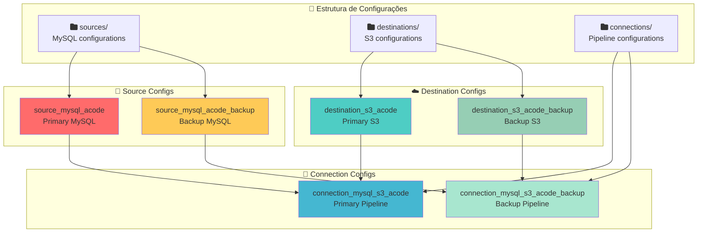

# ⚙️ Configurações Exemplo - ACODE + Redundância

## 📋 Visão Geral

Esta seção apresenta todas as configurações completas em formato YAML para implementar o sistema ACODE com redundância. Todos os exemplos são baseados nas configurações reais em produção e incluem comentários explicativos.



## 🔌 Source Configurations

### **1. Source MySQL ACODE Primary**

```yaml
# sources/source_mysql_acode/configuration.yaml
# Configuration for airbyte/source-mysql (Primary ACODE)
resource_name: "source_mysql_acode"
definition_type: source
definition_id: 435bb9a5-7887-4809-aa58-28c27df0d7ad
definition_image: airbyte/source-mysql
definition_version: 1.0.21

configuration:
  # Conexão principal ACODE (sistema externo do parceiro)
  host: db-hsp-farmarcas.acode.com.br
  port: 3306
  database: acode_farmarcas
  username: userfarmarcasac02
  password: ${ACODE_PASS}  # Variável de ambiente segura
  
  # Configurações de SSL (obrigatório para conexões externas)
  ssl: true
  ssl_mode:
    mode: "preferred"  # SSL preferido mas não obrigatório para compatibilidade
  
  # Método de replicação (Full Refresh para dados ACODE)
  replication_method:
    method: "STANDARD"  # Full refresh - dados completos a cada sync
    
  # Configurações de JDBC
  jdbc_url_params: "connectTimeout=60000&socketTimeout=600000&useSSL=true"
  
  # Tunnel/Proxy (desabilitado - conexão direta)
  tunnel_method:
    tunnel_method: "NO_TUNNEL"
    
  # Configurações específicas MySQL
  check_privileges: true  # Verificar permissões antes do sync
  
  # Configurações de sessão MySQL
  session_timezone: "America/Sao_Paulo"
  
# Metadata opcional
metadata:
  description: "Primary ACODE MySQL connection for fiscal and commercial data"
  tags:
    - "production"
    - "acode"
    - "primary"
    - "external-partner"
  owner: "data-engineering"
  criticality: "high"
  data_classification: "sensitive"
```

### **2. Source MySQL ACODE Backup**

```yaml
# sources/source_mysql_acode_backup/configuration.yaml
# Configuration for airbyte/source-mysql (Backup ACODE)
resource_name: "source_mysql_acode_backup"
definition_type: source
definition_id: 435bb9a5-7887-4809-aa58-28c27df0d7ad
definition_image: airbyte/source-mysql
definition_version: 1.0.21

configuration:
  # Conexão backup ACODE (servidor interno replicado)
  host: acode-backup.farmarcas.internal
  port: 3306
  database: acode_farmarcas_replica
  username: userfarmarcasac02_backup
  password: ${ACODE_BACKUP_PASS}  # Variável de ambiente para backup
  
  # Configurações de SSL (interno - pode ser mais flexível)
  ssl: true
  ssl_mode:
    mode: "preferred"
  
  # Método de replicação
  replication_method:
    method: "STANDARD"  # Full refresh para consistência
    
  # JDBC params para servidor backup
  jdbc_url_params: "connectTimeout=30000&socketTimeout=300000&useSSL=true"
  
  # Sem tunnel (rede interna)
  tunnel_method:
    tunnel_method: "NO_TUNNEL"
    
  # Configurações específicas para backup
  check_privileges: true
  
  # Timezone
  session_timezone: "America/Sao_Paulo"
  
  # Configurações específicas de backup
  normalization:
    option: "basic"  # Normalização básica para backup
    
  # Configurações de timeout mais agressivas para backup
  connection_timeout_ms: 30000  # 30 segundos
  socket_timeout_ms: 300000     # 5 minutos

# Metadata para backup
metadata:
  description: "Backup ACODE MySQL connection for redundancy and failover"
  tags:
    - "production"
    - "acode"
    - "backup"
    - "failover"
    - "internal"
  owner: "data-engineering"
  criticality: "high"
  data_classification: "sensitive"
  backup_of: "source_mysql_acode"
```

## ☁️ Destination Configurations

### **1. Destination S3 ACODE Primary**

```yaml
# destinations/destination_s3_acode/configuration.yaml
# Configuration for airbyte/destination-s3 (Primary)
resource_name: "destination_s3_acode"
definition_type: destination
definition_id: 4816b78f-1489-44c1-9060-4b19d5fa9362
definition_image: airbyte/destination-s3
definition_version: 0.3.23

configuration:
  # Configurações S3 primárias
  s3_bucket_name: farmarcas-production-bronze
  s3_bucket_region: us-east-2
  s3_bucket_path: "origin=airbyte/database=bronze_acode"
  
  # Estrutura de arquivos e particionamento
  s3_path_format: "${STREAM_NAME}/cog_dt_ingestion=${YEAR}-${MONTH}-${DAY}/file_${STREAM_NAME}"
  
  # Credenciais AWS (produção)
  access_key_id: ${FARMARCAS_AWS_ACCESS_KEY_ID}
  secret_access_key: ${FARMARCAS_AWS_SECRET_ACCESS_KEY}
  
  # Formato de arquivo otimizado
  format:
    format_type: "Parquet"  # Formato colunar para analytics
    compression_codec: "SNAPPY"  # Compressão otimizada para performance
    compression:
      compression_type: "No Compression"  # Deixar compressão para codec
    block_size: 134217728  # 128MB block size
    max_padding_size: 8388608  # 8MB padding
    page_size: 1048576  # 1MB page size
    dictionary_page_size: 1048576  # 1MB dictionary
    dictionary_encoding: true
    
  # Configurações de upload
  s3_endpoint: ""  # Usar endpoint padrão AWS
  s3_path_format_use_custom_timestamp: false
  
  # Configurações de performance
  file_name_pattern: "file_${STREAM_NAME}_${TIMESTAMP}_${PART_NUMBER}"
  
  # Configurações de buffer e flush
  buffer_size: 104857600  # 100MB buffer
  flush_interval: 900     # 15 minutos

# Metadata
metadata:
  description: "Primary S3 destination for ACODE data in bronze layer"
  tags:
    - "production"
    - "s3"
    - "bronze-layer"
    - "acode"
    - "primary"
  owner: "data-engineering"
  data_retention_days: 2555  # 7 anos (compliance)
  lifecycle_policy: "bronze_layer_standard"
```

### **2. Destination S3 ACODE Backup**

```yaml
# destinations/destination_s3_acode_backup/configuration.yaml
# Configuration for airbyte/destination-s3 (Backup)
resource_name: "destination_s3_acode_backup"
definition_type: destination
definition_id: 4816b78f-1489-44c1-9060-4b19d5fa9362
definition_image: airbyte/destination-s3
definition_version: 0.3.23

configuration:
  # Bucket separado para backup
  s3_bucket_name: farmarcas-backup-acode
  s3_bucket_region: us-east-2
  s3_bucket_path: "origin=backup/database=bronze_acode_backup"
  
  # Path diferenciado para backup
  s3_path_format: "backup_${STREAM_NAME}/backup_dt=${YEAR}-${MONTH}-${DAY}/backup_file_${STREAM_NAME}"
  
  # Mesmas credenciais AWS ou específicas para backup
  access_key_id: ${FARMARCAS_AWS_ACCESS_KEY_ID}
  secret_access_key: ${FARMARCAS_AWS_SECRET_ACCESS_KEY}
  
  # Formato otimizado para backup (maior compressão)
  format:
    format_type: "Parquet"
    compression_codec: "GZIP"  # Maior compressão para economia de espaço
    compression:
      compression_type: "GZIP"
    block_size: 67108864   # 64MB block size (menor para backup)
    max_padding_size: 4194304  # 4MB padding
    page_size: 524288      # 512KB page size
    dictionary_page_size: 524288
    dictionary_encoding: true
    
  # Configurações de upload backup
  s3_endpoint: ""
  s3_path_format_use_custom_timestamp: false
  
  # Configurações de performance ajustadas para backup
  file_name_pattern: "backup_file_${STREAM_NAME}_${TIMESTAMP}_${PART_NUMBER}"
  
  # Buffer menor para backup (menos recursos)
  buffer_size: 52428800   # 50MB buffer
  flush_interval: 1800    # 30 minutos

# Metadata para backup
metadata:
  description: "Backup S3 destination for ACODE data redundancy"
  tags:
    - "production"
    - "s3"
    - "backup"
    - "acode"
    - "redundancy"
  owner: "data-engineering"
  data_retention_days: 365  # 1 ano para backup
  lifecycle_policy: "backup_accelerated_archive"
  backup_of: "destination_s3_acode"
```

## 🔄 Connection Configurations

### **1. Connection ACODE Primary**

```yaml
# connections/connection_mysql_s3_acode/configuration.yaml
# Configuration for connection connection_mysql_s3_acode (Primary Pipeline)
definition_type: connection
resource_name: "connection_mysql_s3_acode"
source_configuration_path: sources/source_mysql_acode/configuration.yaml
destination_configuration_path: destinations/destination_s3_acode/configuration.yaml

configuration:
  # Status da conexão
  status: active
  skip_reset: false
  
  # Configurações de namespace
  namespace_definition: destination
  namespace_format: "${SOURCE_NAMESPACE}"
  prefix: ""  # Sem prefixo para manter nomes originais
  
  # Recursos alocados para processamento ACODE
  resource_requirements:
    cpu_limit: "2.0"      # 2 cores para processamento
    cpu_request: "1.0"    # 1 core garantido
    memory_limit: "4Gi"   # 4GB para tabelas grandes
    memory_request: "2Gi" # 2GB garantido
    
  # Agendamento manual (controlado pelo Airflow)
  schedule_type: manual
  
  # Configurações de operation timeout
  operation_timeout: 10800  # 3 horas máximo
  
  # Configuração completa de streams
  sync_catalog:
    streams:
      # Stream 1: Dados analíticos diários principais (transações fiscais)
      - config:
          alias_name: farmarcas_si_analitico_diario
          cursor_field: []  # Full refresh - sem cursor
          destination_sync_mode: append  # Append para preservar histórico
          primary_key:
            - - idpk  # Chave primária única
          selected: true
          sync_mode: full_refresh
          
          # Configurações específicas do stream
          field_selection_enabled: false  # Sincronizar todos os campos
          
        stream:
          name: farmarcas_si_analitico_diario
          namespace: acode_farmarcas
          source_defined_primary_key:
            - - idpk
          supported_sync_modes:
            - full_refresh
            - incremental  # Suportado mas não usado
            
          # Schema completo do farmarcas_si_analitico_diario
          json_schema:
            type: object
            properties:
              idpk:
                type: number
                airbyte_type: integer
                description: "Primary key - unique identifier"
              ACODE_Val_Total:
                type: number
                description: "Total transaction value"
              CNPJ:
                type: string
                description: "Pharmacy CNPJ"
                maxLength: 18
              CNPJ_Fornecedor:
                type: string
                description: "Supplier CNPJ"
                maxLength: 18
              Data:
                type: string
                format: date
                description: "Transaction date"
              Data_Processamento:
                type: string
                format: date-time
                description: "ACODE processing timestamp"
              EAN:
                type: string
                description: "Product barcode"
                maxLength: 14
              Fornecedor:
                type: string
                description: "Supplier name"
                maxLength: 255
              NF_Numero:
                type: number
                airbyte_type: integer
                description: "Invoice number"
              Qtd_Trib:
                type: number
                description: "Taxable quantity"
              Val_Prod:
                type: number
                description: "Product value"
              Val_Trib:
                type: number
                description: "Tax value"
              CFOP:
                type: number
                airbyte_type: integer
                description: "Tax operation code"
              NCM:
                type: number
                airbyte_type: integer
                description: "Mercosul common nomenclature"
              CST:
                type: string
                description: "Tax situation code"
                maxLength: 3
              Aliquota_ICMS:
                type: number
                description: "ICMS tax rate"
              Valor_ICMS:
                type: number
                description: "ICMS tax value"
              IPI:
                type: number
                description: "IPI tax value"
              ST:
                type: number
                description: "Tax substitution value"
              STRet:
                type: number
                description: "Retained tax substitution"
                
      # Stream 2: Dados de produtos (catálogo farmacêutico)
      - config:
          alias_name: farmarcas_si_analitico_diario_produtos
          cursor_field: []
          destination_sync_mode: append
          primary_key:
            - - idpk
          selected: true
          sync_mode: full_refresh
          field_selection_enabled: false
          
        stream:
          name: farmarcas_si_analitico_diario_produtos
          namespace: acode_farmarcas
          source_defined_primary_key:
            - - idpk
          supported_sync_modes:
            - full_refresh
            - incremental
            
          # Schema completo do farmarcas_si_analitico_diario_produtos
          json_schema:
            type: object
            properties:
              idpk:
                type: number
                airbyte_type: integer
                description: "Primary key - unique identifier"
              EAN:
                type: string
                description: "Product barcode"
                maxLength: 14
              Produto:
                type: string
                description: "Product name"
                maxLength: 500
              Fabricante:
                type: string
                description: "Manufacturer name"
                maxLength: 255
              P_Ativo:
                type: string
                description: "Active ingredient"
                maxLength: 500
              Classe:
                type: string
                description: "Therapeutic class"
                maxLength: 255
              Sub_Classe:
                type: string
                description: "Therapeutic sub-class"
                maxLength: 255
              Familia:
                type: string
                description: "Product family"
                maxLength: 255
              Grupo:
                type: string
                description: "Product group"
                maxLength: 255
              Tipo:
                type: string
                description: "Product type"
                maxLength: 255
              Desc_Marca:
                type: string
                description: "Brand description"
                maxLength: 255
              Holding:
                type: string
                description: "Corporate group"
                maxLength: 255

# Metadata da conexão
metadata:
  description: "Primary ACODE connection for fiscal and commercial data ingestion"
  tags:
    - "production"
    - "acode"
    - "primary"
    - "fiscal-data"
    - "commercial-data"
  owner: "data-engineering"
  business_owner: "finance-team"
  criticality: "critical"
  sla_hours: 24
  max_runtime_hours: 3
  expected_frequency: "daily"
  data_volume_gb: "4-8"
  downstream_dependencies:
    - "silver_layer_transformations"
    - "executive_dashboards"
    - "financial_reconciliation"
    - "compliance_reports"
```

### **2. Connection ACODE Backup**

```yaml
# connections/connection_mysql_s3_acode_backup/configuration.yaml
# Configuration for connection connection_mysql_s3_acode_backup (Backup Pipeline)
definition_type: connection
resource_name: "connection_mysql_s3_acode_backup"
source_configuration_path: sources/source_mysql_acode_backup/configuration.yaml
destination_configuration_path: destinations/destination_s3_acode_backup/configuration.yaml

configuration:
  # Status inicial (ativado apenas durante emergências)
  status: inactive  # Inativo por padrão
  skip_reset: false
  
  # Configurações de namespace
  namespace_definition: destination
  namespace_format: "${SOURCE_NAMESPACE}"
  prefix: "backup_"  # Prefixo para diferenciar dados backup
  
  # Recursos reduzidos para backup (economia)
  resource_requirements:
    cpu_limit: "1.5"      # Menos recursos que primary
    cpu_request: "0.75"
    memory_limit: "3Gi"   # Menos memória
    memory_request: "1.5Gi"
    
  # Agendamento manual (acionado por health check)
  schedule_type: manual
  
  # Timeout maior para backup (pode ser mais lento)
  operation_timeout: 14400  # 4 horas máximo
  
  # Configuração de streams (mesma estrutura do primary)
  sync_catalog:
    streams:
      # Backup do stream principal
      - config:
          alias_name: farmarcas_si_analitico_diario_backup
          cursor_field: []
          destination_sync_mode: overwrite  # Overwrite para backup limpo
          primary_key:
            - - idpk
          selected: true
          sync_mode: full_refresh
          field_selection_enabled: false
          
        stream:
          name: farmarcas_si_analitico_diario
          namespace: acode_farmarcas_replica  # Namespace backup
          source_defined_primary_key:
            - - idpk
          supported_sync_modes:
            - full_refresh
            
          # Schema idêntico ao primary
          json_schema:
            type: object
            properties:
              idpk:
                type: number
                airbyte_type: integer
              ACODE_Val_Total:
                type: number
              CNPJ:
                type: string
                maxLength: 18
              CNPJ_Fornecedor:
                type: string
                maxLength: 18
              Data:
                type: string
                format: date
              Data_Processamento:
                type: string
                format: date-time
              EAN:
                type: string
                maxLength: 14
              Fornecedor:
                type: string
                maxLength: 255
              NF_Numero:
                type: number
                airbyte_type: integer
              Qtd_Trib:
                type: number
              Val_Prod:
                type: number
              Val_Trib:
                type: number
              CFOP:
                type: number
                airbyte_type: integer
              NCM:
                type: number
                airbyte_type: integer
              CST:
                type: string
                maxLength: 3
              Aliquota_ICMS:
                type: number
              Valor_ICMS:
                type: number
              IPI:
                type: number
              ST:
                type: number
              STRet:
                type: number
                
      # Backup do stream de produtos
      - config:
          alias_name: farmarcas_si_analitico_diario_produtos_backup
          cursor_field: []
          destination_sync_mode: overwrite
          primary_key:
            - - idpk
          selected: true
          sync_mode: full_refresh
          field_selection_enabled: false
          
        stream:
          name: farmarcas_si_analitico_diario_produtos
          namespace: acode_farmarcas_replica
          source_defined_primary_key:
            - - idpk
          supported_sync_modes:
            - full_refresh
            
          # Schema idêntico ao primary
          json_schema:
            type: object
            properties:
              idpk:
                type: number
                airbyte_type: integer
              EAN:
                type: string
                maxLength: 14
              Produto:
                type: string
                maxLength: 500
              Fabricante:
                type: string
                maxLength: 255
              P_Ativo:
                type: string
                maxLength: 500
              Classe:
                type: string
                maxLength: 255
              Sub_Classe:
                type: string
                maxLength: 255
              Familia:
                type: string
                maxLength: 255
              Grupo:
                type: string
                maxLength: 255
              Tipo:
                type: string
                maxLength: 255
              Desc_Marca:
                type: string
                maxLength: 255
              Holding:
                type: string
                maxLength: 255

# Metadata backup
metadata:
  description: "Backup ACODE connection for emergency failover and redundancy"
  tags:
    - "production"
    - "acode"
    - "backup"
    - "failover"
    - "redundancy"
  owner: "data-engineering"
  criticality: "high"
  purpose: "emergency_backup"
  primary_connection: "connection_mysql_s3_acode"
  activation_triggers:
    - "primary_connection_failure"
    - "health_check_failure"
    - "manual_emergency_activation"
  max_runtime_hours: 4
  expected_data_lag_vs_primary: "< 5 minutes"
```

## 🛠️ Scripts de Deploy

### **Deploy Script Completo**

```bash
#!/bin/bash
# deploy_acode_configurations.sh

set -e  # Exit on any error

echo "🚀 Deploying ACODE Configurations"
echo "================================="

# Verificar pré-requisitos
echo "1. Checking prerequisites..."

# Verificar Octavia CLI
command -v octavia >/dev/null 2>&1 || { echo "❌ Octavia CLI not found"; exit 1; }

# Verificar variáveis de ambiente
[ -z "$ACODE_PASS" ] && { echo "❌ ACODE_PASS not set"; exit 1; }
[ -z "$ACODE_BACKUP_PASS" ] && { echo "❌ ACODE_BACKUP_PASS not set"; exit 1; }
[ -z "$FARMARCAS_AWS_ACCESS_KEY_ID" ] && { echo "❌ AWS credentials not set"; exit 1; }

echo "✅ Prerequisites OK"

# Deploy sources
echo "2. Deploying sources..."
octavia apply sources/source_mysql_acode || { echo "❌ Failed to deploy primary source"; exit 1; }
octavia apply sources/source_mysql_acode_backup || { echo "❌ Failed to deploy backup source"; exit 1; }
echo "✅ Sources deployed"

# Deploy destinations  
echo "3. Deploying destinations..."
octavia apply destinations/destination_s3_acode || { echo "❌ Failed to deploy primary destination"; exit 1; }
octavia apply destinations/destination_s3_acode_backup || { echo "❌ Failed to deploy backup destination"; exit 1; }
echo "✅ Destinations deployed"

# Deploy connections
echo "4. Deploying connections..."
octavia apply connections/connection_mysql_s3_acode || { echo "❌ Failed to deploy primary connection"; exit 1; }
octavia apply connections/connection_mysql_s3_acode_backup || { echo "❌ Failed to deploy backup connection"; exit 1; }
echo "✅ Connections deployed"

# Verificar deployment
echo "5. Verifying deployment..."
octavia list sources | grep -q "source_mysql_acode" || { echo "❌ Primary source not found"; exit 1; }
octavia list sources | grep -q "source_mysql_acode_backup" || { echo "❌ Backup source not found"; exit 1; }
octavia list destinations | grep -q "destination_s3_acode" || { echo "❌ Primary destination not found"; exit 1; }
octavia list destinations | grep -q "destination_s3_acode_backup" || { echo "❌ Backup destination not found"; exit 1; }
octavia list connections | grep -q "connection_mysql_s3_acode" || { echo "❌ Primary connection not found"; exit 1; }
octavia list connections | grep -q "connection_mysql_s3_acode_backup" || { echo "❌ Backup connection not found"; exit 1; }
echo "✅ Deployment verified"

# Testar conectividade
echo "6. Testing connectivity..."

# Test primary connection
python3 << 'EOF'
import mysql.connector
import os

try:
    conn = mysql.connector.connect(
        host='db-hsp-farmarcas.acode.com.br',
        port=3306,
        database='acode_farmarcas',
        user='userfarmarcasac02',
        password=os.getenv('ACODE_PASS'),
        ssl_mode='PREFERRED'
    )
    cursor = conn.cursor()
    cursor.execute("SELECT COUNT(*) FROM farmarcas_si_analitico_diario LIMIT 1")
    conn.close()
    print("✅ Primary MySQL connectivity OK")
except Exception as e:
    print(f"❌ Primary MySQL connectivity failed: {e}")
    exit(1)
EOF

# Test backup connection
python3 << 'EOF'
import mysql.connector
import os

try:
    conn = mysql.connector.connect(
        host='acode-backup.farmarcas.internal',
        port=3306,
        database='acode_farmarcas_replica',
        user='userfarmarcasac02_backup',
        password=os.getenv('ACODE_BACKUP_PASS'),
        ssl_mode='PREFERRED'
    )
    cursor = conn.cursor()
    cursor.execute("SELECT 1")
    conn.close()
    print("✅ Backup MySQL connectivity OK")
except Exception as e:
    print(f"❌ Backup MySQL connectivity failed: {e}")
    exit(1)
EOF

# Test S3 access
aws s3 ls s3://farmarcas-production-bronze/origin=airbyte/database=bronze_acode/ >/dev/null 2>&1 && \
    echo "✅ Primary S3 access OK" || { echo "❌ Primary S3 access failed"; exit 1; }

aws s3 ls s3://farmarcas-backup-acode/ >/dev/null 2>&1 && \
    echo "✅ Backup S3 access OK" || { echo "❌ Backup S3 access failed"; exit 1; }

echo "✅ Connectivity tests passed"

# Configurar status inicial das conexões
echo "7. Setting initial connection status..."

# Primary connection ativa
octavia apply connections/connection_mysql_s3_acode --status active

# Backup connection inativa (ativada apenas em emergências)
octavia apply connections/connection_mysql_s3_acode_backup --status inactive

echo "✅ Connection status configured"

echo "================================="
echo "🎉 ACODE Configurations Successfully Deployed!"
echo ""
echo "📊 Summary:"
echo "  - Primary connection: ACTIVE"
echo "  - Backup connection: INACTIVE (standby)"
echo "  - Sources: 2 deployed"
echo "  - Destinations: 2 deployed"
echo "  - Connections: 2 deployed"
echo ""
echo "🔗 Next steps:"
echo "  1. Deploy health monitoring DAGs"
echo "  2. Configure alerting systems"
echo "  3. Test backup activation procedures"
echo "  4. Schedule first production sync"
echo ""
echo "📚 Documentation: ./README.md"
```

### **Validation Script**

```python
#!/usr/bin/env python3
# validate_acode_deployment.py

import requests
import json
import mysql.connector
import boto3
import os
from datetime import datetime

class ACODEDeploymentValidator:
    def __init__(self):
        self.airbyte_url = "http://airbyte-server:8001"
        self.results = {
            'timestamp': datetime.now().isoformat(),
            'overall_status': 'unknown',
            'checks': {}
        }
    
    def validate_airbyte_components(self):
        """Validate Airbyte components are deployed correctly"""
        try:
            # Check sources
            sources_response = requests.get(f"{self.airbyte_url}/api/v1/sources")
            sources = sources_response.json().get('sources', [])
            
            acode_sources = [s for s in sources if 'acode' in s['name'].lower()]
            
            self.results['checks']['airbyte_sources'] = {
                'status': 'pass' if len(acode_sources) >= 2 else 'fail',
                'found_sources': len(acode_sources),
                'expected_sources': 2,
                'source_names': [s['name'] for s in acode_sources]
            }
            
            # Check destinations
            destinations_response = requests.get(f"{self.airbyte_url}/api/v1/destinations")
            destinations = destinations_response.json().get('destinations', [])
            
            acode_destinations = [d for d in destinations if 'acode' in d['name'].lower()]
            
            self.results['checks']['airbyte_destinations'] = {
                'status': 'pass' if len(acode_destinations) >= 2 else 'fail',
                'found_destinations': len(acode_destinations),
                'expected_destinations': 2,
                'destination_names': [d['name'] for d in acode_destinations]
            }
            
            # Check connections
            connections_response = requests.get(f"{self.airbyte_url}/api/v1/connections")
            connections = connections_response.json().get('connections', [])
            
            acode_connections = [c for c in connections if 'acode' in c['name'].lower()]
            
            self.results['checks']['airbyte_connections'] = {
                'status': 'pass' if len(acode_connections) >= 2 else 'fail',
                'found_connections': len(acode_connections),
                'expected_connections': 2,
                'connection_names': [c['name'] for c in acode_connections],
                'connection_statuses': {c['name']: c['status'] for c in acode_connections}
            }
            
        except Exception as e:
            self.results['checks']['airbyte_components'] = {
                'status': 'error',
                'error': str(e)
            }
    
    def validate_mysql_connectivity(self):
        """Validate MySQL connections"""
        # Primary MySQL
        try:
            conn = mysql.connector.connect(
                host='db-hsp-farmarcas.acode.com.br',
                port=3306,
                database='acode_farmarcas',
                user='userfarmarcasac02',
                password=os.getenv('ACODE_PASS'),
                ssl_mode='PREFERRED',
                connect_timeout=30
            )
            
            cursor = conn.cursor()
            cursor.execute("SELECT COUNT(*) FROM farmarcas_si_analitico_diario LIMIT 1")
            cursor.execute("SELECT COUNT(*) FROM farmarcas_si_analitico_diario_produtos LIMIT 1")
            conn.close()
            
            self.results['checks']['mysql_primary'] = {
                'status': 'pass',
                'host': 'db-hsp-farmarcas.acode.com.br',
                'database': 'acode_farmarcas',
                'tables_accessible': True
            }
            
        except Exception as e:
            self.results['checks']['mysql_primary'] = {
                'status': 'fail',
                'error': str(e)
            }
        
        # Backup MySQL
        try:
            conn = mysql.connector.connect(
                host='acode-backup.farmarcas.internal',
                port=3306,
                database='acode_farmarcas_replica',
                user='userfarmarcasac02_backup',
                password=os.getenv('ACODE_BACKUP_PASS'),
                ssl_mode='PREFERRED',
                connect_timeout=30
            )
            
            cursor = conn.cursor()
            cursor.execute("SHOW SLAVE STATUS")
            slave_status = cursor.fetchone()
            conn.close()
            
            self.results['checks']['mysql_backup'] = {
                'status': 'pass',
                'host': 'acode-backup.farmarcas.internal',
                'database': 'acode_farmarcas_replica',
                'replication_configured': slave_status is not None
            }
            
        except Exception as e:
            self.results['checks']['mysql_backup'] = {
                'status': 'fail',
                'error': str(e)
            }
    
    def validate_s3_access(self):
        """Validate S3 bucket access"""
        s3 = boto3.client('s3')
        
        # Primary bucket
        try:
            s3.list_objects_v2(
                Bucket='farmarcas-production-bronze',
                Prefix='origin=airbyte/database=bronze_acode/',
                MaxKeys=1
            )
            
            self.results['checks']['s3_primary'] = {
                'status': 'pass',
                'bucket': 'farmarcas-production-bronze',
                'prefix': 'origin=airbyte/database=bronze_acode/'
            }
            
        except Exception as e:
            self.results['checks']['s3_primary'] = {
                'status': 'fail',
                'error': str(e)
            }
        
        # Backup bucket
        try:
            s3.list_objects_v2(
                Bucket='farmarcas-backup-acode',
                MaxKeys=1
            )
            
            self.results['checks']['s3_backup'] = {
                'status': 'pass',
                'bucket': 'farmarcas-backup-acode'
            }
            
        except Exception as e:
            self.results['checks']['s3_backup'] = {
                'status': 'fail',
                'error': str(e)
            }
    
    def validate_configuration_consistency(self):
        """Validate configuration consistency"""
        checks = []
        
        # Check if all components exist
        airbyte_checks = [
            self.results['checks'].get('airbyte_sources', {}).get('status') == 'pass',
            self.results['checks'].get('airbyte_destinations', {}).get('status') == 'pass',
            self.results['checks'].get('airbyte_connections', {}).get('status') == 'pass'
        ]
        
        mysql_checks = [
            self.results['checks'].get('mysql_primary', {}).get('status') == 'pass',
            self.results['checks'].get('mysql_backup', {}).get('status') == 'pass'
        ]
        
        s3_checks = [
            self.results['checks'].get('s3_primary', {}).get('status') == 'pass',
            self.results['checks'].get('s3_backup', {}).get('status') == 'pass'
        ]
        
        self.results['checks']['configuration_consistency'] = {
            'status': 'pass' if all(airbyte_checks + mysql_checks + s3_checks) else 'fail',
            'airbyte_components': all(airbyte_checks),
            'mysql_connectivity': all(mysql_checks),
            's3_access': all(s3_checks)
        }
    
    def run_validation(self):
        """Run complete validation suite"""
        print("🔍 ACODE Deployment Validation")
        print("=" * 40)
        
        print("1. Validating Airbyte components...")
        self.validate_airbyte_components()
        
        print("2. Validating MySQL connectivity...")
        self.validate_mysql_connectivity()
        
        print("3. Validating S3 access...")
        self.validate_s3_access()
        
        print("4. Validating configuration consistency...")
        self.validate_configuration_consistency()
        
        # Determine overall status
        all_checks = [check.get('status') for check in self.results['checks'].values()]
        if all(status == 'pass' for status in all_checks):
            self.results['overall_status'] = 'pass'
        elif any(status == 'error' for status in all_checks):
            self.results['overall_status'] = 'error'
        else:
            self.results['overall_status'] = 'fail'
        
        # Print results
        print("\n📊 Validation Results:")
        print("=" * 40)
        
        for check_name, check_result in self.results['checks'].items():
            status = check_result.get('status', 'unknown')
            emoji = '✅' if status == 'pass' else '❌' if status == 'fail' else '⚠️'
            print(f"{emoji} {check_name.replace('_', ' ').title()}: {status.upper()}")
            
            if status != 'pass' and 'error' in check_result:
                print(f"   Error: {check_result['error']}")
        
        print("\n" + "=" * 40)
        overall_emoji = '✅' if self.results['overall_status'] == 'pass' else '❌'
        print(f"{overall_emoji} Overall Status: {self.results['overall_status'].upper()}")
        
        return self.results

if __name__ == "__main__":
    validator = ACODEDeploymentValidator()
    results = validator.run_validation()
    
    # Save results to file
    with open('acode_validation_results.json', 'w') as f:
        json.dump(results, f, indent=2)
    
    print(f"\n📁 Results saved to: acode_validation_results.json")
    
    # Exit with appropriate code
    exit(0 if results['overall_status'] == 'pass' else 1)
```

## 🔧 Configurações de Ambiente

### **Environment Variables Template**

```bash
# .env.acode-production
# ACODE Production Environment Variables

# ==========================================
# MySQL ACODE Primary
# ==========================================
ACODE_HOST=db-hsp-farmarcas.acode.com.br
ACODE_PORT=3306
ACODE_DATABASE=acode_farmarcas
ACODE_USER=userfarmarcasac02
ACODE_PASS=your_secure_acode_password_here

# ==========================================
# MySQL ACODE Backup
# ==========================================
ACODE_BACKUP_HOST=acode-backup.farmarcas.internal
ACODE_BACKUP_PORT=3306
ACODE_BACKUP_DATABASE=acode_farmarcas_replica
ACODE_BACKUP_USER=userfarmarcasac02_backup
ACODE_BACKUP_PASS=your_secure_backup_password_here

# ==========================================
# AWS Credentials
# ==========================================
FARMARCAS_AWS_ACCESS_KEY_ID=AKIA...
FARMARCAS_AWS_SECRET_ACCESS_KEY=your_secret_key_here
AWS_DEFAULT_REGION=us-east-2

# ==========================================
# S3 Buckets
# ==========================================
S3_PRIMARY_BUCKET=farmarcas-production-bronze
S3_BACKUP_BUCKET=farmarcas-backup-acode
S3_EMERGENCY_BUCKET=farmarcas-emergency-backup
S3_QUARANTINE_BUCKET=farmarcas-quarantine

# ==========================================
# Airbyte Configuration
# ==========================================
AIRBYTE_SERVER_URL=http://airbyte-server:8001
AIRBYTE_WORKSPACE_ID=your_workspace_id_here

# ==========================================
# Monitoring & Alerting
# ==========================================
SLACK_WEBHOOK_URL=https://hooks.slack.com/services/...
DATADOG_API_KEY=your_datadog_api_key_here
PAGERDUTY_SERVICE_KEY=your_pagerduty_key_here

# ==========================================
# Operational Settings
# ==========================================
ACODE_MAX_RUNTIME_HOURS=3
ACODE_HEALTH_CHECK_INTERVAL_MINUTES=5
ACODE_REPLICATION_LAG_THRESHOLD_MINUTES=10
ACODE_CONSECUTIVE_FAILURE_THRESHOLD=3
```

---

## 🔗 Scripts de Manutenção

### **Backup Configuration Script**

```bash
#!/bin/bash
# backup_acode_configurations.sh

BACKUP_DATE=$(date +%Y%m%d_%H%M%S)
BACKUP_DIR="./acode_config_backup_$BACKUP_DATE"

echo "💾 Backing up ACODE configurations..."

mkdir -p $BACKUP_DIR

# Export current Airbyte configurations
octavia list sources > $BACKUP_DIR/sources_list.txt
octavia list destinations > $BACKUP_DIR/destinations_list.txt
octavia list connections > $BACKUP_DIR/connections_list.txt

# Backup configuration files
cp -r sources/ $BACKUP_DIR/
cp -r destinations/ $BACKUP_DIR/
cp -r connections/ $BACKUP_DIR/

# Create deployment info
cat > $BACKUP_DIR/deployment_info.txt << EOF
ACODE Configuration Backup
=========================
Date: $(date)
Backup ID: $BACKUP_DATE
Environment: Production

Components Backed Up:
- Sources: $(ls sources/ | wc -l)
- Destinations: $(ls destinations/ | wc -l)  
- Connections: $(ls connections/ | wc -l)

Current Git Commit: $(git rev-parse HEAD 2>/dev/null || echo "Not in git repo")
EOF

# Compress backup
tar -czf "acode_config_backup_$BACKUP_DATE.tar.gz" $BACKUP_DIR/
rm -rf $BACKUP_DIR

echo "✅ Configuration backup completed: acode_config_backup_$BACKUP_DATE.tar.gz"
```

---

## 📋 Checklist de Deploy

### **Pre-Deploy Checklist** ✓
- [ ] All environment variables configured
- [ ] MySQL primary connectivity verified
- [ ] MySQL backup replication configured
- [ ] S3 buckets created and accessible
- [ ] Octavia CLI installed and configured
- [ ] Airbyte platform running and accessible

### **Deploy Checklist** ✓
- [ ] Sources deployed successfully
- [ ] Destinations deployed successfully
- [ ] Connections deployed successfully
- [ ] Primary connection status set to active
- [ ] Backup connection status set to inactive
- [ ] All components validated

### **Post-Deploy Checklist** ✓
- [ ] Health monitoring DAGs deployed
- [ ] Alerting systems configured
- [ ] Backup activation procedures tested
- [ ] Documentation updated
- [ ] Team notified of deployment

---

**Próximo**: [Troubleshooting](./erros_comuns.md) - Resolução de problemas de configuração
