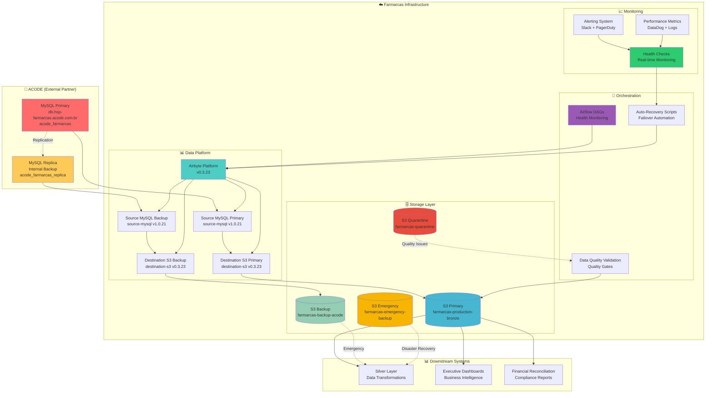
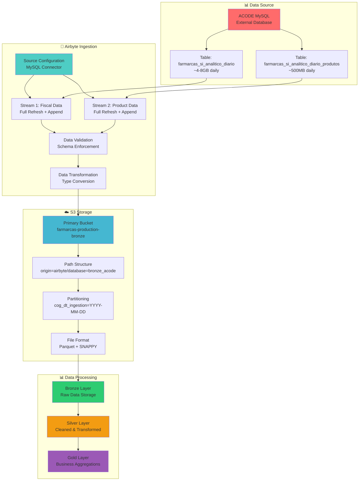
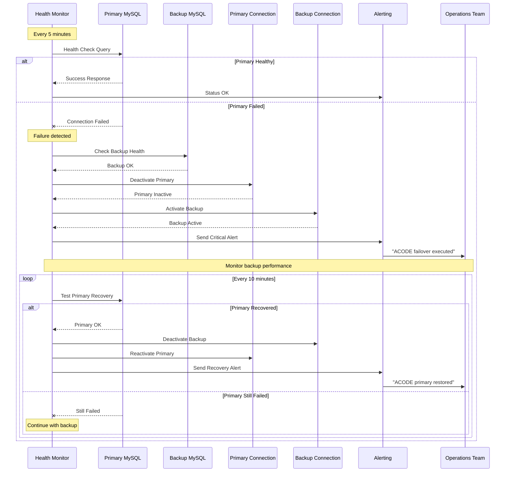
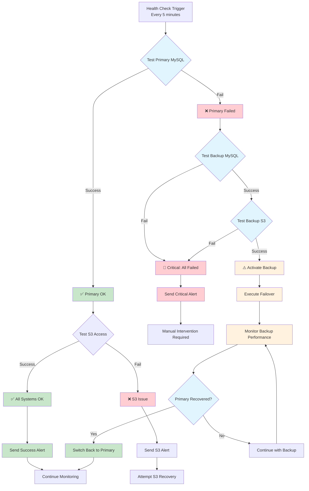
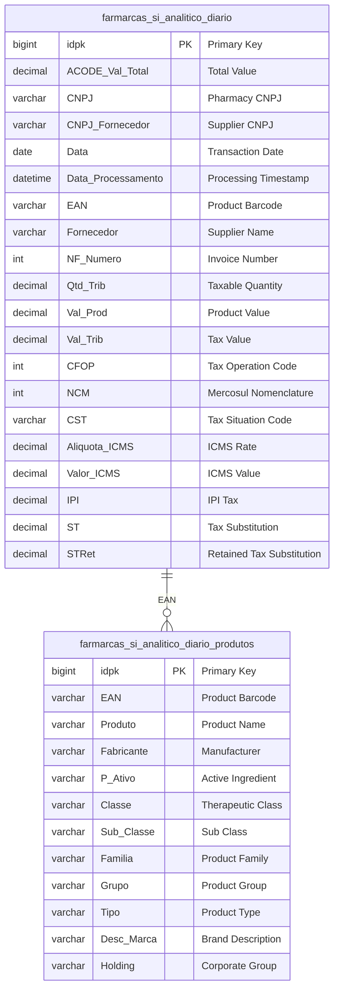
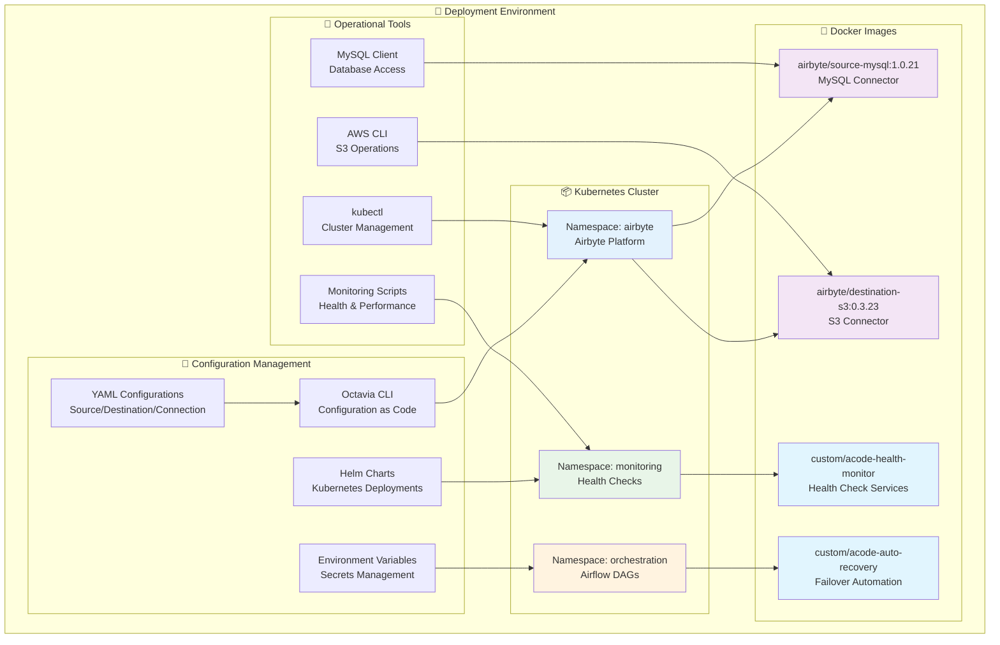
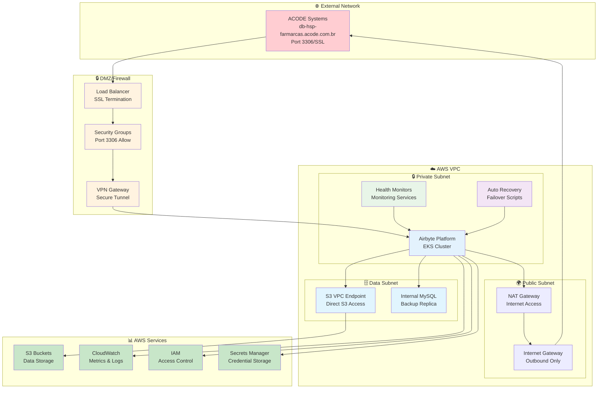
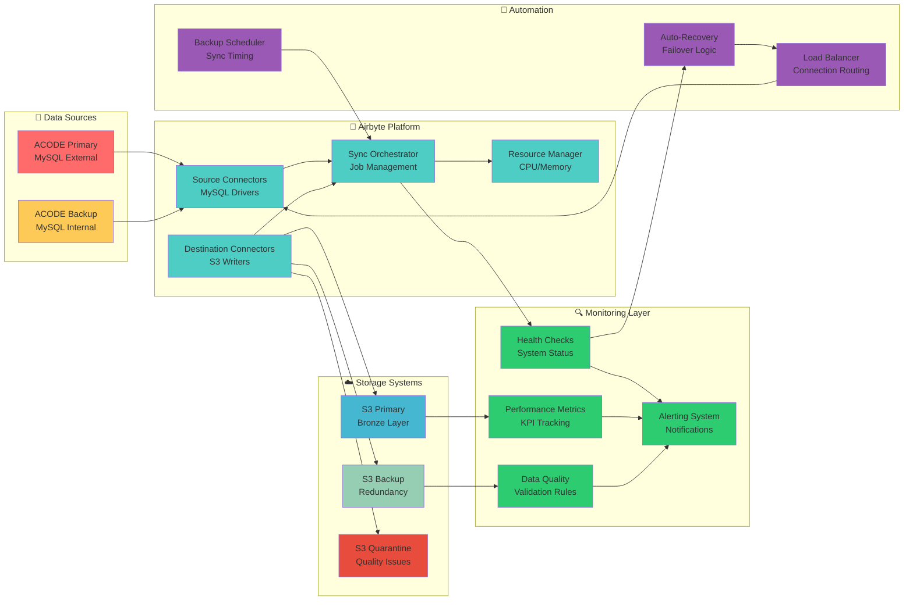
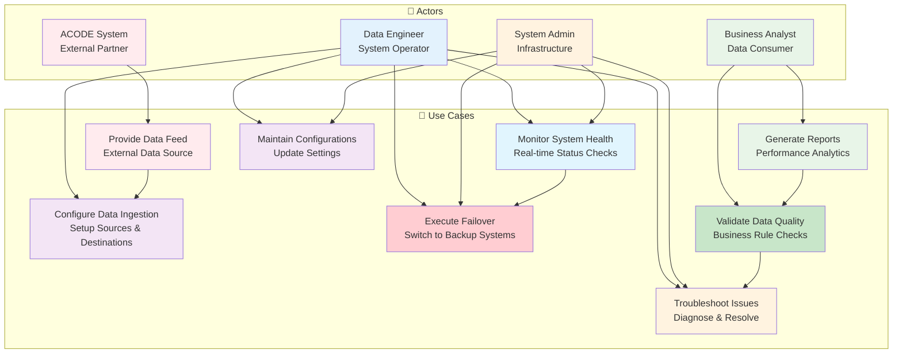

# 📊 Diagramas Técnicos - ACODE + Redundância

## 📋 Visão Geral

Esta seção apresenta diagramas técnicos detalhados do sistema ACODE com redundância, incluindo arquitetura de componentes, fluxos de dados, procedimentos de failover e monitoramento.

## 🏗️ Arquitetura Geral do Sistema



## 🔄 Fluxo de Dados Detalhado



## ⚡ Processo de Failover



## 🔍 Health Check Flow



## 🗂️ Data Schema & Structure



## 📊 Monitoring Dashboard Layout

```mermaid
graph TB
    subgraph "📊 ACODE Monitoring Dashboard"
        subgraph "🟢 System Health"
            A1[Primary MySQL Status<br/>🟢 Online | 🔴 Offline]
            A2[Backup MySQL Status<br/>🟢 Online | 🔴 Offline]
            A3[S3 Access Status<br/>🟢 Available | 🔴 Failed]
            A4[Airbyte Connection<br/>🟢 Active | 🟡 Standby | 🔴 Failed]
        end
        
        subgraph "📈 Performance Metrics"
            B1[Query Response Time<br/>< 30s Target]
            B2[Sync Duration<br/>< 3h Target]
            B3[Data Freshness<br/>< 25h Target]
            B4[Replication Lag<br/>< 5min Target]
        end
        
        subgraph "📊 Data Quality"
            C1[Records Processed<br/>Daily Count]
            C2[Quality Score<br/>> 90% Target]
            C3[Quarantined Records<br/>< 1% Target]
            C4[Validation Errors<br/>Count & Trends]
        end
        
        subgraph "🚨 Alerts & Actions"
            D1[Active Alerts<br/>Critical/Warning/Info]
            D2[Recent Failovers<br/>Last 24h Events]
            D3[Manual Actions<br/>Required Interventions]
            D4[System Recovery<br/>Auto/Manual Status]
        end
        
        subgraph "📅 Historical Trends"
            E1[Sync Success Rate<br/>7/30 day trends]
            E2[Data Volume Trends<br/>GB per day]
            E3[Performance Trends<br/>Response time history]
            E4[Failure Patterns<br/>Incident analysis]
        end
    end
    
    style A1 fill:#c8e6c9
    style A2 fill:#c8e6c9
    style A3 fill:#c8e6c9
    style A4 fill:#c8e6c9
    style B1 fill:#e1f5fe
    style B2 fill:#e1f5fe
    style B3 fill:#e1f5fe
    style B4 fill:#e1f5fe
    style C1 fill:#f3e5f5
    style C2 fill:#f3e5f5
    style C3 fill:#f3e5f5
    style C4 fill:#f3e5f5
    style D1 fill:#ffebee
    style D2 fill:#ffebee
    style D3 fill:#ffebee
    style D4 fill:#ffebee
    style E1 fill:#fff3e0
    style E2 fill:#fff3e0
    style E3 fill:#fff3e0
    style E4 fill:#fff3e0
```

## 🛠️ Deployment Architecture



## 🔄 Data Lifecycle Management

```mermaid
timeline
    title ACODE Data Lifecycle
    
    section Data Ingestion
        00:00 : Health Check
              : Primary MySQL Test
              : Connection Validation
        
        01:00 : Sync Start
              : Airbyte Job Launch
              : Resource Allocation
              
        01:30 : Data Extract
              : MySQL Query Execution
              : 4-8GB Transfer
              
        02:30 : Data Transform
              : Schema Validation
              : Type Conversion
              
        03:00 : Data Load
              : S3 Upload (Parquet)
              : SNAPPY Compression
              
        03:30 : Sync Complete
              : Quality Validation
              : Success Notification
    
    section Monitoring
        Every 5min : Health Checks
                   : MySQL Connectivity
                   : S3 Access Test
                   
        Every 15min : Performance Check
                    : Query Response Time
                    : Replication Lag
                    
        Every 1hr : Data Quality
                  : Validation Rules
                  : Business Logic
                  
        Daily : Trend Analysis
              : Volume Patterns
              : Performance Metrics
    
    section Backup & Recovery
        Continuous : MySQL Replication
                   : Primary to Backup
                   : < 5min Lag
                   
        On Failure : Auto Failover
                   : Backup Activation
                   : Alert Notification
                   
        Recovery : Primary Restoration
                 : Automatic Switchback
                 : System Validation
                 
        Weekly : Backup Testing
               : DR Procedures
               : Recovery Validation
```

## 🏗️ Network Architecture



## 📊 Performance Metrics Dashboard

```mermaid
graph TB
    subgraph "📊 Real-time Metrics"
        subgraph "🔄 Connection Status"
            M1[Primary Connection<br/>🟢 Active | 🔴 Failed]
            M2[Backup Connection<br/>🟡 Standby | 🟢 Active]
            M3[Failover Status<br/>🟢 Ready | 🔄 In Progress]
        end
        
        subgraph "⚡ Performance KPIs"
            P1[Query Response<br/>Current: 12.3s | Target: <30s]
            P2[Sync Duration<br/>Current: 2.1h | Target: <3h]
            P3[Data Throughput<br/>Current: 45MB/min]
            P4[Success Rate<br/>Last 24h: 98.5%]
        end
        
        subgraph "📈 Data Metrics"
            D1[Records/Day<br/>~2.8M records]
            D2[Data Volume<br/>~6.2GB daily]
            D3[Quality Score<br/>94.2% | Target: >90%]
            D4[Replication Lag<br/>3.2min | Target: <5min]
        end
        
        subgraph "🚨 Alert Summary"
            A1[Critical: 0<br/>🟢 All Clear]
            A2[Warnings: 2<br/>🟡 Minor Issues]
            A3[Last Incident<br/>48h ago - Resolved]
            A4[MTTR<br/>Average: 15min]
        end
    end
    
    style M1 fill:#c8e6c9
    style M2 fill:#fff3e0
    style M3 fill:#c8e6c9
    style P1 fill:#c8e6c9
    style P2 fill:#c8e6c9
    style P3 fill:#e1f5fe
    style P4 fill:#c8e6c9
    style D1 fill:#f3e5f5
    style D2 fill:#f3e5f5
    style D3 fill:#c8e6c9
    style D4 fill:#c8e6c9
    style A1 fill:#c8e6c9
    style A2 fill:#fff3e0
    style A3 fill:#e1f5fe
    style A4 fill:#c8e6c9
```

## 🔧 Technical Component Interactions



---

## 🎯 Diagrama de Casos de Uso



---

**Próximo**: [Boas Práticas](./boas_praticas.md) - Recomendações de operação e manutenção
