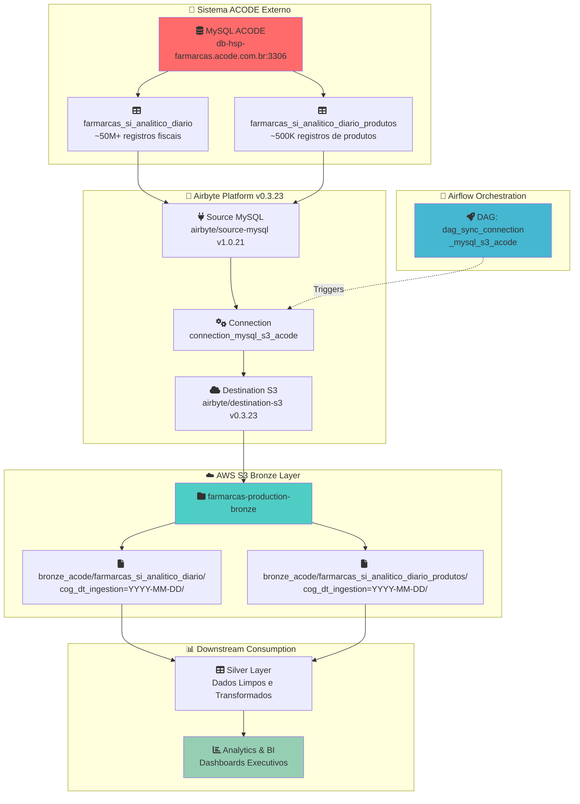
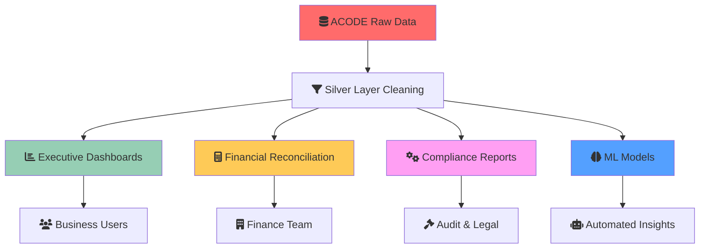

# 🌊 Fluxo Detalhado de Ingestão ACODE

## 📋 Visão Geral do Fluxo

O fluxo de ingestão ACODE é um pipeline crítico que processa dados fiscais e comerciais da farmarcas através de múltiplas etapas, garantindo integridade e disponibilidade dos dados para análises de business intelligence.



## 📊 Detalhamento por Etapa

### **1. Origem dos Dados (MySQL ACODE)**

#### Servidor de Produção
```yaml
Configuração do Servidor:
  Host: db-hsp-farmarcas.acode.com.br
  Port: 3306
  Database: acode_farmarcas
  User: userfarmarcasac02
  SSL: Enabled (preferred mode)
  Connection Type: Direct (external partner)
  Partner: ACODE - Sistema de gestão farmacêutica
```

#### Tabelas Principais Sincronizadas
| Tabela | Descrição | Records (aprox.) | Sync Mode | Primary Key | Criticidade |
|--------|-----------|------------------|-----------|-------------|-------------|
| `farmarcas_si_analitico_diario` | Transações fiscais detalhadas com dados de vendas | ~50M+ | Full Refresh | `idpk` | 🔴 Crítica |
| `farmarcas_si_analitico_diario_produtos` | Catálogo completo de produtos farmacêuticos | ~500K | Full Refresh | `idpk` | 🟡 Alta |

#### Schema das Tabelas

**farmarcas_si_analitico_diario** (Dados Fiscais):
```json
{
  "properties": {
    "idpk": {"type": "number", "airbyte_type": "integer", "description": "Chave primária única"},
    "ACODE_Val_Total": {"type": "number", "description": "Valor total da transação"},
    "CNPJ": {"type": "string", "description": "CNPJ da farmácia compradora"},
    "CNPJ_Fornecedor": {"type": "string", "description": "CNPJ do fornecedor"},
    "Data": {"type": "string", "format": "date", "description": "Data da transação"},
    "Data_Processamento": {"type": "string", "format": "date", "description": "Data de processamento ACODE"},
    "EAN": {"type": "string", "description": "Código de barras do produto"},
    "Fornecedor": {"type": "string", "description": "Nome do fornecedor"},
    "NF_Numero": {"type": "number", "airbyte_type": "integer", "description": "Número da nota fiscal"},
    "Qtd_Trib": {"type": "number", "description": "Quantidade tributável"},
    "Val_Prod": {"type": "number", "description": "Valor do produto"},
    "Val_Trib": {"type": "number", "description": "Valor tributário"},
    "CFOP": {"type": "number", "airbyte_type": "integer", "description": "Código Fiscal de Operação"},
    "NCM": {"type": "number", "airbyte_type": "integer", "description": "Nomenclatura Comum do Mercosul"},
    "CST": {"type": "string", "description": "Código de Situação Tributária"},
    "Aliquota_ICMS": {"type": "number", "description": "Alíquota do ICMS"},
    "Valor_ICMS": {"type": "number", "description": "Valor do ICMS"},
    "IPI": {"type": "number", "description": "Valor do IPI"},
    "ST": {"type": "number", "description": "Substituição Tributária"},
    "STRet": {"type": "number", "description": "ST Retido"}
  }
}
```

**farmarcas_si_analitico_diario_produtos** (Catálogo de Produtos):
```json
{
  "properties": {
    "idpk": {"type": "number", "airbyte_type": "integer", "description": "Chave primária única"},
    "EAN": {"type": "string", "description": "Código de barras do produto"},
    "Produto": {"type": "string", "description": "Nome do produto"},
    "Fabricante": {"type": "string", "description": "Empresa fabricante"},
    "P_Ativo": {"type": "string", "description": "Princípio ativo"},
    "Classe": {"type": "string", "description": "Classe terapêutica"},
    "Sub_Classe": {"type": "string", "description": "Sub-classe terapêutica"},
    "Familia": {"type": "string", "description": "Família do produto"},
    "Grupo": {"type": "string", "description": "Grupo do produto"},
    "Tipo": {"type": "string", "description": "Tipo do produto"},
    "Desc_Marca": {"type": "string", "description": "Descrição da marca"},
    "Holding": {"type": "string", "description": "Grupo empresarial"}
  }
}
```

### **2. Processamento via Airbyte**

#### Configuração da Source
```yaml
Connector: airbyte/source-mysql v1.0.21
Configuration:
  host: db-hsp-farmarcas.acode.com.br
  port: 3306
  database: acode_farmarcas
  username: userfarmarcasac02
  password: ${ACODE_PASS}  # Variável de ambiente
  ssl: true
  ssl_mode: preferred
  replication_method: STANDARD (Full Refresh)
  tunnel_method: NO_TUNNEL
```

#### Configuração da Destination
```yaml
Connector: airbyte/destination-s3 v0.3.23
Configuration:
  s3_bucket_name: farmarcas-production-bronze
  s3_bucket_region: us-east-2
  s3_bucket_path: "origin=airbyte/database=bronze_acode"
  s3_path_format: "${STREAM_NAME}/cog_dt_ingestion=${YEAR}-${MONTH}-${DAY}/file_${STREAM_NAME}"
  format: Parquet
  compression_codec: SNAPPY
```

#### Resource Allocation
```yaml
Recursos de Processamento:
  CPU Limit: 2.0 cores
  CPU Request: 1.0 core
  Memory Limit: 4Gi
  Memory Request: 2Gi
  Max Active Runs: 1
  Timeout: 3 horas
```

### **3. Armazenamento S3**

#### Estrutura de Diretórios
```
s3://farmarcas-production-bronze/origin=airbyte/database=bronze_acode/
├── farmarcas_si_analitico_diario/
│   └── cog_dt_ingestion=2025-08-07/
│       ├── file_farmarcas_si_analitico_diario_20250807_001.parquet
│       ├── file_farmarcas_si_analitico_diario_20250807_002.parquet
│       └── file_farmarcas_si_analitico_diario_20250807_003.parquet
└── farmarcas_si_analitico_diario_produtos/
    └── cog_dt_ingestion=2025-08-07/
        └── file_farmarcas_si_analitico_diario_produtos_20250807_001.parquet
```

#### Padrão de Nomenclatura
- **Path Format**: `${STREAM_NAME}/cog_dt_ingestion=${YEAR}-${MONTH}-${DAY}/file_${STREAM_NAME}`
- **Particionamento**: Por data de ingestão (YYYY-MM-DD)
- **Compressão**: SNAPPY para performance otimizada
- **Formato**: Parquet para compatibilidade com analytics

#### Propriedades dos Arquivos
```yaml
Formato Parquet:
  Compressão: SNAPPY
  Schema: Preservado do MySQL
  Metadata: Incluído
  
Tamanho Típico por Arquivo:
  farmarcas_si_analitico_diario: 50-200MB por arquivo
  farmarcas_si_analitico_diario_produtos: 5-20MB por arquivo
  
Particionamento:
  Campo: cog_dt_ingestion (data de ingestão)
  Granularidade: Diária
  Retenção: Conforme política de lifecycle S3
```

### **4. Orquestração via Airflow**

#### DAG Principal: `dag_sync_connection_mysql_s3_acode`
```python
# Configuração da DAG
DAG_CONFIG = {
    'dag_id': 'dag_sync_connection_mysql_s3_acode',
    'schedule': 'Manual',  # Triggered by upstream DAG
    'owner': 'data-engineering',
    'max_active_runs': 1,
    'retry': 1,
    'retry_delay': timedelta(minutes=15),
    'catchup': False
}

# Tasks principais
TASKS = [
    'trigger_acode_sync',      # AirbyteTriggerSyncOperator
    'wait_acode_sync',         # AirbyteJobSensor
    'validate_data_quality',   # PythonOperator (opcional)
    'update_metadata',         # PythonOperator (opcional)
    'notify_completion'        # SlackOperator
]
```

#### Dependências e Scheduling
- **Upstream**: DAG orchestrator principal
- **Trigger**: Manual via Airflow API ou UI
- **Frequência Esperada**: Diária (tipicamente entre 02:00-06:00 UTC)
- **SLA**: 2 horas para completar sincronização
- **Timeout**: 3 horas máximo

#### Monitoramento da DAG
```python
# Métricas coletadas durante execução
EXECUTION_METRICS = {
    'start_time': 'Timestamp de início',
    'end_time': 'Timestamp de fim',
    'duration_minutes': 'Duração total em minutos',
    'records_processed': {
        'farmarcas_si_analitico_diario': 'Quantidade de registros',
        'farmarcas_si_analitico_diario_produtos': 'Quantidade de registros'
    },
    'data_size_gb': 'Tamanho total dos dados processados',
    'success_rate': 'Taxa de sucesso (%)',
    'error_count': 'Quantidade de erros'
}
```

## ⏱️ Timeline e Performance

### **Tempo de Execução Típico**

```mermaid
gantt
    title Timeline de Execução ACODE
    dateFormat  HH:mm
    axisFormat %H:%M
    
    section Preparação
    Verificação de conectividade    :active, prep1, 00:00, 00:02
    Autenticação MySQL             :prep2, after prep1, 00:01
    
    section Extração
    farmarcas_si_analitico_diario   :active, extract1, after prep2, 01:30
    farmarcas_si_analitico_diario_produtos :extract2, after prep2, 00:15
    
    section Upload S3
    Upload arquivos Parquet        :upload1, after extract1, 00:20
    Verificação integridade        :verify1, after upload1, 00:05
    
    section Finalização
    Cleanup e notificações         :cleanup1, after verify1, 00:02
```


### **Métricas de Performance Detalhadas**

#### Volume de Dados por Sync
```yaml
farmarcas_si_analitico_diario:
  registros_por_sync: "1M - 5M (depende do período)"
  tamanho_dados: "2-5GB"
  arquivos_gerados: "10-20 arquivos Parquet"
  tempo_processamento: "60-90 minutos"

farmarcas_si_analitico_diario_produtos:
  registros_por_sync: "500K - 800K"
  tamanho_dados: "50-100MB"
  arquivos_gerados: "1-2 arquivos Parquet"
  tempo_processamento: "10-15 minutos"

totais_por_execucao:
  dados_totais: "4-8GB"
  tempo_total: "45-120 minutos"
  pico_cpu: "~80% dos 2.0 cores"
  pico_memoria: "~3GB dos 4GB alocados"
  throughput_rede: "~1-2 Gbps"
```

#### Padrões de Crescimento
```yaml
crescimento_mensal:
  farmarcas_si_analitico_diario: "+5-10% registros/mês"
  farmarcas_si_analitico_diario_produtos: "+2-3% registros/mês"
  
projecoes_anuais:
  registros_2025: "~60M farmarcas_si_analitico_diario"
  tamanho_dados_2025: "~100GB/mês"
  necessidade_recursos: "Possível scale-up em Q4/2025"
```

## 🔍 Validações e Qualidade

### **Validações Automáticas Durante o Fluxo**

#### 1. Validação de Conectividade
```sql
-- Teste de conectividade básica
SELECT 1 as connectivity_test;

-- Verificação de permissões
SHOW GRANTS FOR CURRENT_USER();

-- Teste de acesso às tabelas
SELECT COUNT(*) FROM farmarcas_si_analitico_diario LIMIT 1;
SELECT COUNT(*) FROM farmarcas_si_analitico_diario_produtos LIMIT 1;
```

#### 2. Validação de Schema
```python
# Verificação de schema antes da extração
EXPECTED_COLUMNS = {
    'farmarcas_si_analitico_diario': [
        'idpk', 'ACODE_Val_Total', 'CNPJ', 'Data', 'EAN', 
        'Fornecedor', 'NF_Numero', 'CFOP', 'NCM', 'CST'
    ],
    'farmarcas_si_analitico_diario_produtos': [
        'idpk', 'EAN', 'Produto', 'Fabricante', 'P_Ativo',
        'Classe', 'Sub_Classe', 'Familia', 'Grupo'
    ]
}

def validate_schema(table_name, actual_columns):
    expected = set(EXPECTED_COLUMNS[table_name])
    actual = set(actual_columns)
    
    missing = expected - actual
    extra = actual - expected
    
    return {
        'schema_valid': len(missing) == 0,
        'missing_columns': list(missing),
        'extra_columns': list(extra)
    }
```

#### 3. Validação de Qualidade de Dados
```sql
-- Verificação de completude
SELECT 
    DATE(cog_dt_ingestion) as ingestion_date,
    COUNT(*) as total_records,
    COUNT(DISTINCT CNPJ) as unique_cnpjs,
    COUNT(DISTINCT EAN) as unique_products,
    SUM(CASE WHEN ACODE_Val_Total > 0 THEN 1 ELSE 0 END) as positive_values,
    AVG(ACODE_Val_Total) as avg_transaction_value
FROM farmarcas_si_analitico_diario 
WHERE DATE(cog_dt_ingestion) = CURRENT_DATE()
GROUP BY DATE(cog_dt_ingestion);

-- Verificação de integridade referencial
SELECT 
    'REFERENTIAL_INTEGRITY' as check_type,
    COUNT(DISTINCT d.EAN) as eans_in_diario,
    COUNT(DISTINCT p.EAN) as eans_in_produtos,
    COUNT(DISTINCT d.EAN) - COUNT(DISTINCT p.EAN) as missing_products
FROM farmarcas_si_analitico_diario d
LEFT JOIN farmarcas_si_analitico_diario_produtos p ON d.EAN = p.EAN
WHERE DATE(d.cog_dt_ingestion) = CURRENT_DATE();

-- Verificação de outliers
SELECT 
    'HIGH_VALUE_TRANSACTIONS' as check_type,
    COUNT(*) as outlier_count,
    MAX(ACODE_Val_Total) as max_value,
    AVG(ACODE_Val_Total) as avg_value
FROM farmarcas_si_analitico_diario 
WHERE ACODE_Val_Total > 100000  -- Valores > R$ 100k
    AND DATE(cog_dt_ingestion) = CURRENT_DATE();
```

### **Validações Pós-Upload S3**

#### 1. Verificação de Integridade de Arquivos
```python
import boto3
import pandas as pd

def validate_s3_files(bucket, prefix, date):
    """Validar arquivos S3 após upload"""
    s3 = boto3.client('s3')
    
    # Listar arquivos do dia
    response = s3.list_objects_v2(
        Bucket=bucket,
        Prefix=f"{prefix}/cog_dt_ingestion={date}/"
    )
    
    files = response.get('Contents', [])
    
    validation_results = {
        'total_files': len(files),
        'total_size_mb': sum(f['Size'] for f in files) / 1024 / 1024,
        'files_by_table': {},
        'data_integrity': {}
    }
    
    # Validar cada tabela
    for table in ['farmarcas_si_analitico_diario', 'farmarcas_si_analitico_diario_produtos']:
        table_files = [f for f in files if table in f['Key']]
        validation_results['files_by_table'][table] = len(table_files)
        
        # Testar leitura de um arquivo
        if table_files:
            try:
                sample_file = table_files[0]['Key']
                df = pd.read_parquet(f"s3://{bucket}/{sample_file}")
                
                validation_results['data_integrity'][table] = {
                    'readable': True,
                    'record_count': len(df),
                    'column_count': len(df.columns),
                    'null_percentage': df.isnull().sum().sum() / (len(df) * len(df.columns))
                }
            except Exception as e:
                validation_results['data_integrity'][table] = {
                    'readable': False,
                    'error': str(e)
                }
    
    return validation_results
```

## 📊 Downstream Impact

### **Sistemas que Dependem dos Dados ACODE**

#### Analytics e BI
```yaml
Dashboards Executivos:
  - Dashboard Financeiro: Receitas e faturamento
  - Dashboard Operacional: Volume de vendas e produtos
  - Dashboard Compliance: Relatórios fiscais e auditoria

Sistemas Downstream:
  - Silver Layer: Dados limpos e transformados
  - Gold Layer: Agregações e métricas de negócio
  - Data Warehouse: Histórico consolidado
  - ML Pipelines: Modelos de previsão e recomendação
```

#### Criticalidade e Dependências


### **SLAs Downstream**
```yaml
Executive Dashboards:
  data_freshness_sla: "< 4 horas"
  availability_sla: "99.5%"
  
Financial Reconciliation:
  data_freshness_sla: "< 2 horas"  
  availability_sla: "99.9%"
  accuracy_sla: "99.99%"
  
Compliance Reports:
  data_freshness_sla: "< 24 horas"
  availability_sla: "99.9%"
  completeness_sla: "100%"
```

---

## 🔗 Links Relacionados

- **[README Principal](./README.md)** - Visão geral do sistema
- **[Redundância](./redundancia.md)** - Mecanismos de backup e failover
- **[Configurações](./configuracoes_exemplo.md)** - YAMLs e setup completo
- **[Troubleshooting](./erros_comuns.md)** - Resolução de problemas

**Próximo**: [Redundância](./redundancia.md) - Entenda os mecanismos de backup e failover automático.
