# 🔄 Mecanismos de Redundância ACODE

## 📋 Visão Geral da Redundância

O sistema de redundância ACODE foi projetado para garantir 99.9% de disponibilidade através de múltiplas camadas de backup e failover automático. Esta documentação detalha todos os mecanismos implementados para proteger contra falhas e garantir continuidade dos dados críticos.

```mermaid
graph TB
    subgraph "🎯 Camadas de Redundância"
        L1[fa:fa-sync Nível 1: Retry Automático<br/>Airbyte native retry]
        L2[fa:fa-heartbeat Nível 2: Health Check<br/>Monitoramento ativo 5min]
        L3[fa:fa-shield Nível 3: Backup Activation<br/>Sistema secundário automático]
        L4[fa:fa-ambulance Nível 4: Emergency Procedures<br/>Intervenção manual]
    end
    
    subgraph "🔧 Componentes Primários"
        P1[(fa:fa-database MySQL ACODE Primary<br/>db-hsp-farmarcas.acode.com.br)]
        P2[fa:fa-cogs Airbyte Connection Primary<br/>connection_mysql_s3_acode]
        P3[fa:fa-cloud S3 Primary Path<br/>bronze_acode/]
    end
    
    subgraph "🛡️ Componentes de Backup"
        B1[(fa:fa-database MySQL ACODE Backup<br/>acode-backup.farmarcas.internal)]
        B2[fa:fa-cogs Airbyte Connection Backup<br/>connection_mysql_s3_acode_backup]
        B3[fa:fa-cloud S3 Backup Path<br/>backup-acode/]
    end
    
    subgraph "🚨 Monitoring & Alerts"
        M1[fa:fa-chart-line DataDog Monitoring]
        M2[fa:fa-bell Slack Alerts]
        M3[fa:fa-phone PagerDuty 24/7]
        M4[fa:fa-robot Health Check DAG]
    end
    
    L1 --> L2
    L2 --> L3
    L3 --> L4
    
    P1 -.->|Replication| B1
    P2 -.->|Failover| B2
    P3 -.->|Backup| B3
    
    M4 -.->|Monitors| P1
    M4 -.->|Triggers| B2
    M1 --> M2
    M2 --> M3
    
    style L1 fill:#e8f5e8
    style L2 fill:#fff3cd
    style L3 fill:#f8d7da
    style L4 fill:#d1ecf1
```



## 🛡️ Estratégias de Redundância

### **1. Nível 1: Retry Automático (Airbyte Native)**

#### Configuração de Retry
```yaml
# Configuração automática do Airbyte
retry_policy:
  max_attempts: 3
  backoff_strategy: "exponential"
  initial_delay: "5 minutes"
  max_delay: "20 minutes"
  multiplier: 2.0
  
# Cenários de retry automático
retry_triggers:
  - connection_timeout
  - temporary_network_issues
  - mysql_lock_timeout
  - s3_throttling
  - authentication_refresh_needed
```

#### Logs e Monitoramento L1
```bash
# Verificar tentativas de retry
kubectl logs -n airbyte -l app=airbyte-worker | grep -i "retry\|attempt"

# Exemplo de log de retry
# 2025-08-07 10:15:23 INFO - Sync attempt 1/3 failed: Connection timeout
# 2025-08-07 10:20:23 INFO - Retrying in 5 minutes (backoff: exponential)
# 2025-08-07 10:25:23 INFO - Sync attempt 2/3 starting...
```

### **2. Nível 2: Health Check Ativo (5 minutos)**

#### Sistema de Monitoramento
```python
# Configuração do Health Check
HEALTH_CHECK_CONFIG = {
    "interval_minutes": 5,
    "timeout_seconds": 30,
    "consecutive_failures_threshold": 3,
    "data_freshness_threshold_hours": 24,
    "replication_lag_threshold_minutes": 10,
    "error_rate_threshold": 0.1  # 10%
}

# Verificações executadas
HEALTH_CHECKS = [
    "mysql_connectivity",      # Conectividade com ACODE
    "data_freshness",          # Dados recentes disponíveis
    "airbyte_connection",      # Status da conexão Airbyte
    "s3_uploads",              # Uploads recentes S3
    "backup_replication",      # Lag de replicação backup
    "resource_utilization"     # Uso de CPU/memória
]
```

#### Airflow DAG de Monitoramento
```python
# dags/acode_health_monitoring.py
from airflow import DAG
from airflow.operators.python import PythonOperator, BranchPythonOperator
from airflow.operators.bash import BashOperator
from datetime import datetime, timedelta

default_args = {
    'owner': 'data-engineering',
    'depends_on_past': False,
    'start_date': datetime(2025, 1, 1),
    'email_on_failure': True,
    'retries': 2,
    'retry_delay': timedelta(minutes=2)
}

dag = DAG(
    'acode_health_monitoring',
    default_args=default_args,
    description='Monitor ACODE system health every 5 minutes',
    schedule_interval='*/5 * * * *',  # Every 5 minutes
    catchup=False,
    max_active_runs=1,
    tags=['acode', 'monitoring', 'redundancy']
)

def comprehensive_health_check(**context):
    """Execute comprehensive health check"""
    from acode_health_check import ACODEHealthCheck
    
    hc = ACODEHealthCheck()
    results = hc.run_health_check()
    
    # Store results in XCom
    context['task_instance'].xcom_push(key='health_results', value=results)
    
    return results['overall_status']

def evaluate_health_and_decide(**context):
    """Evaluate health results and decide next action"""
    results = context['task_instance'].xcom_pull(key='health_results')
    
    primary_status = results.get('primary', {}).get('status', 'unknown')
    backup_status = results.get('backup', {}).get('status', 'unknown')
    consecutive_failures = results.get('consecutive_failures', 0)
    
    # Decision matrix
    if primary_status != 'healthy' and consecutive_failures >= 3:
        if backup_status == 'healthy':
            return 'trigger_backup_failover'
        else:
            return 'emergency_alert'
    elif primary_status != 'healthy':
        return 'warning_alert'
    else:
        return 'all_systems_healthy'

# Define tasks
health_check = PythonOperator(
    task_id='comprehensive_health_check',
    python_callable=comprehensive_health_check,
    provide_context=True,
    dag=dag
)

decision_branch = BranchPythonOperator(
    task_id='evaluate_health_and_decide',
    python_callable=evaluate_health_and_decide,
    provide_context=True,
    dag=dag
)

# Action tasks
trigger_backup = PythonOperator(
    task_id='trigger_backup_failover',
    python_callable=lambda: trigger_emergency_backup(),
    dag=dag
)

warning_alert = BashOperator(
    task_id='warning_alert',
    bash_command='echo "Warning: ACODE primary system showing issues"',
    dag=dag
)

emergency_alert = BashOperator(
    task_id='emergency_alert',
    bash_command='''
    curl -X POST "${SLACK_WEBHOOK_URL}" \
    -H "Content-Type: application/json" \
    -d '{"text":"🚨 EMERGENCY: Both ACODE primary and backup systems unhealthy!"}'
    ''',
    dag=dag
)

all_healthy = BashOperator(
    task_id='all_systems_healthy',
    bash_command='echo "✅ All ACODE systems healthy"',
    dag=dag
)

# Task dependencies
health_check >> decision_branch
decision_branch >> [trigger_backup, warning_alert, emergency_alert, all_healthy]
```

### **3. Nível 3: Backup Activation Automática**

#### Configuração do Sistema de Backup

##### MySQL Backup Setup (Master-Slave Replication)
```sql
-- Configuração no servidor PRIMARY (ACODE)
SET GLOBAL log_bin = ON;
SET GLOBAL server_id = 1;
SET GLOBAL binlog_format = 'ROW';
SET GLOBAL binlog_do_db = 'acode_farmarcas';

-- Criar usuário de replicação
CREATE USER 'replication_acode'@'%' IDENTIFIED BY 'replication_password_segura';
GRANT REPLICATION SLAVE ON *.* TO 'replication_acode'@'%';
GRANT REPLICATION CLIENT ON *.* TO 'replication_acode'@'%';
FLUSH PRIVILEGES;

-- Verificar status master
SHOW MASTER STATUS;

-- Configuração no servidor BACKUP
SET GLOBAL server_id = 2;
SET GLOBAL read_only = ON;  -- Backup em modo somente leitura

CHANGE MASTER TO 
  MASTER_HOST='db-hsp-farmarcas.acode.com.br',
  MASTER_USER='replication_acode',
  MASTER_PASSWORD='replication_password_segura',
  MASTER_AUTO_POSITION=1;

START SLAVE;

-- Monitorar replicação
SHOW SLAVE STATUS\G
```

##### Backup Connection Configuration
```yaml
# connections/connection_mysql_s3_acode_backup/configuration.yaml
definition_type: connection
resource_name: "connection_mysql_s3_acode_backup"
source_configuration_path: sources/source_mysql_acode_backup/configuration.yaml
destination_configuration_path: destinations/destination_s3_acode_backup/configuration.yaml

configuration:
  status: inactive  # Ativado apenas durante falhas
  skip_reset: false
  namespace_definition: destination
  
  # Recursos otimizados para backup
  resource_requirements:
    cpu_limit: "1.5"
    cpu_request: "0.75"
    memory_limit: "3Gi"
    memory_request: "1.5Gi"
    
  schedule_type: manual  # Acionado por health check
  
  # Configuração de streams (mesmas tabelas)
  sync_catalog:
    streams:
      - config:
          alias_name: farmarcas_si_analitico_diario_backup
          sync_mode: full_refresh
          destination_sync_mode: overwrite
          primary_key: [["idpk"]]
          selected: true
        stream:
          name: farmarcas_si_analitico_diario
          namespace: acode_farmarcas_replica
          
      - config:
          alias_name: farmarcas_si_analitico_diario_produtos_backup
          sync_mode: full_refresh
          destination_sync_mode: overwrite
          primary_key: [["idpk"]]
          selected: true
        stream:
          name: farmarcas_si_analitico_diario_produtos
          namespace: acode_farmarcas_replica
```

##### Backup Destination S3
```yaml
# destinations/destination_s3_acode_backup/configuration.yaml
resource_name: "destination_s3_acode_backup"
definition_type: destination
definition_id: 4816b78f-1489-44c1-9060-4b19d5fa9362
definition_image: airbyte/destination-s3
definition_version: 0.3.23

configuration:
  # Bucket separado para backup
  s3_bucket_name: farmarcas-backup-acode
  s3_bucket_region: us-east-2
  s3_bucket_path: "origin=backup/database=bronze_acode_backup"
  
  # Path diferenciado para backup
  s3_path_format: "backup_${STREAM_NAME}/backup_dt=${YEAR}-${MONTH}-${DAY}/backup_file_${STREAM_NAME}"
  
  # Credenciais AWS (mesmas ou específicas)
  access_key_id: ${FARMARCAS_AWS_ACCESS_KEY_ID}
  secret_access_key: ${FARMARCAS_AWS_SECRET_ACCESS_KEY}
  
  # Formato otimizado para backup
  format:
    format_type: "Parquet"
    compression_codec: "GZIP"  # Maior compressão para economia
    compression:
      compression_type: "GZIP"
```

#### Script de Ativação de Backup
```python
#!/usr/bin/env python3
# emergency_backup_activation.py

import logging
import requests
import time
import json
from datetime import datetime

logging.basicConfig(level=logging.INFO)
logger = logging.getLogger(__name__)

class EmergencyBackupActivator:
    def __init__(self):
        self.airbyte_url = "http://airbyte-server:8001"
        self.slack_webhook = os.getenv('SLACK_WEBHOOK_URL')
        self.backup_connection_id = "connection_mysql_s3_acode_backup"
        
    def activate_backup_system(self, reason="automatic_health_check_failure"):
        """Activate backup system in emergency"""
        logger.info(f"🚨 Activating backup system. Reason: {reason}")
        
        try:
            # Step 1: Deactivate primary connection
            self._deactivate_primary_connection()
            
            # Step 2: Activate backup connection
            backup_activated = self._activate_backup_connection()
            
            if backup_activated:
                # Step 3: Trigger immediate backup sync
                job_id = self._trigger_backup_sync()
                
                if job_id:
                    # Step 4: Monitor backup sync
                    sync_success = self._monitor_backup_sync(job_id)
                    
                    if sync_success:
                        # Step 5: Validate backup data
                        validation_result = self._validate_backup_data()
                        
                        # Step 6: Send notifications
                        self._send_success_notification(job_id, validation_result)
                        
                        return {
                            'status': 'success',
                            'backup_job_id': job_id,
                            'validation': validation_result,
                            'timestamp': datetime.now().isoformat()
                        }
                    else:
                        self._send_failure_notification("Backup sync failed")
                        return {'status': 'sync_failed'}
                else:
                    self._send_failure_notification("Failed to trigger backup sync")
                    return {'status': 'trigger_failed'}
            else:
                self._send_failure_notification("Failed to activate backup connection")
                return {'status': 'activation_failed'}
                
        except Exception as e:
            logger.error(f"Emergency backup activation failed: {e}")
            self._send_failure_notification(f"Exception: {str(e)}")
            return {'status': 'error', 'error': str(e)}
    
    def _deactivate_primary_connection(self):
        """Deactivate primary connection to prevent conflicts"""
        try:
            response = requests.patch(
                f"{self.airbyte_url}/api/v1/connections/connection_mysql_s3_acode",
                json={"status": "inactive"},
                timeout=30
            )
            
            if response.status_code == 200:
                logger.info("✅ Primary connection deactivated")
                return True
            else:
                logger.error(f"Failed to deactivate primary: {response.status_code}")
                return False
                
        except Exception as e:
            logger.error(f"Error deactivating primary: {e}")
            return False
    
    def _activate_backup_connection(self):
        """Activate backup connection"""
        try:
            response = requests.patch(
                f"{self.airbyte_url}/api/v1/connections/{self.backup_connection_id}",
                json={"status": "active"},
                timeout=30
            )
            
            if response.status_code == 200:
                logger.info("✅ Backup connection activated")
                return True
            else:
                logger.error(f"Failed to activate backup: {response.status_code}")
                return False
                
        except Exception as e:
            logger.error(f"Error activating backup: {e}")
            return False
    
    def _trigger_backup_sync(self):
        """Trigger immediate backup sync"""
        try:
            response = requests.post(
                f"{self.airbyte_url}/api/v1/connections/{self.backup_connection_id}/sync",
                timeout=30
            )
            
            if response.status_code == 200:
                job_data = response.json()
                job_id = job_data.get('job', {}).get('id')
                logger.info(f"✅ Backup sync triggered. Job ID: {job_id}")
                return job_id
            else:
                logger.error(f"Failed to trigger backup sync: {response.status_code}")
                return None
                
        except Exception as e:
            logger.error(f"Error triggering backup sync: {e}")
            return None
    
    def _monitor_backup_sync(self, job_id, timeout_minutes=120):
        """Monitor backup sync progress"""
        start_time = time.time()
        timeout_seconds = timeout_minutes * 60
        
        logger.info(f"Monitoring backup sync job {job_id}...")
        
        while time.time() - start_time < timeout_seconds:
            try:
                response = requests.get(
                    f"{self.airbyte_url}/api/v1/jobs/{job_id}",
                    timeout=30
                )
                
                if response.status_code == 200:
                    job_data = response.json()
                    status = job_data.get('job', {}).get('status')
                    
                    logger.info(f"Backup sync status: {status}")
                    
                    if status == 'succeeded':
                        logger.info("✅ Backup sync completed successfully")
                        return True
                    elif status == 'failed':
                        logger.error("❌ Backup sync failed")
                        return False
                    elif status in ['running', 'pending']:
                        time.sleep(60)  # Check every minute
                        continue
                    else:
                        logger.warning(f"Unknown status: {status}")
                        time.sleep(60)
                        
                else:
                    logger.error(f"Failed to get job status: {response.status_code}")
                    time.sleep(60)
                    
            except Exception as e:
                logger.error(f"Error monitoring sync: {e}")
                time.sleep(60)
        
        logger.error("Backup sync monitoring timeout")
        return False
    
    def _validate_backup_data(self):
        """Validate backup data integrity"""
        try:
            import boto3
            
            s3 = boto3.client('s3')
            bucket = 'farmarcas-backup-acode'
            today = datetime.now().strftime('%Y-%m-%d')
            
            # Check if backup files exist
            prefix = f"origin=backup/database=bronze_acode_backup/backup_farmarcas_si_analitico_diario/backup_dt={today}/"
            
            response = s3.list_objects_v2(
                Bucket=bucket,
                Prefix=prefix
            )
            
            files = response.get('Contents', [])
            
            validation_result = {
                'backup_files_found': len(files),
                'total_size_mb': sum(f['Size'] for f in files) / 1024 / 1024,
                'validation_timestamp': datetime.now().isoformat(),
                'files_readable': True  # TODO: Implement actual file reading test
            }
            
            logger.info(f"Backup validation: {validation_result}")
            return validation_result
            
        except Exception as e:
            logger.error(f"Backup validation failed: {e}")
            return {
                'validation_failed': True,
                'error': str(e),
                'validation_timestamp': datetime.now().isoformat()
            }
    
    def _send_success_notification(self, job_id, validation_result):
        """Send success notification"""
        message = f"""
🔄 ACODE Backup System Activated Successfully

✅ **Status**: Backup system operational
🔗 **Job ID**: {job_id}
📊 **Files**: {validation_result.get('backup_files_found', 'Unknown')}
💾 **Size**: {validation_result.get('total_size_mb', 0):.2f} MB
⏰ **Time**: {datetime.now().strftime('%Y-%m-%d %H:%M:%S')}

**Next Steps**:
1. Monitor backup system stability
2. Investigate primary system issues
3. Plan recovery to primary when ready

**Monitoring**: http://airbyte-server:8001/connections/{self.backup_connection_id}
"""
        self._send_slack_alert(message, 'good')
    
    def _send_failure_notification(self, error_message):
        """Send failure notification"""
        message = f"""
🚨 ACODE Backup Activation FAILED

❌ **Error**: {error_message}
⏰ **Time**: {datetime.now().strftime('%Y-%m-%d %H:%M:%S')}

**URGENT ACTION REQUIRED**:
1. Manual intervention needed immediately
2. Both primary and backup may be down
3. Escalate to on-call engineer

**Escalation**: @data-engineering-oncall
**PagerDuty**: ACODE Critical Alert
"""
        self._send_slack_alert(message, 'danger')
    
    def _send_slack_alert(self, message, color):
        """Send Slack alert"""
        if not self.slack_webhook:
            logger.warning("Slack webhook not configured")
            return
            
        payload = {
            "channel": "#data-engineering-alerts",
            "username": "ACODE Emergency System",
            "icon_emoji": ":warning:",
            "attachments": [{
                "color": color,
                "text": message,
                "footer": "ACODE Backup System",
                "ts": int(datetime.now().timestamp())
            }]
        }
        
        try:
            requests.post(self.slack_webhook, json=payload, timeout=10)
            logger.info("Slack notification sent")
        except Exception as e:
            logger.error(f"Failed to send Slack notification: {e}")

# CLI usage
if __name__ == "__main__":
    import sys
    
    activator = EmergencyBackupActivator()
    
    reason = sys.argv[1] if len(sys.argv) > 1 else "manual_trigger"
    result = activator.activate_backup_system(reason)
    
    print(f"Backup activation result: {json.dumps(result, indent=2)}")
    
    if result['status'] == 'success':
        sys.exit(0)
    else:
        sys.exit(1)
```

### **4. Nível 4: Emergency Procedures (Intervenção Manual)**

#### Procedimentos de Emergência Crítica

##### Cenário 1: Ambos os Sistemas Indisponíveis
```bash
#!/bin/bash
# emergency_manual_recovery.sh

echo "🚨 ACODE EMERGENCY MANUAL RECOVERY"
echo "=================================="

# Step 1: Assess the situation
echo "1. Assessing system status..."

# Test primary
mysql -h db-hsp-farmarcas.acode.com.br -u userfarmarcasac02 -p${ACODE_PASS} \
      -e "SELECT 'PRIMARY_OK' as status" 2>/dev/null || echo "❌ PRIMARY DOWN"

# Test backup
mysql -h acode-backup.farmarcas.internal -u userfarmarcasac02_backup -p${ACODE_BACKUP_PASS} \
      -e "SELECT 'BACKUP_OK' as status" 2>/dev/null || echo "❌ BACKUP DOWN"

# Step 2: Manual data extraction
echo "2. Attempting manual data extraction..."

# Create emergency dump
DUMP_FILE="acode_emergency_$(date +%Y%m%d_%H%M%S).sql"

# Try primary first
mysqldump -h db-hsp-farmarcas.acode.com.br \
          -u userfarmarcasac02 \
          -p${ACODE_PASS} \
          --single-transaction \
          --quick \
          --lock-tables=false \
          --where="DATE(Data_Processamento) >= DATE_SUB(CURDATE(), INTERVAL 7 DAY)" \
          acode_farmarcas farmarcas_si_analitico_diario farmarcas_si_analitico_diario_produtos \
          > $DUMP_FILE 2>/dev/null

if [ -s $DUMP_FILE ]; then
    echo "✅ Emergency dump created: $DUMP_FILE"
    
    # Convert to CSV for immediate analysis
    mysql -h localhost -e "
    SOURCE $DUMP_FILE;
    SELECT * FROM farmarcas_si_analitico_diario INTO OUTFILE '/tmp/emergency_diario.csv'
    FIELDS TERMINATED BY ',' ENCLOSED BY '\"' LINES TERMINATED BY '\n';
    "
    
    # Upload emergency data to S3
    aws s3 cp $DUMP_FILE s3://farmarcas-emergency-backup/acode/$(date +%Y/%m/%d)/$DUMP_FILE
    aws s3 cp /tmp/emergency_diario.csv s3://farmarcas-emergency-backup/acode/$(date +%Y/%m/%d)/emergency_diario.csv
    
    echo "✅ Emergency data uploaded to S3"
else
    echo "❌ Failed to create emergency dump"
fi

# Step 3: Notify stakeholders
echo "3. Notifying stakeholders..."

# Send emergency notification
curl -X POST "${SLACK_WEBHOOK_URL}" \
     -H "Content-Type: application/json" \
     -d '{
       "text": "🚨 ACODE EMERGENCY RECOVERY IN PROGRESS",
       "attachments": [{
         "color": "danger",
         "fields": [{
           "title": "Status",
           "value": "Manual recovery initiated - both systems down",
           "short": true
         }, {
           "title": "Action",
           "value": "Emergency data extraction completed",
           "short": true
         }, {
           "title": "Next Steps",
           "value": "1. Escalate to CTO\n2. Contact ACODE support\n3. Prepare business continuity plan",
           "short": false
         }]
       }]
     }'

# Step 4: Escalation contacts
echo "4. ESCALATION REQUIRED:"
echo "   CTO: +55 11 99999-0004"
echo "   Head of Data: +55 11 99999-0003"
echo "   ACODE Support: acode-support@partner.com"

echo "=================================="
echo "✅ Emergency recovery procedures completed"
echo "📁 Emergency dump: $DUMP_FILE"
echo "☁️  S3 backup: s3://farmarcas-emergency-backup/acode/$(date +%Y/%m/%d)/"
```

##### Cenário 2: Corrupção de Dados Detectada
```bash
#!/bin/bash
# data_corruption_recovery.sh

echo "🔍 ACODE DATA CORRUPTION RECOVERY"
echo "================================="

# Step 1: Isolate corrupted data
echo "1. Isolating potentially corrupted data..."

QUARANTINE_DATE=$(date +%Y%m%d)
QUARANTINE_PATH="s3://farmarcas-quarantine/acode/$QUARANTINE_DATE/"

# Move suspicious data to quarantine
aws s3 mv s3://farmarcas-production-bronze/origin=airbyte/database=bronze_acode/ \
         $QUARANTINE_PATH \
         --recursive

echo "✅ Potentially corrupted data moved to quarantine: $QUARANTINE_PATH"

# Step 2: Validate backup integrity
echo "2. Validating backup data integrity..."

python3 << 'EOF'
import pandas as pd
import numpy as np
from datetime import datetime, timedelta

def validate_backup_integrity():
    """Validate backup data integrity"""
    try:
        # Read recent backup data
        backup_path = "s3://farmarcas-backup-acode/origin=backup/database=bronze_acode_backup/"
        
        # Sample validation
        df_diario = pd.read_parquet(f"{backup_path}backup_farmarcas_si_analitico_diario/")
        df_produtos = pd.read_parquet(f"{backup_path}backup_farmarcas_si_analitico_diario_produtos/")
        
        validation_results = {
            'diario_records': len(df_diario),
            'produtos_records': len(df_produtos),
            'diario_null_percentage': df_diario.isnull().sum().sum() / (len(df_diario) * len(df_diario.columns)),
            'produtos_null_percentage': df_produtos.isnull().sum().sum() / (len(df_produtos) * len(df_produtos.columns)),
            'diario_duplicates': df_diario.duplicated().sum(),
            'produtos_duplicates': df_produtos.duplicated().sum(),
            'validation_timestamp': datetime.now().isoformat()
        }
        
        print(f"Backup validation results: {validation_results}")
        
        # Check if backup is clean
        if (validation_results['diario_null_percentage'] < 0.1 and 
            validation_results['produtos_null_percentage'] < 0.1 and
            validation_results['diario_duplicates'] < 100):
            print("✅ Backup data appears clean")
            return True
        else:
            print("❌ Backup data may also be corrupted")
            return False
            
    except Exception as e:
        print(f"❌ Backup validation failed: {e}")
        return False

# Run validation
backup_clean = validate_backup_integrity()
EOF

# Step 3: Restore from clean backup
echo "3. Restoring from clean backup..."

if [ "$?" -eq 0 ]; then
    # Activate backup connection for clean restoration
    octavia apply connections/connection_mysql_s3_acode_backup --status active
    
    # Trigger clean sync
    curl -X POST "http://airbyte-server:8001/api/v1/connections/connection_mysql_s3_acode_backup/sync"
    
    echo "✅ Clean backup restoration initiated"
else
    echo "❌ Backup also corrupted - manual intervention required"
    
    # Emergency notification for complete system compromise
    curl -X POST "${SLACK_WEBHOOK_URL}" \
         -H "Content-Type: application/json" \
         -d '{
           "text": "🚨🚨 CRITICAL: ACODE data corruption detected in both primary and backup",
           "attachments": [{
             "color": "danger",
             "text": "IMMEDIATE ACTION REQUIRED:\n1. Stop all downstream processes\n2. Escalate to CTO immediately\n3. Contact ACODE support for source data verification\n4. Prepare for business continuity procedures"
           }]
         }'
fi

echo "================================="
echo "🔍 Data corruption recovery completed"
echo "📁 Quarantined data: $QUARANTINE_PATH"
```

## 📊 Buckets Alternativos e Storage Strategy

### **Estrutura de Storage Multi-Layer**


### **Configuração de Buckets Alternativos**

#### Bucket de Backup Principal
```yaml
# Configuração S3 Backup
bucket_name: farmarcas-backup-acode
region: us-east-2
access_policy: private
encryption: AES256

# Lifecycle policy
lifecycle_rules:
  - id: backup_transition
    status: enabled
    transitions:
      - days: 30
        storage_class: STANDARD_IA
      - days: 90
        storage_class: GLACIER
    expiration:
      days: 365  # 1 year retention

# Versioning
versioning: enabled
mfa_delete: disabled

# Cross-region replication (opcional)
replication:
  destination_bucket: farmarcas-backup-acode-replica
  destination_region: us-west-2
  status: enabled
```

#### Bucket de Emergência
```yaml
# Configuração Emergency Bucket
bucket_name: farmarcas-emergency-backup
region: us-east-1  # Região diferente para DR
access_policy: private
encryption: AES256

# Lifecycle policy (retenção extendida)
lifecycle_rules:
  - id: emergency_retention
    status: enabled
    transitions:
      - days: 7
        storage_class: STANDARD_IA
      - days: 30
        storage_class: GLACIER
    expiration:
      days: 2555  # 7 years (compliance)

# Notificação para uploads
notifications:
  events: ['s3:ObjectCreated:*']
  destination: sns_topic_emergency_alerts
```

#### Bucket de Quarentena
```yaml
# Configuração Quarantine Bucket
bucket_name: farmarcas-quarantine
region: us-east-2
access_policy: restricted  # Acesso muito limitado
encryption: AES256

# Lifecycle policy (análise e remoção)
lifecycle_rules:
  - id: quarantine_analysis
    status: enabled
    transitions:
      - days: 1
        storage_class: STANDARD_IA
    expiration:
      days: 90  # 90 days para análise

# Logging detalhado
access_logging:
  enabled: true
  target_bucket: farmarcas-audit-logs
  target_prefix: quarantine-access-logs/
```

## 🚨 DAGs de Fallback

### **DAG de Auto-Recovery**
```python
# dags/acode_auto_recovery.py
from airflow import DAG
from airflow.providers.airbyte.operators.airbyte import AirbyteTriggerSyncOperator
from airflow.providers.airbyte.sensors.airbyte import AirbyteJobSensor
from airflow.operators.python import PythonOperator, BranchPythonOperator
from airflow.operators.bash import BashOperator
from datetime import datetime, timedelta

default_args = {
    'owner': 'data-engineering',
    'depends_on_past': False,
    'start_date': datetime(2025, 1, 1),
    'retries': 1,
    'retry_delay': timedelta(minutes=10),
    'email_on_failure': True,
    'email_on_retry': False
}

dag = DAG(
    'acode_auto_recovery',
    default_args=default_args,
    description='Auto-recovery system for ACODE data pipeline',
    schedule_interval=None,  # Triggered by alerts
    catchup=False,
    max_active_runs=1,
    tags=['acode', 'recovery', 'emergency']
)

def analyze_failure_context(**context):
    """Analyze failure context and determine recovery strategy"""
    dag_run = context.get('dag_run')
    failure_context = dag_run.conf if dag_run and dag_run.conf else {}
    
    failure_type = failure_context.get('failure_type', 'unknown')
    consecutive_failures = failure_context.get('consecutive_failures', 1)
    
    logger.info(f"Analyzing failure: type={failure_type}, consecutive={consecutive_failures}")
    
    # Recovery strategy decision matrix
    strategies = {
        'connection_timeout': 'retry_primary_with_backoff',
        'authentication_failed': 'rotate_credentials_and_retry',
        'schema_change_detected': 'refresh_schema_and_retry',
        'data_corruption': 'activate_backup_immediately',
        'mysql_server_down': 'activate_backup_immediately',
        'network_partition': 'retry_primary_with_backoff',
        'resource_exhaustion': 'scale_resources_and_retry',
        'unknown': 'conservative_retry_then_backup'
    }
    
    # Escalation based on consecutive failures
    if consecutive_failures >= 5:
        return 'emergency_manual_intervention'
    elif consecutive_failures >= 3:
        return 'activate_backup_immediately'
    else:
        return strategies.get(failure_type, 'conservative_retry_then_backup')

def retry_primary_with_backoff(**context):
    """Retry primary connection with exponential backoff"""
    from acode_health_check import ACODEHealthCheck
    import time
    import random
    
    hc = ACODEHealthCheck()
    
    # Exponential backoff: 5min, 15min, 30min
    delays = [300, 900, 1800]
    
    for attempt, delay in enumerate(delays, 1):
        logger.info(f"Retry attempt {attempt}/{len(delays)} - waiting {delay/60} minutes...")
        
        # Add jitter to prevent thundering herd
        jitter = random.randint(0, min(60, delay // 10))
        time.sleep(delay + jitter)
        
        # Test primary connection
        primary_health = hc.check_primary_health()
        
        if primary_health['status'] == 'healthy':
            logger.info(f"✅ Primary recovered on attempt {attempt}")
            
            # Trigger primary sync
            return trigger_primary_sync()
        else:
            logger.warning(f"❌ Primary still unhealthy on attempt {attempt}: {primary_health}")
    
    # If all retries failed, escalate to backup
    logger.error("All retry attempts failed - escalating to backup")
    return 'escalate_to_backup'

def rotate_credentials_and_retry(**context):
    """Rotate credentials and retry connection"""
    logger.info("Rotating ACODE credentials...")
    
    try:
        # Generate new password
        import secrets
        import string
        
        new_password = ''.join(secrets.choice(string.ascii_letters + string.digits) for _ in range(16))
        
        # Update MySQL password (requires admin access)
        import mysql.connector
        
        admin_conn = mysql.connector.connect(
            host='db-hsp-farmarcas.acode.com.br',
            user='admin_user',  # Requires admin credentials
            password=os.getenv('ACODE_ADMIN_PASS'),
            database='mysql'
        )
        
        cursor = admin_conn.cursor()
        cursor.execute(f"ALTER USER 'userfarmarcasac02'@'%' IDENTIFIED BY '{new_password}'")
        cursor.execute("FLUSH PRIVILEGES")
        admin_conn.close()
        
        # Update Airbyte configuration
        # (In practice, this would use Octavia CLI or API)
        logger.info("✅ Credentials rotated successfully")
        
        # Update environment variable
        os.environ['ACODE_PASS'] = new_password
        
        # Test new credentials
        from acode_health_check import ACODEHealthCheck
        hc = ACODEHealthCheck()
        primary_health = hc.check_primary_health()
        
        if primary_health['status'] == 'healthy':
            return trigger_primary_sync()
        else:
            return 'credential_rotation_failed'
            
    except Exception as e:
        logger.error(f"Credential rotation failed: {e}")
        return 'credential_rotation_failed'

def activate_backup_immediately(**context):
    """Immediate backup activation"""
    from emergency_backup_activation import EmergencyBackupActivator
    
    logger.info("🚨 Activating backup system immediately")
    
    activator = EmergencyBackupActivator()
    result = activator.activate_backup_system("auto_recovery_triggered")
    
    if result['status'] == 'success':
        return 'backup_activated_successfully'
    else:
        return 'backup_activation_failed'

def emergency_manual_intervention(**context):
    """Trigger emergency manual intervention procedures"""
    logger.error("🚨🚨 Emergency manual intervention required")
    
    # Execute emergency scripts
    emergency_script = "/opt/airflow/scripts/emergency_manual_recovery.sh"
    
    try:
        subprocess.run([emergency_script], check=True, timeout=1800)  # 30 min timeout
        return 'emergency_procedures_completed'
    except subprocess.TimeoutExpired:
        logger.error("Emergency procedures timed out")
        return 'emergency_procedures_timeout'
    except subprocess.CalledProcessError as e:
        logger.error(f"Emergency procedures failed: {e}")
        return 'emergency_procedures_failed'

# Define tasks
analyze_failure = BranchPythonOperator(
    task_id='analyze_failure_context',
    python_callable=analyze_failure_context,
    provide_context=True,
    dag=dag
)

retry_primary = PythonOperator(
    task_id='retry_primary_with_backoff',
    python_callable=retry_primary_with_backoff,
    provide_context=True,
    timeout=timedelta(hours=2),
    dag=dag
)

rotate_credentials = PythonOperator(
    task_id='rotate_credentials_and_retry',
    python_callable=rotate_credentials_and_retry,
    provide_context=True,
    dag=dag
)

activate_backup = PythonOperator(
    task_id='activate_backup_immediately',
    python_callable=activate_backup_immediately,
    provide_context=True,
    dag=dag
)

emergency_intervention = PythonOperator(
    task_id='emergency_manual_intervention',
    python_callable=emergency_manual_intervention,
    provide_context=True,
    timeout=timedelta(hours=1),
    dag=dag
)

# Primary sync trigger
trigger_primary_sync_task = AirbyteTriggerSyncOperator(
    task_id='trigger_primary_sync',
    airbyte_conn_id='airbyte_default',
    connection_id='connection_mysql_s3_acode',
    asynchronous=True,
    dag=dag
)

wait_primary_sync = AirbyteJobSensor(
    task_id='wait_primary_sync',
    airbyte_conn_id='airbyte_default',
    airbyte_job_id="{{ task_instance.xcom_pull(task_ids='trigger_primary_sync') }}",
    timeout=7200,  # 2 hours
    poke_interval=120,  # Check every 2 minutes
    dag=dag
)

# Success notifications
notify_recovery_success = BashOperator(
    task_id='notify_recovery_success',
    bash_command='''
    curl -X POST "${SLACK_WEBHOOK_URL}" \
    -H "Content-Type: application/json" \
    -d '{"text":"✅ ACODE Auto-Recovery Successful - System operational"}'
    ''',
    dag=dag
)

notify_recovery_failed = BashOperator(
    task_id='notify_recovery_failed',
    bash_command='''
    curl -X POST "${SLACK_WEBHOOK_URL}" \
    -H "Content-Type: application/json" \
    -d '{"text":"❌ ACODE Auto-Recovery Failed - Manual intervention required"}'
    ''',
    dag=dag
)

# Task dependencies
analyze_failure >> [retry_primary, rotate_credentials, activate_backup, emergency_intervention]

retry_primary >> trigger_primary_sync_task
rotate_credentials >> trigger_primary_sync_task
activate_backup >> notify_recovery_success
emergency_intervention >> notify_recovery_failed

trigger_primary_sync_task >> wait_primary_sync >> notify_recovery_success
```

### **DAG de Monitoring Contínuo**
```python
# dags/acode_continuous_monitoring.py
from airflow import DAG
from airflow.operators.python import PythonOperator
from airflow.operators.email import EmailOperator
from airflow.sensors.s3_sensor import S3KeySensor
from datetime import datetime, timedelta

default_args = {
    'owner': 'data-engineering',
    'depends_on_past': False,
    'start_date': datetime(2025, 1, 1),
    'email_on_failure': True,
    'retries': 3,
    'retry_delay': timedelta(minutes=5)
}

dag = DAG(
    'acode_continuous_monitoring',
    default_args=default_args,
    description='Continuous monitoring and alerting for ACODE system',
    schedule_interval='*/10 * * * *',  # Every 10 minutes
    catchup=False,
    max_active_runs=1,
    tags=['acode', 'monitoring', 'alerting']
)

def comprehensive_system_check(**context):
    """Comprehensive system health check"""
    from acode_health_check import ACODEHealthCheck
    import json
    
    hc = ACODEHealthCheck()
    
    # Run all health checks
    primary_health = hc.check_primary_health()
    backup_health = hc.check_backup_health()
    airbyte_health = hc.check_airbyte_connection()
    
    # Check S3 data freshness
    s3_health = check_s3_data_freshness()
    
    # Aggregate results
    health_summary = {
        'timestamp': datetime.now().isoformat(),
        'primary': primary_health,
        'backup': backup_health,
        'airbyte': airbyte_health,
        's3_data': s3_health,
        'overall_status': determine_overall_status([
            primary_health, backup_health, airbyte_health, s3_health
        ])
    }
    
    # Store in XCom for downstream tasks
    context['task_instance'].xcom_push(key='health_summary', value=health_summary)
    
    # Log summary
    logger.info(f"Health check summary: {json.dumps(health_summary, indent=2)}")
    
    return health_summary

def check_s3_data_freshness():
    """Check if S3 data is fresh"""
    import boto3
    from datetime import datetime, timedelta
    
    s3 = boto3.client('s3')
    bucket = 'farmarcas-production-bronze'
    prefix = 'origin=airbyte/database=bronze_acode/'
    
    try:
        # Get most recent objects
        response = s3.list_objects_v2(
            Bucket=bucket,
            Prefix=prefix,
            MaxKeys=10
        )
        
        if 'Contents' in response:
            latest_file = max(response['Contents'], key=lambda x: x['LastModified'])
            latest_modified = latest_file['LastModified']
            
            # Check if data is fresh (< 6 hours old)
            age_hours = (datetime.now(latest_modified.tzinfo) - latest_modified).total_seconds() / 3600
            
            return {
                'status': 'healthy' if age_hours < 6 else 'stale',
                'latest_file': latest_file['Key'],
                'age_hours': age_hours,
                'last_modified': latest_modified.isoformat()
            }
        else:
            return {
                'status': 'no_data',
                'error': 'No files found in S3'
            }
            
    except Exception as e:
        return {
            'status': 'error',
            'error': str(e)
        }

def determine_overall_status(health_checks):
    """Determine overall system status"""
    statuses = [check.get('status', 'unknown') for check in health_checks]
    
    if all(status == 'healthy' for status in statuses):
        return 'healthy'
    elif any(status == 'error' for status in statuses):
        return 'error'
    elif any(status == 'unhealthy' for status in statuses):
        return 'degraded'
    else:
        return 'warning'

def evaluate_and_alert(**context):
    """Evaluate health and send alerts if needed"""
    health_summary = context['task_instance'].xcom_pull(key='health_summary')
    overall_status = health_summary.get('overall_status', 'unknown')
    
    # Define alerting thresholds
    if overall_status in ['error', 'degraded']:
        # Critical alert
        send_critical_alert(health_summary)
        
        # Trigger auto-recovery if primary is down
        if health_summary['primary']['status'] != 'healthy':
            trigger_auto_recovery(health_summary)
            
    elif overall_status == 'warning':
        # Warning alert
        send_warning_alert(health_summary)
    
    # Always log for audit trail
    log_health_metrics(health_summary)

def send_critical_alert(health_summary):
    """Send critical alert"""
    message = format_alert_message(health_summary, 'critical')
    
    # Send to Slack
    send_slack_alert(message, 'danger')
    
    # Send to PagerDuty
    send_pagerduty_alert(health_summary)

def send_warning_alert(health_summary):
    """Send warning alert"""
    message = format_alert_message(health_summary, 'warning')
    send_slack_alert(message, 'warning')

def trigger_auto_recovery(health_summary):
    """Trigger auto-recovery DAG"""
    from airflow.models import DagRun
    from airflow.utils.state import State
    
    # Prepare failure context for recovery DAG
    failure_context = {
        'failure_type': determine_failure_type(health_summary),
        'consecutive_failures': get_consecutive_failure_count(),
        'trigger_timestamp': datetime.now().isoformat(),
        'health_summary': health_summary
    }
    
    # Trigger recovery DAG
    recovery_dag_id = 'acode_auto_recovery'
    
    try:
        dag_run = DagRun.find(dag_id=recovery_dag_id, state=State.RUNNING)
        
        if not dag_run:  # Only trigger if not already running
            trigger_dag(
                dag_id=recovery_dag_id,
                conf=failure_context,
                execution_date=datetime.now()
            )
            logger.info(f"Auto-recovery DAG triggered: {recovery_dag_id}")
        else:
            logger.info("Auto-recovery DAG already running")
            
    except Exception as e:
        logger.error(f"Failed to trigger auto-recovery: {e}")

# Define tasks
system_health_check = PythonOperator(
    task_id='comprehensive_system_check',
    python_callable=comprehensive_system_check,
    provide_context=True,
    dag=dag
)

evaluate_and_alert_task = PythonOperator(
    task_id='evaluate_and_alert',
    python_callable=evaluate_and_alert,
    provide_context=True,
    dag=dag
)

# S3 data freshness sensor
s3_freshness_check = S3KeySensor(
    task_id='s3_freshness_check',
    bucket_name='farmarcas-production-bronze',
    bucket_key='origin=airbyte/database=bronze_acode/',
    wildcard_match=True,
    timeout=300,  # 5 minutes timeout
    poke_interval=60,  # Check every minute
    soft_fail=True,  # Don't fail DAG if S3 check fails
    dag=dag
)

# Task dependencies
system_health_check >> evaluate_and_alert_task
s3_freshness_check >> system_health_check
```

---

## 🔗 Links Relacionados

- **[README Principal](./README.md)** - Visão geral do sistema
- **[Fluxo ACODE](./fluxo_acode.md)** - Fluxo detalhado de ingestão
- **[Configurações](./configuracoes_exemplo.md)** - Setup completo de backup
- **[Troubleshooting](./erros_comuns.md)** - Resolução de problemas

**Próximo**: [Pré-requisitos](./pre_requisitos.md) - Configure seu ambiente para redundância.
