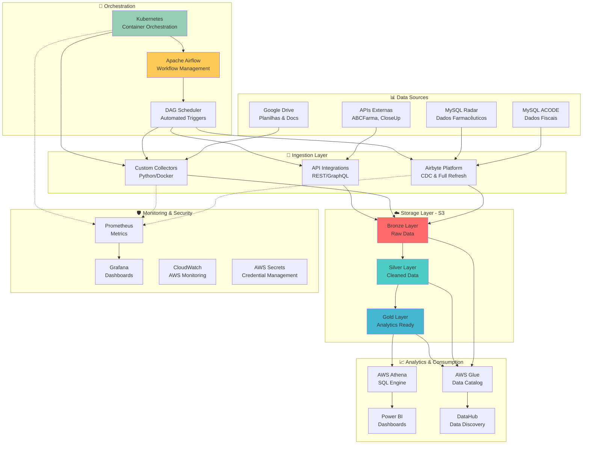
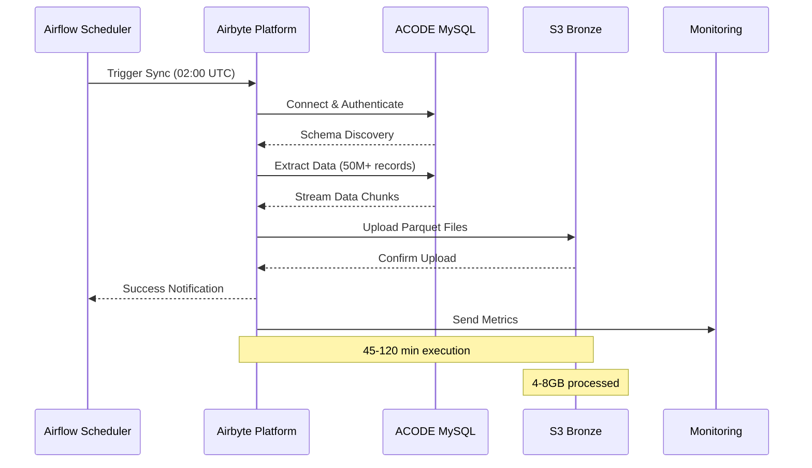
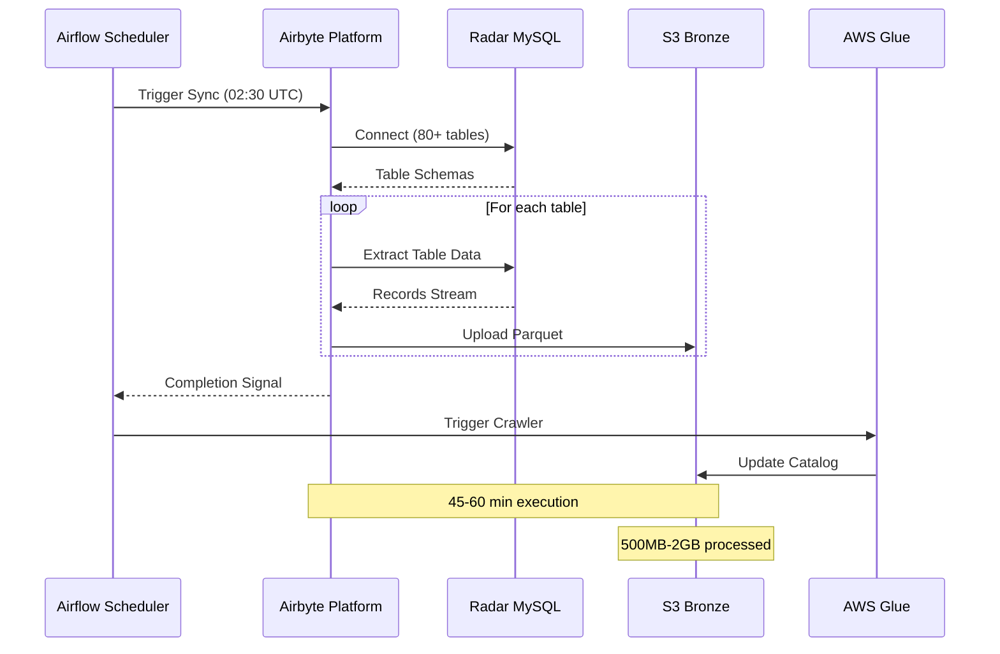

# 🏗️ Arquitetura Geral - Cognitivo Data Platform

## 📋 Visão Geral da Arquitetura

A Cognitivo Data Platform implementa uma arquitetura moderna de data lake multi-camadas, orquestrada por Kubernetes e Airflow, com foco em alta disponibilidade, escalabilidade e observabilidade.



## 🏛️ Camadas da Arquitetura

### **1. Data Sources Layer**

#### Sistemas Críticos
| Sistema | Tipo | Volume/Dia | Criticidade | SLA |
|---------|------|------------|-------------|-----|
| ACODE | MySQL | 50M+ registros | 🔴 Crítica | 99.9% |
| Radar | MySQL | 1M+ registros | 🟡 Alta | 99.5% |
| Google Drive | Files | 200+ arquivos | 🟢 Média | 99.0% |
| ABCFarma | API | Variável | 🟡 Alta | 95.0% |

#### Características por Source
```yaml
ACODE:
  host: "db-hsp-farmarcas.acode.com.br"
  type: "External Partner Database"
  access_pattern: "Full Refresh Daily"
  data_types: "Transactional, Fiscal"
  
Radar:
  host: "db-mysql-radar-production"  
  type: "Internal MySQL Cluster"
  access_pattern: "CDC + Full Refresh"
  data_types: "Operational, Analytics"
  
Google_Drive:
  platform: "Google Cloud"
  type: "File Storage"
  access_pattern: "Scheduled Collection"
  data_types: "Documents, Spreadsheets"
```

### **2. Ingestion Layer**

#### Airbyte Platform
```yaml
Version: "0.3.23"
Deployment: "Kubernetes Native"
Connectors:
  - source-mysql: "v1.0.21"
  - destination-s3: "v0.3.23"
  - source-google-drive: "custom"

Resource_Allocation:
  CPU: "2-4 cores per sync"
  Memory: "4-8Gi per sync"
  Storage: "100Gi ephemeral"
  
Connections:
  - connection_mysql_s3_acode
  - connection_mysql_s3_radar
  - connection_gdrive_s3
```

#### Custom Collectors
```yaml
Google_Drive_Collector:
  language: "Python 3.10"
  framework: "FastAPI + Pandas"
  container: "Docker Alpine"
  
QSA_Collector:
  language: "Python 3.10"
  framework: "Selenium + Pandas"
  container: "Docker with Chrome"
  
WebService_Collector:
  language: "Python 3.10"
  framework: "Requests + Pandas"
  container: "Docker Alpine"
```

### **3. Storage Layer (AWS S3)**

#### Data Lake Structure
```
s3://farmarcas-production-bronze/    # Raw ingested data
├── origin=airbyte/database=bronze_acode/
├── origin=airbyte/database=bronze_radar/
├── origin=eks/database=bronze_gdrive/
└── origin=eks/database=bronze_abcfarma/

s3://farmarcas-production-silver/    # Cleaned & validated data  
├── warehouse/acode/
├── warehouse/radar/
└── warehouse/gdrive/

s3://farmarcas-production-gold/      # Analytics-ready data
├── datamart/financial/
├── datamart/operational/
└── datamart/commercial/
```

#### Partitioning Strategy
```yaml
Bronze_Layer:
  partition_field: "cog_dt_ingestion"
  granularity: "daily"
  format: "YYYY-MM-DD"
  
Silver_Layer:
  partition_fields: ["year", "month", "source"]
  granularity: "monthly"
  
Gold_Layer:
  partition_fields: ["year", "month", "domain"]
  granularity: "monthly"
```

### **4. Orchestration Layer**

#### Apache Airflow
```yaml
Version: "2.5.1"
Executor: "KubernetesExecutor"
Scheduler:
  - DAG Processing: "Every 30s"
  - Task Instance Limit: 50
  - Max Active Runs: 10

DAG_Categories:
  ingestion: "14 DAGs"
  transformation: "8 DAGs"  
  quality: "5 DAGs"
  maintenance: "3 DAGs"

Resource_Management:
  CPU_Request: "1.0 core"
  CPU_Limit: "2.0 cores"
  Memory_Request: "2Gi"
  Memory_Limit: "4Gi"
```

#### Kubernetes Cluster
```yaml
Cluster_Specs:
  Provider: "AWS EKS"
  Version: "1.24"
  Node_Groups:
    - name: "airflow-workers"
      instance_type: "m5.xlarge"
      min_size: 2
      max_size: 10
    - name: "data-collectors"  
      instance_type: "c5.2xlarge"
      min_size: 1
      max_size: 5

Namespaces:
  - plataforma: "Airflow & Core Services"
  - collectors: "Data Collection Pods"
  - monitoring: "Observability Stack"
```

## 🔄 Fluxos de Dados Principais

### **Pipeline ACODE (Crítico)**


### **Pipeline Radar (Alto Volume)**


## 📊 Padrões de Arquitetura

### **Data Governance**

#### Schema Evolution
```yaml
Schema_Management:
  Bronze: "Schema-on-read"
  Silver: "Schema validation & evolution"
  Gold: "Strict schema enforcement"
  
Versioning:
  Strategy: "Backward compatible"
  Tools: "Confluent Schema Registry"
  Validation: "Great Expectations"
```

#### Data Quality
```yaml
Quality_Gates:
  Bronze: "Format validation"
  Silver: "Business rules validation"  
  Gold: "Completeness & accuracy checks"
  
Tools:
  - Soda Core: "SQL-based quality checks"
  - Great Expectations: "Python data validation"
  - Custom validators: "Business logic checks"
```

### **Security Architecture**

#### Authentication & Authorization
```yaml
Identity_Management:
  AWS_IAM: "Role-based access control"
  Service_Accounts: "Kubernetes RBAC"
  API_Keys: "Rotated every 90 days"
  
Data_Access:
  Encryption_at_Rest: "AES-256"
  Encryption_in_Transit: "TLS 1.3"
  Network_Security: "VPC + Security Groups"
```

#### Credential Management
```yaml
Secrets_Management:
  Provider: "AWS Secrets Manager"
  Rotation: "Automated every 90 days"
  Access_Control: "Least privilege principle"
  
Environment_Separation:
  Development: "Isolated AWS account"
  Staging: "Shared account, separate VPC"
  Production: "Dedicated account + VPC"
```

## 🚀 Escalabilidade e Performance

### **Auto-Scaling Configuration**

#### Horizontal Pod Autoscaler
```yaml
HPA_Config:
  airflow_workers:
    min_replicas: 2
    max_replicas: 10
    cpu_threshold: 70%
    
  data_collectors:
    min_replicas: 1
    max_replicas: 5
    memory_threshold: 80%
```

#### Vertical Pod Autoscaler
```yaml
VPA_Config:
  recommendation_mode: "Auto"
  update_mode: "Initial"
  resource_policy:
    cpu_min: "100m"
    cpu_max: "4000m"
    memory_min: "256Mi"
    memory_max: "8Gi"
```

### **Performance Optimizations**

#### S3 Optimization
```yaml
Storage_Class: "S3 Standard"
Lifecycle_Rules:
  - Bronze: "30 days → IA, 90 days → Glacier"
  - Silver: "60 days → IA, 180 days → Glacier"
  - Gold: "Permanent Standard"
  
Transfer_Acceleration: "Enabled"
Multipart_Upload: "Auto (>100MB files)"
```

#### Database Connections
```yaml
Connection_Pooling:
  max_connections: 20
  pool_timeout: 30
  pool_recycle: 3600
  
Query_Optimization:
  read_replicas: "Preferred for analytics"
  connection_caching: "Enabled"
  prepared_statements: "Used where possible"
```

---

## 📈 Métricas e SLAs

### **Performance Targets**
| Métrica | Target | Atual | Trend |
|---------|--------|-------|-------|
| ACODE Sync Time | < 2h | 1.5h | ↗️ |
| Radar Sync Time | < 1h | 45min | → |
| Data Freshness | < 4h | 2.5h | ↗️ |
| Error Rate | < 1% | 0.3% | ↘️ |

### **Availability SLAs**
- **ACODE Pipeline**: 99.9% (RTO: 2h, RPO: 1h)
- **Radar Pipeline**: 99.5% (RTO: 4h, RPO: 2h)
- **Google Drive**: 99.0% (RTO: 8h, RPO: 24h)

---

**Próximo**: [Configuração Detalhada](./configuracao.md)
