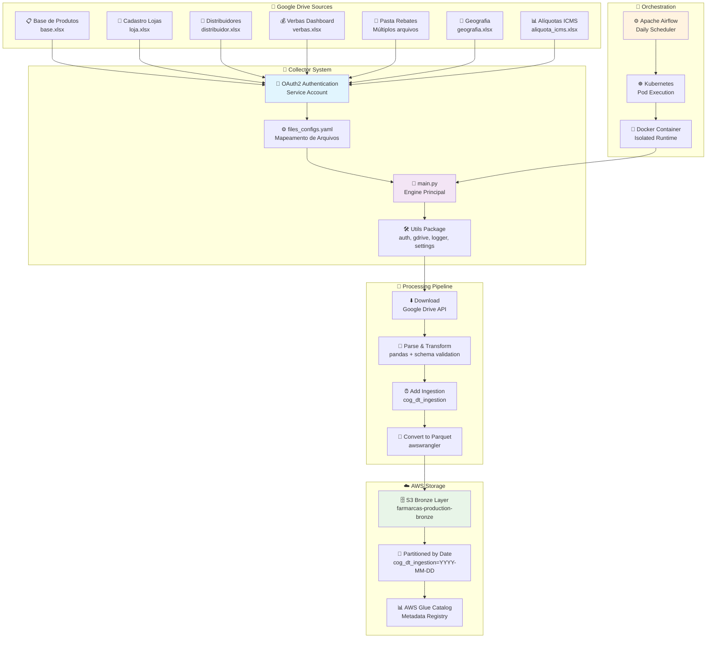

# 📁 Sistema de Ingestão Google Drive

[](../../README.md)
[](./boas_praticas.md)
[](./fluxo_ingestao.md)
[](./dag_e_execucao.md)

## 📋 Descrição

O **Google Drive Collector** é um sistema automatizado de ingestão de dados que realiza a coleta programática de arquivos do Google Drive para o data lake S3 da Farmarcas. Esta solução permite processar automaticamente planilhas Excel, arquivos CSV e outros documentos críticos do negócio, transformando-os em dados estruturados para análise de business intelligence.

A arquitetura containerizada executa via Kubernetes/Airflow, suportando múltiplos formatos de arquivo com schema customizável e processamento diário orquestrado, garantindo disponibilidade e integridade dos dados coletados para análises estratégicas da organização.

## 🚀 Quick Start

### Instalação
```bash
# Clone o repositório
git clone <repository-url>
cd gdrive-collector

# Configure as credenciais Google
export GOOGLE_CREDENTIALS_PATH="/path/to/service-account.json"
export GOOGLE_DRIVE_FOLDER_ID="<folder_id>"

# Configure AWS
export AWS_PROFILE="farmarcas-production"

# Verifique conectividade
./scripts/gdrive-health-check.sh
```

### Uso Básico
```bash
# Configurar autenticação Google Drive
./scripts/gdrive-setup-auth.sh

# Testar conectividade
./scripts/gdrive-test-connection.sh

# Executar coleta manual
./scripts/gdrive-collect.sh

# Verificar dados coletados
./scripts/gdrive-validate-s3.sh
```

## ✨ Principais Funcionalidades

- 📊 **Base de Produtos**: Catálogo farmacêutico com EAN, NCM e laboratórios
- 🏪 **Rede de Lojas**: CNPJ, localização e status operacional
- 🚚 **Distribuidores**: Configurações comerciais e regras de distribuição
- 💰 **Verbas e Rebates**: Incentivos e pagamentos estruturados
- 📍 **Geografia**: Divisões territoriais e hierarquias regionais
- 📈 **Alíquotas ICMS**: Dados fiscais por estado e produto
- 🔄 **Processamento Multi-formato**: Excel, CSV com schema validation
- ⚡ **Execução Containerizada**: Docker + Kubernetes para escalabilidade

## 🏗️ Arquitetura Técnica



## 📚 Documentação Completa

Para informações detalhadas, consulte nossa **documentação especializada**:

### 🔄 **[Fluxo de Ingestão](./fluxo_ingestao.md)**
- Processo completo passo a passo
- Fluxo de dados detalhado  
- Tratamento de múltiplas abas
- Processamento de pastas (Rebates)
- Pipeline de transformação

### ⚙️ **[Pré-requisitos](./pre_requisitos.md)**
- Autenticação Google Drive API
- Configuração Service Account
- Permissões AWS necessárias
- Variáveis de ambiente
- Dependências Python

### 📄 **[files_configs.yaml](./files_config_yaml.md)**
- Estrutura completa do arquivo
- Exemplos de configuração
- Schemas de dados
- Configuração de pastas
- Validações e tipos

### 🚀 **[DAG e Execução](./dag_e_execucao.md)**
- Integração com Airflow
- Configuração Kubernetes
- Scripts de execução
- Monitoramento e logs
- Deploy automatizado

### ⚠️ **[Erros Comuns](./erros_comuns.md)**
- Problemas de autenticação
- Falhas de download
- Erros de schema
- Issues de upload S3
- Troubleshooting completo

### 💡 **[Boas Práticas](./boas_praticas.md)**
- Configuração segura
- Otimização de performance
- Monitoramento efetivo
- Manutenção preventiva
- Desenvolvimento e testes

### 📊 **[Diagramas de Fluxo](./diagrama_fluxo.md)**
- Arquitetura visual
- Sequência de execução
- Fluxos de dados
- Interações entre componentes
- Cenários de falha

---

## 🎯 Importância Estratégica

### **Dados Críticos Coletados:**
- 📊 **Base de Produtos**: Catálogo farmacêutico com EAN, NCM, laboratórios
- 🏪 **Rede de Lojas**: CNPJ, razão social, localização e status
- 🚚 **Distribuidores**: Configurações de distribuição e regras comerciais
- 💰 **Verbas e Rebates**: Informações de incentivos e pagamentos
- 📍 **Geografia**: Divisões territoriais e hierarquias regionais
- 📈 **Alíquotas ICMS**: Dados fiscais por estado e produto

### **Casos de Uso de Negócio:**
- **Analytics de Vendas**: Análise de performance por região/produto
- **Compliance Fiscal**: Cálculos de impostos e obrigações
- **Gestão Comercial**: Monitoramento de redes e distribuidores
- **Business Intelligence**: Dashboards executivos e operacionais
- **Reconciliação Financeira**: Validação de verbas e pagamentos

## 📊 Dados Processados

### **Volumes Típicos (Produção)**
- **Arquivos processados**: ~10-15 por execução
- **Volume de dados**: 2-5 MB total por dia
- **Registros**: ~50K-100K linhas consolidadas
- **Tempo execução**: 5-10 minutos

### **Estrutura S3 Resultante**
```
s3://farmarcas-production-bronze/origin=eks/
└── database=bronze_gdrive/
    ├── base/cog_dt_ingestion=2025-08-07/base.parquet
    ├── loja/cog_dt_ingestion=2025-08-07/loja.parquet
    ├── distribuidor/cog_dt_ingestion=2025-08-07/distribuidor.parquet
    ├── verbas_base_industria/cog_dt_ingestion=2025-08-07/verbas.parquet
    ├── rebates_template/cog_dt_ingestion=2025-08-07/rebates_template.parquet
    └── geografia/cog_dt_ingestion=2025-08-07/geografia.parquet
```

---

## 🔧 Suporte e Manutenção

- **Equipe**: Data Engineering Farmarcas
- **SLA**: Execução diária com retry automático
- **Monitoramento**: CloudWatch + Airflow UI
- **Alertas**: Slack notifications em caso de falha

**Última atualização**: 07/08/2025
