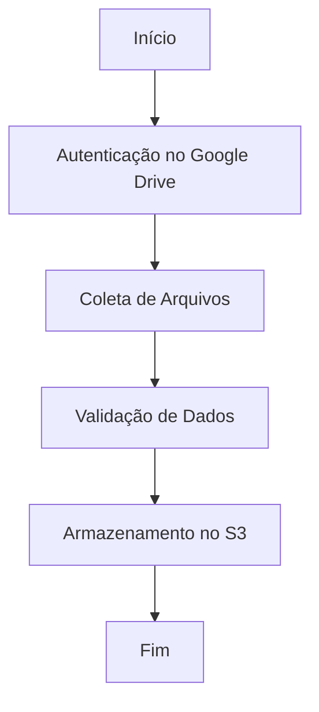

# Diagrama de Fluxo

Este documento apresenta o diagrama de fluxo para o projeto Collector Google Drive. O diagrama ilustra os principais componentes e etapas do processo de coleta e armazenamento de dados.

## Fluxo Geral

## Descrição das Etapas

1. **Início**: O processo é iniciado manualmente ou por meio de um trigger automatizado.
2. **Autenticação no Google Drive**: O sistema autentica usando credenciais configuradas.
3. **Coleta de Arquivos**: Os arquivos são coletados do Google Drive com base nos critérios definidos.
4. **Validação de Dados**: Os dados coletados são validados para garantir integridade e conformidade.
5. **Armazenamento no S3**: Os dados validados são armazenados no bucket S3 configurado.
6. **Fim**: O processo é concluído e os logs são gerados para auditoria.

## Observações

- Certifique-se de que as credenciais do Google Drive estejam atualizadas.
- Verifique os logs para identificar possíveis erros durante o processo.
- O bucket S3 deve estar configurado com as permissões corretas para escrita.
