# ⚠️ Erros Comuns - Google Drive Collector

## 📋 Visão Geral

Este documento cataloga os erros mais frequentes encontrados durante a execução do Google Drive Collector, suas causas raiz e soluções detalhadas. Utilizado para troubleshooting rápido e resolução de problemas em produção.

### **Categorias de Erros**

```mermaid
mindmap
  root((Erros Comuns))
    [🔐 Autenticação]
      Service Account
      Google Drive API
      Permissões
    [☁️ AWS]
      S3 Access
      IAM Roles
      Rate Limits
    [📊 Processamento]
      Schema Validation
      File Format
      Memory Issues
    [🌐 Conectividade]
      Network Timeout
      DNS Resolution
      Rate Limiting
    [⚙️ Configuração]
      files_configs.yaml
      Environment Variables
      Docker/K8s
```


---

## 🔐 1. Erros de Autenticação

### **1.1 Google Drive API - 403 Forbidden**

#### **Erro Típico:**
```
google.auth.exceptions.RefreshError: ('invalid_grant: Token has been expired or revoked.', {'error': 'invalid_grant', 'error_description': 'Token has been expired or revoked.'})

HTTPError 403: Forbidden
{
  "error": {
    "code": 403,
    "message": "Insufficient Permission: Request had insufficient authentication scopes.",
    "errors": [
      {
        "message": "Insufficient Permission",
        "domain": "global",
        "reason": "insufficientPermissions"
      }
    ]
  }
}
```

#### **Causas Possíveis:**
1. **Service Account sem acesso à pasta**
2. **Credenciais inválidas ou expiradas**
3. **Scopes insuficientes**
4. **Arquivo/pasta movido ou deletado**

#### **Soluções:**

**1. Verificar Compartilhamento da Pasta**
```bash
# 1. Acesse o Google Drive no navegador
# 2. Localize a pasta com erro
# 3. Clique com botão direito > "Compartilhar"
# 4. Verifique se o email do Service Account está na lista:
#    gdrive-collector@farmarcas-data-platform.iam.gserviceaccount.com
# 5. Permissão deve ser "Viewer" ou superior

# Script para testar acesso
python3 << EOF
from google.oauth2 import service_account
from googleapiclient.discovery import build

# Carregar credenciais
credentials = service_account.Credentials.from_service_account_file(
    'google_service_account.json',
    scopes=['https://www.googleapis.com/auth/drive.readonly']
)

# Testar acesso
service = build('drive', 'v3', credentials=credentials)

# Testar pasta específica (substitua pelo ID real)
folder_id = "1BxiMVs0XRA5nFMdKvBdBZjgmUUqptlbs74OgvE2upms"

try:
    folder_info = service.files().get(fileId=folder_id).execute()
    print(f"✅ Acesso OK: {folder_info['name']}")
except Exception as e:
    print(f"❌ Erro de acesso: {e}")
EOF
```

**2. Regenerar Credenciais Service Account**
```bash
# Via gcloud CLI
gcloud iam service-accounts keys create new_key.json \
    --iam-account=gdrive-collector@farmarcas-data-platform.iam.gserviceaccount.com \
    --project=farmarcas-data-platform

# Atualizar secret no Kubernetes
kubectl delete secret google-service-account -n data-platform
kubectl create secret generic google-service-account \
    --from-file=google_service_account.json=new_key.json \
    -n data-platform
```

**3. Verificar Scopes**
```python
# Verificar se scopes estão corretos
required_scopes = ['https://www.googleapis.com/auth/drive.readonly']

# No código do collector, verificar:
credentials = service_account.Credentials.from_service_account_file(
    credentials_file,
    scopes=required_scopes  # ← Deve estar presente
)
```

### **1.2 AWS IAM - AccessDenied**

#### **Erro Típico:**
```
botocore.exceptions.ClientError: An error occurred (AccessDenied) when calling the PutObject operation: Access Denied

botocore.exceptions.NoCredentialsError: Unable to locate credentials
```

#### **Causas e Soluções:**

**1. IAM Role não associado ao Service Account**
```bash
# Verificar associação
kubectl describe serviceaccount gdrive-collector -n data-platform

# Deve mostrar annotation:
# eks.amazonaws.com/role-arn: arn:aws:iam::123456789012:role/gdrive-collector-role

# Corrigir se necessário
kubectl annotate serviceaccount gdrive-collector \
    -n data-platform \
    eks.amazonaws.com/role-arn=arn:aws:iam::123456789012:role/gdrive-collector-role
```

**2. Política IAM insuficiente**
```json
{
  "Version": "2012-10-17",
  "Statement": [
    {
      "Sid": "S3BronzeLayerAccess",
      "Effect": "Allow",
      "Action": [
        "s3:PutObject",
        "s3:PutObjectAcl",
        "s3:GetObject",
        "s3:DeleteObject",
        "s3:ListBucket"
      ],
      "Resource": [
        "arn:aws:s3:::farmarcas-production-bronze",
        "arn:aws:s3:::farmarcas-production-bronze/*"
      ]
    },
    {
      "Sid": "CloudWatchLogsAccess",
      "Effect": "Allow",
      "Action": [
        "logs:CreateLogGroup",
        "logs:CreateLogStream",
        "logs:PutLogEvents"
      ],
      "Resource": "arn:aws:logs:us-east-2:*:log-group:/aws/fargate/gdrive-collector*"
    }
  ]
}
```

**3. Testar credenciais AWS**
```bash
# Teste dentro do pod
kubectl run aws-test --rm -it \
    --image=amazon/aws-cli:latest \
    --serviceaccount=gdrive-collector \
    -n data-platform \
    -- sts get-caller-identity

# Deve retornar:
# {
#     "UserId": "AROAXXXXX:botocore-session-1234567890",
#     "Account": "123456789012",
#     "Arn": "arn:aws:sts::123456789012:assumed-role/gdrive-collector-role/botocore-session-1234567890"
# }
```

---

## 📊 2. Erros de Processamento

### **2.1 Schema Validation Failed**

#### **Erro Típico:**
```
ValueError: DataFrame tem apenas 50 linhas (mínimo: 1000)

KeyError: 'ean_codigo' - Coluna obrigatória ausente

ValidationError: EAN deve ter exatamente 13 dígitos: '123456789012' (12 dígitos)
```

#### **Soluções:**

**1. Coluna Obrigatória Ausente**
```python
# Verificar colunas disponíveis
import pandas as pd

df = pd.read_excel("arquivo_problema.xlsx")
print("Colunas disponíveis:", df.columns.tolist())

# Ajustar files_configs.yaml
schema:
  column_mapping:
    # Mapeamento correto baseado nas colunas reais
    "CÓDIGO EAN": "ean_codigo"  # ← Verificar nome exato
    "EAN-13": "ean_codigo"      # ← Ou variação
    "Código de Barras": "ean_codigo"  # ← Ou outro nome
```

**2. Validação de Formato Falha**
```yaml
# Relaxar validação temporariamente
schema:
  validation:
    format_checks:
      ean_codigo:
        pattern: "^[0-9]{12,13}$"  # ← Aceitar 12 ou 13 dígitos
        message: "EAN deve ter 12 ou 13 dígitos"
    
    # Ou remover validação específica
    # format_checks: {}  # ← Comentar temporariamente
```

**3. Quantidade Insuficiente de Registros**
```yaml
# Ajustar limite mínimo
schema:
  validation:
    min_rows: 10  # ← Reduzir temporariamente de 1000 para 10
    required_columns: ["ean_codigo"]  # ← Manter apenas essenciais
```

### **2.2 Memory Error - Arquivo Muito Grande**

#### **Erro Típico:**
```
MemoryError: Unable to allocate 2.5 GiB for an array with shape (100000, 50) and data type object

pandas.errors.OutOfMemoryError: out of memory
```

#### **Soluções:**

**1. Processamento em Chunks**
```python
# No collector, modificar para chunked processing
def process_large_excel(file_content, chunk_size=5000):
    """
    Processa Excel grande em chunks
    """
    
    # Salvar temporariamente
    with tempfile.NamedTemporaryFile(suffix='.xlsx') as temp_file:
        temp_file.write(file_content)
        temp_file.flush()
        
        # Ler em chunks
        chunks = []
        for chunk in pd.read_excel(temp_file.name, chunksize=chunk_size):
            # Processar chunk individual
            processed_chunk = process_dataframe(chunk, config)
            chunks.append(processed_chunk)
        
        # Consolidar
        return pd.concat(chunks, ignore_index=True)
```

**2. Aumentar Recursos Kubernetes**
```yaml
# Na DAG Airflow, aumentar resources
resources:
  requests:
    memory: "1Gi"      # ← Era 512Mi
    cpu: "0.5"
  limits:
    memory: "4Gi"      # ← Era 1Gi  
    cpu: "2"           # ← Era 1
```

**3. Otimizar Tipos de Dados**
```python
# Otimizar dtype do pandas
def optimize_dtypes(df):
    """
    Otimiza tipos de dados para economizar memória
    """
    
    for col in df.columns:
        if df[col].dtype == 'object':
            # Tentar converter para categoria se poucos valores únicos
            if df[col].nunique() / len(df) < 0.5:
                df[col] = df[col].astype('category')
        
        elif df[col].dtype == 'int64':
            # Usar int32 se possível
            if df[col].min() >= -2147483648 and df[col].max() <= 2147483647:
                df[col] = df[col].astype('int32')
        
        elif df[col].dtype == 'float64':
            # Usar float32 se precisão suficiente
            df[col] = pd.to_numeric(df[col], downcast='float')
    
    return df
```

### **2.3 Excel File Corrupted**

#### **Erro Típico:**
```
xlrd.biffh.XLRDError: Excel xlsx file; not supported

BadZipFile: File is not a zip file

openpyxl.utils.exceptions.InvalidFileException: openpyxl does not support the old .xls file format
```

#### **Soluções:**

**1. Fallback entre Engines**
```python
def robust_excel_reader(file_content, sheet_name=None):
    """
    Leitura robusta de Excel com múltiplos fallbacks
    """
    
    engines = ['openpyxl', 'xlrd', 'calamine']
    
    for engine in engines:
        try:
            with io.BytesIO(file_content) as buffer:
                df = pd.read_excel(
                    buffer, 
                    sheet_name=sheet_name,
                    engine=engine
                )
                
                logger.info(f"✅ Arquivo lido com engine: {engine}")
                return df
                
        except Exception as e:
            logger.warning(f"⚠️ Falha com {engine}: {str(e)}")
            continue
    
    # Se todos os engines falharam
    raise ValueError("Arquivo Excel não pode ser lido com nenhum engine disponível")
```

**2. Validação de Arquivo**
```python
def validate_excel_file(file_content):
    """
    Valida se arquivo é realmente Excel válido
    """
    
    # Verificar magic bytes
    if file_content.startswith(b'PK\x03\x04'):
        logger.info("✅ Arquivo detectado como ZIP/XLSX")
        return True
    elif file_content.startswith(b'\xd0\xcf\x11\xe0'):
        logger.info("✅ Arquivo detectado como OLE/XLS")
        return True
    else:
        logger.error("❌ Arquivo não é Excel válido")
        return False
```

---

## ☁️ 3. Erros AWS

### **3.1 S3 Upload Failed**

#### **Erro Típico:**
```
botocore.exceptions.ClientError: An error occurred (SlowDown) when calling the PutObject operation: Please reduce your request rate

ClientError: An error occurred (RequestTimeout) when calling the PutObject operation: Your socket connection to the server was not read from or written to within the timeout period

NoSuchBucket: The specified bucket does not exist
```

#### **Soluções:**

**1. Rate Limiting S3**
```python
import time
import random
from botocore.exceptions import ClientError

def upload_with_retry(s3_client, bucket, key, data, max_retries=5):
    """
    Upload S3 com retry e backoff exponencial
    """
    
    for attempt in range(max_retries):
        try:
            s3_client.put_object(
                Bucket=bucket,
                Key=key,
                Body=data,
                ServerSideEncryption='AES256'
            )
            
            logger.info(f"✅ Upload S3 sucesso: s3://{bucket}/{key}")
            return True
            
        except ClientError as e:
            error_code = e.response['Error']['Code']
            
            if error_code == 'SlowDown':
                # Rate limiting - aguardar mais tempo
                wait_time = (2 ** attempt) + random.uniform(0, 1)
                logger.warning(f"⚠️ Rate limit S3 - aguardando {wait_time:.1f}s")
                time.sleep(wait_time)
                
            elif error_code in ['RequestTimeout', 'ServiceUnavailable']:
                # Timeout - retry com backoff
                wait_time = 2 ** attempt
                logger.warning(f"⚠️ Timeout S3 - retry em {wait_time}s")
                time.sleep(wait_time)
                
            else:
                # Erro não recuperável
                logger.error(f"❌ Erro S3 não recuperável: {error_code}")
                raise
                
    raise Exception(f"Upload S3 falhou após {max_retries} tentativas")
```

**2. Verificar Bucket Existe**
```bash
# Verificar se bucket existe
aws s3 ls s3://farmarcas-production-bronze/

# Se não existir, criar (apenas desenvolvimento)
aws s3 mb s3://farmarcas-development-bronze --region us-east-2

# Verificar política do bucket
aws s3api get-bucket-policy --bucket farmarcas-production-bronze
```

**3. Multipart Upload para Arquivos Grandes**
```python
def upload_large_file(s3_client, bucket, key, data):
    """
    Upload otimizado para arquivos grandes
    """
    
    file_size = len(data)
    
    # Usar multipart se > 100MB
    if file_size > 100 * 1024 * 1024:
        
        # Iniciar multipart upload
        response = s3_client.create_multipart_upload(
            Bucket=bucket,
            Key=key,
            ServerSideEncryption='AES256'
        )
        
        upload_id = response['UploadId']
        parts = []
        
        try:
            # Upload em partes de 10MB
            part_size = 10 * 1024 * 1024
            part_number = 1
            
            for i in range(0, file_size, part_size):
                part_data = data[i:i + part_size]
                
                part_response = s3_client.upload_part(
                    Bucket=bucket,
                    Key=key,
                    PartNumber=part_number,
                    UploadId=upload_id,
                    Body=part_data
                )
                
                parts.append({
                    'ETag': part_response['ETag'],
                    'PartNumber': part_number
                })
                
                part_number += 1
            
            # Completar multipart upload
            s3_client.complete_multipart_upload(
                Bucket=bucket,
                Key=key,
                UploadId=upload_id,
                MultipartUpload={'Parts': parts}
            )
            
        except Exception as e:
            # Abortar upload em caso de erro
            s3_client.abort_multipart_upload(
                Bucket=bucket,
                Key=key,
                UploadId=upload_id
            )
            raise
    
    else:
        # Upload simples para arquivos pequenos
        s3_client.put_object(
            Bucket=bucket,
            Key=key,
            Body=data,
            ServerSideEncryption='AES256'
        )
```

### **3.2 CloudWatch Logs Error**

#### **Erro Típico:**
```
botocore.exceptions.ClientError: An error occurred (ResourceNotFoundException) when calling the PutLogEvents operation: The specified log group does not exist

InvalidSequenceTokenException: The given sequenceToken is invalid
```

#### **Soluções:**

**1. Criar Log Group Automaticamente**
```python
import boto3
from botocore.exceptions import ClientError

def ensure_log_group_exists(log_group_name):
    """
    Garante que log group existe
    """
    
    logs_client = boto3.client('logs')
    
    try:
        logs_client.describe_log_groups(
            logGroupNamePrefix=log_group_name
        )
        logger.info(f"✅ Log group existe: {log_group_name}")
        
    except ClientError:
        # Criar log group
        try:
            logs_client.create_log_group(
                logGroupName=log_group_name,
                tags={
                    'Application': 'gdrive-collector',
                    'Environment': 'production'
                }
            )
            
            # Definir retenção (30 dias)
            logs_client.put_retention_policy(
                logGroupName=log_group_name,
                retentionInDays=30
            )
            
            logger.info(f"✅ Log group criado: {log_group_name}")
            
        except ClientError as e:
            logger.error(f"❌ Erro ao criar log group: {e}")
```

---

## 🌐 4. Erros de Conectividade

### **4.1 Network Timeout**

#### **Erro Típico:**
```
requests.exceptions.ReadTimeout: HTTPSConnectionPool(host='www.googleapis.com', port=443): Read timed out. (read timeout=60)

URLError: <urlopen error [Errno 110] Connection timed out>
```

#### **Soluções:**

**1. Configurar Timeouts Adequados**
```python
import requests
from googleapiclient.discovery import build
from googleapiclient.http import build_http

def create_resilient_service():
    """
    Cria service Google Drive com timeouts otimizados
    """
    
    # Configurar HTTP client com timeouts
    http = build_http()
    http.timeout = 300  # 5 minutos
    
    # Configurar retry automático
    from google.auth.transport.requests import Request
    from google.oauth2 import service_account
    
    credentials = service_account.Credentials.from_service_account_file(
        'credentials.json',
        scopes=['https://www.googleapis.com/auth/drive.readonly']
    )
    
    # Service com timeout customizado
    service = build(
        'drive', 
        'v3', 
        credentials=credentials,
        http=http
    )
    
    return service
```

**2. Implementar Circuit Breaker**
```python
import time
from functools import wraps

class CircuitBreaker:
    def __init__(self, failure_threshold=5, recovery_timeout=60):
        self.failure_threshold = failure_threshold
        self.recovery_timeout = recovery_timeout
        self.failure_count = 0
        self.last_failure_time = None
        self.state = 'CLOSED'  # CLOSED, OPEN, HALF_OPEN
    
    def call(self, func):
        @wraps(func)
        def wrapper(*args, **kwargs):
            if self.state == 'OPEN':
                if time.time() - self.last_failure_time < self.recovery_timeout:
                    raise Exception("Circuit breaker is OPEN")
                else:
                    self.state = 'HALF_OPEN'
            
            try:
                result = func(*args, **kwargs)
                
                if self.state == 'HALF_OPEN':
                    self.state = 'CLOSED'
                    self.failure_count = 0
                
                return result
                
            except Exception as e:
                self.failure_count += 1
                self.last_failure_time = time.time()
                
                if self.failure_count >= self.failure_threshold:
                    self.state = 'OPEN'
                
                raise
        
        return wrapper

# Uso
breaker = CircuitBreaker()

@breaker.call
def download_file_from_drive(service, file_id):
    return service.files().get_media(fileId=file_id).execute()
```

### **4.2 DNS Resolution Failed**

#### **Erro Típico:**
```
socket.gaierror: [Errno -2] Name or service not known

DNSLookupError: Failed to resolve 'www.googleapis.com'
```

#### **Soluções:**

**1. Verificar DNS no Pod**
```bash
# Testar DNS dentro do pod
kubectl run dns-test --rm -it --image=busybox -n data-platform -- nslookup www.googleapis.com

# Deve retornar:
# Server:		10.100.0.10
# Address:	10.100.0.10:53
# 
# Non-authoritative answer:
# Name:	www.googleapis.com
# Address: 142.250.191.106

# Se falhar, verificar CoreDNS
kubectl get pods -n kube-system -l k8s-app=kube-dns
```

**2. Configurar DNS customizado**
```yaml
# Pod spec com DNS customizado
apiVersion: v1
kind: Pod
spec:
  dnsPolicy: "None"
  dnsConfig:
    nameservers:
      - 8.8.8.8
      - 8.8.4.4
    searches:
      - data-platform.svc.cluster.local
      - svc.cluster.local
      - cluster.local
    options:
      - name: ndots
        value: "2"
      - name: edns0
```

---

## ⚙️ 5. Erros de Configuração

### **5.1 files_configs.yaml Invalid**

#### **Erro Típico:**
```
yaml.scanner.ScannerError: while scanning for the next token found character '\t' that cannot start any token

KeyError: 'gdrive_file_id' - Configuração inválida

ValueError: table_name deve ser snake_case: 'Base-Produtos'
```

#### **Soluções:**

**1. Validar Syntax YAML**
```bash
# Validar syntax
python3 -c "import yaml; yaml.safe_load(open('files_configs.yaml'))"

# Ou usar yamllint
pip install yamllint
yamllint files_configs.yaml
```

**2. Validar Estrutura**
```python
def validate_config_structure(config):
    """
    Valida estrutura do files_configs.yaml
    """
    
    required_fields = ['name', 'table_name', 'datalake']
    
    for config_name, config_data in config.items():
        
        # Verificar campos obrigatórios
        missing_fields = [f for f in required_fields if f not in config_data]
        if missing_fields:
            raise ValueError(f"{config_name}: Campos obrigatórios ausentes: {missing_fields}")
        
        # Verificar tipo de config (file ou folder)
        has_file_id = 'gdrive_file_id' in config_data
        has_folder_id = 'gdrive_folder_id' in config_data
        
        if not has_file_id and not has_folder_id:
            raise ValueError(f"{config_name}: Deve ter 'gdrive_file_id' ou 'gdrive_folder_id'")
        
        # Validar table_name
        table_name = config_data['table_name']
        if not re.match(r'^[a-z0-9_]+$', table_name):
            raise ValueError(f"{config_name}: table_name deve ser snake_case: {table_name}")
        
        # Validar datalake config
        datalake = config_data['datalake']
        if 'bucket' not in datalake or 'database' not in datalake:
            raise ValueError(f"{config_name}: datalake deve ter 'bucket' e 'database'")
```

### **5.2 Environment Variables Missing**

#### **Erro Típico:**
```
KeyError: 'GOOGLE_APPLICATION_CREDENTIALS'

FileNotFoundError: [Errno 2] No such file or directory: 'None/google_service_account.json'
```

#### **Soluções:**

**1. Verificar Variáveis no Pod**
```bash
# Ver variáveis de ambiente no pod
kubectl exec -it <pod-name> -n data-platform -- env | grep -E "(GOOGLE|AWS|S3)"

# Deve mostrar:
# GOOGLE_APPLICATION_CREDENTIALS=/app/credentials/google_service_account.json
# AWS_DEFAULT_REGION=us-east-2
# S3_BUCKET_NAME=farmarcas-production-bronze
```

**2. Validar Secrets e ConfigMaps**
```bash
# Verificar secret
kubectl get secret google-service-account -n data-platform -o yaml

# Verificar se arquivo existe no pod
kubectl exec -it <pod-name> -n data-platform -- ls -la /app/credentials/

# Deve mostrar:
# -rw-r--r-- 1 collector collector 2334 Aug  7 10:30 google_service_account.json
```

**3. Fallback para Variáveis Ausentes**
```python
import os

def get_required_env_var(var_name, default=None):
    """
    Obtém variável de ambiente obrigatória com fallback
    """
    
    value = os.getenv(var_name, default)
    
    if not value:
        raise EnvironmentError(f"Variável de ambiente obrigatória não definida: {var_name}")
    
    return value

# Uso
try:
    credentials_path = get_required_env_var('GOOGLE_APPLICATION_CREDENTIALS')
    s3_bucket = get_required_env_var('S3_BUCKET_NAME', 'farmarcas-production-bronze')
    
except EnvironmentError as e:
    logger.error(f"❌ Configuração inválida: {e}")
    sys.exit(1)
```

---

## 🚨 6. Procedimentos de Emergência

### **6.1 Execução Manual de Emergência**

```bash
#!/bin/bash
# emergency_run.sh

echo "🚨 EXECUÇÃO MANUAL DE EMERGÊNCIA - Google Drive Collector"

# 1. Verificar pré-requisitos
echo "🔍 Verificando pré-requisitos..."

# AWS credentials
aws sts get-caller-identity || {
    echo "❌ Credenciais AWS inválidas"
    exit 1
}

# S3 bucket access
aws s3 ls s3://farmarcas-production-bronze/ || {
    echo "❌ Acesso S3 negado"
    exit 1
}

# Google credentials
if [ ! -f "google_service_account.json" ]; then
    echo "❌ Arquivo de credenciais Google não encontrado"
    exit 1
fi

# 2. Executar collector
echo "🚀 Executando collector..."

docker run --rm \
    -e GOOGLE_APPLICATION_CREDENTIALS=/app/credentials/google_service_account.json \
    -e AWS_ACCESS_KEY_ID=${AWS_ACCESS_KEY_ID} \
    -e AWS_SECRET_ACCESS_KEY=${AWS_SECRET_ACCESS_KEY} \
    -e AWS_DEFAULT_REGION=us-east-2 \
    -e S3_BUCKET_NAME=farmarcas-production-bronze \
    -e LOG_LEVEL=INFO \
    -v $(pwd)/google_service_account.json:/app/credentials/google_service_account.json:ro \
    -v $(pwd)/files_configs.yaml:/app/files_configs.yaml:ro \
    farmarcas/gdrive-collector:latest

# 3. Verificar resultados
echo "🔍 Verificando resultados..."

TODAY=$(date +%Y-%m-%d)
FILES_COUNT=$(aws s3 ls s3://farmarcas-production-bronze/origin=eks/database=bronze_gdrive/ --recursive | grep $TODAY | wc -l)

echo "📊 Arquivos processados hoje: $FILES_COUNT"

if [ $FILES_COUNT -gt 0 ]; then
    echo "✅ Execução de emergência bem-sucedida"
else
    echo "⚠️ Nenhum arquivo processado - verificar logs"
fi
```

### **6.2 Rollback de Versão**

```bash
#!/bin/bash
# rollback.sh

PREVIOUS_VERSION=${1:-"v1.0.0"}

echo "🔄 Fazendo rollback para versão: $PREVIOUS_VERSION"

# 1. Atualizar imagem no ECR
aws ecr batch-get-image \
    --repository-name farmarcas/gdrive-collector \
    --image-ids imageTag=$PREVIOUS_VERSION \
    --query 'images[0].imageManifest' \
    --output text | \
aws ecr put-image \
    --repository-name farmarcas/gdrive-collector \
    --image-tag latest \
    --image-manifest file:///dev/stdin

# 2. Forçar restart do próximo job Airflow
airflow dags trigger gdrive_collector --conf '{"force_restart": true}'

echo "✅ Rollback concluído para versão $PREVIOUS_VERSION"
```

### **6.3 Recuperação de Dados**

```bash
#!/bin/bash
# data_recovery.sh

RECOVERY_DATE=${1:-$(date +%Y-%m-%d)}

echo "📊 Recuperando dados para: $RECOVERY_DATE"

# 1. Verificar se dados existem
EXISTING_FILES=$(aws s3 ls s3://farmarcas-production-bronze/origin=eks/database=bronze_gdrive/ --recursive | grep $RECOVERY_DATE)

if [ -n "$EXISTING_FILES" ]; then
    echo "⚠️ Dados já existem para $RECOVERY_DATE:"
    echo "$EXISTING_FILES"
    
    read -p "Substituir dados existentes? [y/N]: " -n 1 -r
    echo
    
    if [[ ! $REPLY =~ ^[Yy]$ ]]; then
        echo "❌ Operação cancelada"
        exit 1
    fi
    
    # Backup dos dados existentes
    echo "💾 Fazendo backup dos dados existentes..."
    aws s3 sync \
        s3://farmarcas-production-bronze/origin=eks/database=bronze_gdrive/ \
        s3://farmarcas-backup-gdrive/recovery_backup/$RECOVERY_DATE/ \
        --exclude "*" \
        --include "*$RECOVERY_DATE*"
fi

# 2. Executar recuperação
echo "🔄 Executando recuperação de dados..."

# Forçar execução para data específica
airflow dags trigger gdrive_collector \
    --conf "{\"execution_date\": \"$RECOVERY_DATE\", \"force_reprocess\": true}"

echo "✅ Recuperação iniciada para $RECOVERY_DATE"
echo "🔍 Monitorar execução em: https://airflow.farmarcas.com"
```

---

## 📊 7. Monitoramento de Erros

### **7.1 Dashboard de Erros CloudWatch**

```json
{
  "widgets": [
    {
      "type": "log",
      "properties": {
        "query": "SOURCE '/aws/fargate/gdrive-collector'\n| fields @timestamp, @message\n| filter @message like /ERROR/\n| stats count() by bin(5m)\n| sort @timestamp desc",
        "region": "us-east-2",
        "title": "Error Rate (5min buckets)"
      }
    },
    {
      "type": "log",
      "properties": {
        "query": "SOURCE '/aws/fargate/gdrive-collector'\n| fields @timestamp, @message\n| filter @message like /403 Forbidden/\n| sort @timestamp desc\n| limit 20",
        "region": "us-east-2",
        "title": "Google Drive 403 Errors"
      }
    },
    {
      "type": "log",
      "properties": {
        "query": "SOURCE '/aws/fargate/gdrive-collector'\n| fields @timestamp, @message\n| filter @message like /AccessDenied/\n| sort @timestamp desc\n| limit 20",
        "region": "us-east-2",
        "title": "AWS Access Denied Errors"
      }
    }
  ]
}
```

### **7.2 Alertas Automáticos**

```python
# alerts.py
import boto3
import json

def create_error_alerts():
    """
    Cria alertas CloudWatch para erros do collector
    """
    
    cloudwatch = boto3.client('cloudwatch')
    
    # Alerta para taxa de erro alta
    cloudwatch.put_metric_alarm(
        AlarmName='GDriveCollector-HighErrorRate',
        ComparisonOperator='GreaterThanThreshold',
        EvaluationPeriods=2,
        MetricName='ErrorCount',
        Namespace='GDriveCollector',
        Period=300,  # 5 minutos
        Statistic='Sum',
        Threshold=5.0,  # Mais de 5 erros em 5 min
        ActionsEnabled=True,
        AlarmActions=[
            'arn:aws:sns:us-east-2:123456789012:data-platform-alerts'
        ],
        AlarmDescription='Google Drive Collector error rate is high',
        Unit='Count'
    )
    
    # Alerta para falhas de execução
    cloudwatch.put_metric_alarm(
        AlarmName='GDriveCollector-ExecutionFailure',
        ComparisonOperator='LessThanThreshold',
        EvaluationPeriods=1,
        MetricName='FilesProcessed',
        Namespace='GDriveCollector',
        Period=3600,  # 1 hora
        Statistic='Sum',
        Threshold=1.0,  # Menos de 1 arquivo processado
        ActionsEnabled=True,
        AlarmActions=[
            'arn:aws:sns:us-east-2:123456789012:data-platform-alerts'
        ],
        AlarmDescription='Google Drive Collector processed no files',
        Unit='Count'
    )
```

---

## 📋 8. Checklist de Troubleshooting

### **Problema: Execução Falhando**
```bash
🔍 DIAGNÓSTICO:
□ Verificar logs CloudWatch últimas 24h
□ Verificar status da DAG no Airflow
□ Verificar recursos Kubernetes (CPU/Memory)
□ Testar conectividade Google Drive manualmente
□ Testar acesso S3 manualmente
□ Verificar se credenciais não expiraram
□ Verificar se files_configs.yaml é válido

🔧 AÇÕES:
□ Executar validação de pré-requisitos
□ Restart manual da DAG se necessário
□ Aumentar recursos se problema de memory
□ Regenerar credenciais se problemas auth
□ Contatar time de infra se problema rede
```

### **Problema: Dados Inconsistentes**
```bash
🔍 DIAGNÓSTICO:
□ Comparar contagem de arquivos S3 vs Google Drive
□ Verificar se schema validations estão passando
□ Verificar se há arquivos corrompidos no Google Drive
□ Verificar logs de processamento individual
□ Verificar se partições S3 estão corretas

🔧 AÇÕES:
□ Reprocessar arquivos específicos manualmente
□ Ajustar validações de schema se necessário
□ Solicitar ao usuário re-upload de arquivos corrompidos
□ Executar data quality checks
□ Notificar stakeholders se dados críticos afetados
```

---

**Última Atualização**: 07/08/2025 - Catálogo baseado em problemas reais de produção
