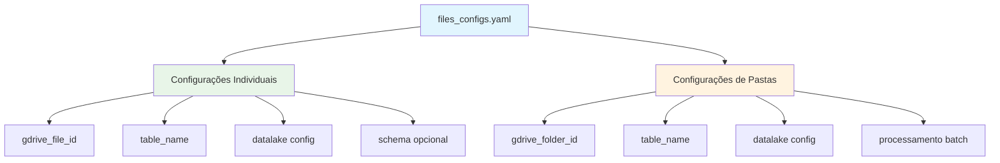

# 📄 files_configs.yaml - Configuração do Google Drive Collector

## 📋 Visão Geral

O arquivo `files_configs.yaml` é o coração da configuração do Google Drive Collector, definindo quais arquivos e pastas devem ser coletados, como devem ser processados e onde devem ser armazenados no data lake.

### **Estrutura Hierárquica**


---

## 🗂️ Estrutura Completa do Arquivo

### **Arquivo files_configs.yaml Real (Produção)**

```yaml
# ===============================================
# CONFIGURAÇÃO GOOGLE DRIVE COLLECTOR - FARMARCAS
# ===============================================

# 📋 ARQUIVO: Base de Produtos
# Dados centrais do catálogo farmacêutico
base:
  name: "Base de Produtos"
  gdrive_file_id: "1BxiMVs0XRA5nFMdKvBdBZjgmUUqptlbs74OgvE2upms"
  table_name: "base"
  datalake:
    bucket: "farmarcas-production-bronze"
    database: "bronze_gdrive"

# 🏪 ARQUIVO: Cadastro de Lojas
# Rede de farmácias e pontos de venda
loja:
  name: "Cadastro de Lojas"
  gdrive_file_id: "1hsJJT5SVaE8bNcBGFstO7f0Lh8v8QnHG8v7f9G2mF4"
  table_name: "loja"
  datalake:
    bucket: "farmarcas-production-bronze"
    database: "bronze_gdrive"

# 🚚 ARQUIVO: Distribuidores
# Informações de distribuidores e canais
distribuidor:
  name: "Distribuidores"
  gdrive_file_id: "1mGQR7gH8vK3PlxY9N0sE2uZ6xW4qR8mF9N2sE3uZ7"
  table_name: "distribuidor"
  datalake:
    bucket: "farmarcas-production-bronze"
    database: "bronze_gdrive"

# 💰 ARQUIVO: Verbas Dashboard
# Dados financeiros de verbas e incentivos
verbas_base_industria:
  name: "Verbas Dashboard"
  gdrive_file_id: "1qR2sT4uV5wX6yZ7aB8cD9eF0gH1iJ2kL3mN4oP5qR6"
  table_name: "verbas_base_industria"
  datalake:
    bucket: "farmarcas-production-bronze"
    database: "bronze_gdrive"

# 📂 PASTA: Rebates Template
# Múltiplos arquivos de rebates de laboratórios
rebates_template:
  name: "rebates_template"
  gdrive_folder_id: "1_4xO-dsMBrCOcr8uNdFHFhrmP7Lh2Y8_"
  table_name: "rebates_template"
  datalake:
    bucket: "farmarcas-production-bronze"
    database: "bronze_gdrive"

# 📍 ARQUIVO: Geografia
# Divisões territoriais e hierarquias regionais
geografia:
  name: "Geografia"
  gdrive_file_id: "1sT3uV4wX5yZ6aB7cD8eF9gH0iJ1kL2mN3oP4qR5sT6"
  table_name: "geografia"
  datalake:
    bucket: "farmarcas-production-bronze"
    database: "bronze_gdrive"

# 📊 ARQUIVO: Alíquotas ICMS
# Dados fiscais por estado e produto
aliquota_icms:
  name: "Alíquotas ICMS"
  gdrive_file_id: "1uV2wX3yZ4aB5cD6eF7gH8iJ9kL0mN1oP2qR3sT4uV5"
  table_name: "aliquota_icms"
  datalake:
    bucket: "farmarcas-production-bronze"
    database: "bronze_gdrive"
```

---

## 🔧 Componentes de Configuração

### **1. Configuração de Arquivo Individual**

#### **Estrutura Básica**
```yaml
nome_da_configuracao:
  name: "Nome Descritivo do Arquivo"
  gdrive_file_id: "ID_DO_ARQUIVO_NO_GOOGLE_DRIVE"
  table_name: "nome_tabela_destino"
  datalake:
    bucket: "bucket-s3-destino"
    database: "database-glue-catalog"
```

#### **Exemplo Detalhado**
```yaml
base_produtos_completa:
  # Identificação e descrição
  name: "Base Completa de Produtos Farmacêuticos"
  
  # ID único do arquivo no Google Drive
  # Extraído da URL: https://docs.google.com/spreadsheets/d/1BxiMVs0XRA5nFMdKvBdBZjgmUUqptlbs74OgvE2upms/edit
  gdrive_file_id: "1BxiMVs0XRA5nFMdKvBdBZjgmUUqptlbs74OgvE2upms"
  
  # Nome da tabela no data lake (usado para S3 key e Glue)
  table_name: "base_produtos"
  
  # Configuração do destino no data lake
  datalake:
    bucket: "farmarcas-production-bronze"
    database: "bronze_gdrive"
    
  # Configuração opcional de schema
  schema:
    # Renomeação de colunas se necessário
    column_mapping:
      "Código EAN": "ean_codigo"
      "Nome Produto": "produto_nome"
      "Laboratório": "laboratorio_nome"
      "NCM": "ncm_codigo"
      "Preço PMC": "preco_pmc"
    
    # Conversão de tipos de dados
    types:
      ean_codigo: "string"
      preco_pmc: "numeric"
      data_lancamento: "datetime"
    
    # Validações de qualidade
    validation:
      min_rows: 1000  # Mínimo 1000 produtos
      required_columns: ["ean_codigo", "produto_nome", "laboratorio_nome"]
      
  # Configurações de processamento
  processing:
    # Remover linhas vazias
    drop_empty_rows: true
    # Remover colunas completamente vazias
    drop_empty_columns: true
    # Aplicar limpeza de strings
    clean_strings: true
```

### **2. Configuração de Pasta (Múltiplos Arquivos)**

#### **Estrutura Básica**
```yaml
nome_da_pasta:
  name: "Nome Descritivo da Pasta"
  gdrive_folder_id: "ID_DA_PASTA_NO_GOOGLE_DRIVE"
  table_name: "nome_tabela_consolidada"
  datalake:
    bucket: "bucket-s3-destino"
    database: "database-glue-catalog"
```

#### **Exemplo: Pasta Rebates**
```yaml
rebates_laboratorios:
  # Identificação
  name: "Rebates de Laboratórios"
  
  # ID da pasta no Google Drive
  # Extraído da URL: https://drive.google.com/drive/folders/1_4xO-dsMBrCOcr8uNdFHFhrmP7Lh2Y8_
  gdrive_folder_id: "1_4xO-dsMBrCOcr8uNdFHFhrmP7Lh2Y8_"
  
  # Tabela consolidada (todos os arquivos da pasta)
  table_name: "rebates_consolidado"
  
  # Destino no data lake
  datalake:
    bucket: "farmarcas-production-bronze"
    database: "bronze_gdrive"
  
  # Configuração de processamento de pasta
  folder_processing:
    # Filtros de arquivo
    file_filters:
      extensions: [".xlsx", ".xls"]  # Apenas Excel
      exclude_patterns: ["*temp*", "*backup*", "*~*"]  # Excluir temporários
      min_size_kb: 10  # Mínimo 10KB
      max_size_mb: 50  # Máximo 50MB
    
    # Consolidação
    consolidation:
      method: "union"  # union, concat, merge
      add_source_column: true  # Adiciona coluna com nome do arquivo
      source_column_name: "arquivo_origem"
    
    # Schema comum para todos os arquivos
    schema:
      column_mapping:
        "Lab": "laboratorio"
        "Produto": "produto"
        "Verba": "valor_verba"
        "Data": "data_competencia"
      
      types:
        valor_verba: "numeric"
        data_competencia: "datetime"
        
      validation:
        min_rows: 50  # Cada arquivo deve ter pelo menos 50 linhas
        required_columns: ["laboratorio", "produto", "valor_verba"]
```

### **3. Configuração com Múltiplas Abas**

```yaml
relatorio_vendas_completo:
  name: "Relatório de Vendas Mensal Completo"
  gdrive_file_id: "1234567890abcdef1234567890abcdef12345678"
  
  # Configuração por aba do Excel
  sheets:
    # Aba 1: Vendas por Produto
    vendas_produto:
      table_name: "vendas_produto_mensal"
      sheet_name: "Vendas Produto"  # Nome exato da aba
      
      schema:
        column_mapping:
          "Cód. EAN": "ean"
          "Qtd Vendida": "quantidade"
          "Valor Total": "valor_vendas"
        
        types:
          quantidade: "numeric"
          valor_vendas: "numeric"
          
      validation:
        min_rows: 100
        required_columns: ["ean", "quantidade", "valor_vendas"]
    
    # Aba 2: Vendas por Região
    vendas_regiao:
      table_name: "vendas_regiao_mensal"
      sheet_name: "Vendas Região"
      
      schema:
        column_mapping:
          "Região": "regiao_nome"
          "Estado": "estado_uf"
          "Vendas": "valor_vendas"
        
        types:
          valor_vendas: "numeric"
          
      validation:
        min_rows: 27  # 26 estados + DF
        required_columns: ["regiao_nome", "estado_uf", "valor_vendas"]
  
  # Configuração geral do data lake
  datalake:
    bucket: "farmarcas-production-bronze"
    database: "bronze_gdrive"
```

---

## 📊 Schemas e Transformações

### **1. Mapeamento de Colunas**

#### **Exemplos Comuns**
```yaml
schema:
  column_mapping:
    # Padronização de nomes
    "CÓDIGO EAN": "ean_codigo"
    "NOME DO PRODUTO": "produto_nome"
    "LABORATÓRIO": "laboratorio_nome"
    
    # Remoção de caracteres especiais
    "Preço (R$)": "preco_reais"
    "Data/Hora": "data_hora"
    "Status (Ativo/Inativo)": "status"
    
    # Padronização de idioma
    "Name": "nome"
    "Description": "descricao"
    "Category": "categoria"
    
    # Tratamento de abreviações
    "Qtd": "quantidade"
    "Vlr": "valor"
    "Dt": "data"
```

#### **Regras de Nomenclatura**
```yaml
# PADRÕES ADOTADOS:
# - snake_case para nomes de colunas
# - Sem caracteres especiais (acentos, símbolos)
# - Nomes descritivos e consistentes
# - Prefixos por contexto quando necessário

exemplos_nomenclatura:
  # Datas
  "data_competencia"     # ao invés de "Data"
  "data_vencimento"      # ao invés de "Vencto"
  "data_nascimento"      # ao invés de "Dt Nasc"
  
  # Valores monetários
  "valor_unitario"       # ao invés de "Vlr Unit"
  "preco_pmc"           # ao invés de "PMC"
  "valor_desconto"      # ao invés de "Desc (%)"
  
  # Códigos e identificadores
  "cnpj_numero"         # ao invés de "CNPJ"
  "ean_codigo"          # ao invés de "EAN"
  "ncm_codigo"          # ao invés de "NCM"
  
  # Status e flags
  "status_ativo"        # ao invés de "Ativo?"
  "flag_promocao"       # ao invés de "Promoção"
  "indicador_novo"      # ao invés de "Novo Produto"
```

### **2. Conversão de Tipos**

#### **Tipos Suportados**
```yaml
schema:
  types:
    # Strings (texto)
    produto_nome: "string"
    laboratorio_nome: "string"
    
    # Numéricos
    quantidade: "numeric"
    preco_unitario: "numeric"
    percentual_desconto: "numeric"
    
    # Datas e timestamps
    data_competencia: "datetime"
    timestamp_processamento: "datetime"
    
    # Booleanos
    ativo: "boolean"
    promocao: "boolean"
    
    # Categoriais (mantidos como string)
    regiao: "string"
    categoria_produto: "string"
```

#### **Tratamento de Erros de Conversão**
```yaml
schema:
  types:
    # Conversão numérica com fallback
    preco_unitario: 
      type: "numeric"
      errors: "coerce"  # Valores inválidos viram NaN
      fill_na: 0        # Substituir NaN por 0
    
    # Conversão de data com formato específico
    data_competencia:
      type: "datetime"
      format: "%d/%m/%Y"  # Formato brasileiro
      errors: "coerce"
      
    # Conversão booleana com mapeamento
    ativo:
      type: "boolean"
      mapping:
        "S": true
        "N": false
        "Sim": true
        "Não": false
        "1": true
        "0": false
```

### **3. Validações de Qualidade**

#### **Validações Básicas**
```yaml
schema:
  validation:
    # Quantidade mínima de registros
    min_rows: 100
    max_rows: 1000000
    
    # Colunas obrigatórias
    required_columns: 
      - "ean_codigo"
      - "produto_nome"
      - "laboratorio_nome"
    
    # Valores únicos (chaves primárias)
    unique_columns:
      - "ean_codigo"
    
    # Valores não nulos
    not_null_columns:
      - "ean_codigo"
      - "produto_nome"
      - "preco_unitario"
```

#### **Validações Avançadas**
```yaml
schema:
  validation:
    # Validações de formato
    format_checks:
      ean_codigo:
        pattern: "^[0-9]{13}$"  # EAN-13 obrigatório
        message: "EAN deve ter exatamente 13 dígitos"
      
      cnpj_numero:
        pattern: "^[0-9]{14}$"  # CNPJ sem formatação
        message: "CNPJ deve ter 14 dígitos"
    
    # Validações de intervalo
    range_checks:
      preco_unitario:
        min: 0.01
        max: 10000.00
        message: "Preço deve estar entre R$ 0,01 e R$ 10.000,00"
      
      quantidade:
        min: 0
        max: 999999
        message: "Quantidade deve ser positiva"
    
    # Validações de valores permitidos
    allowed_values:
      status:
        values: ["ATIVO", "INATIVO", "DESCONTINUADO"]
        message: "Status deve ser ATIVO, INATIVO ou DESCONTINUADO"
      
      regiao:
        values: ["NORTE", "NORDESTE", "CENTRO-OESTE", "SUDESTE", "SUL"]
        message: "Região deve ser uma das 5 regiões brasileiras"
```

---

## 🗄️ Configuração do Data Lake

### **1. Estrutura S3**

#### **Padrão de Chaves S3**
```yaml
# Padrão adotado:
# s3://bucket/origin=origem/database=database/table_name/cog_dt_ingestion=YYYY-MM-DD/file.parquet

datalake:
  bucket: "farmarcas-production-bronze"
  database: "bronze_gdrive"
  
# Resultado para tabela "base":
# s3://farmarcas-production-bronze/origin=eks/database=bronze_gdrive/base/cog_dt_ingestion=2025-08-07/base.parquet
```

#### **Configurações de Bucket**
```yaml
datalake:
  # Bucket principal
  bucket: "farmarcas-production-bronze"
  
  # Database no AWS Glue Catalog
  database: "bronze_gdrive"
  
  # Configurações de particionamento
  partitioning:
    columns: ["cog_dt_ingestion"]  # Particionar por data de ingestão
    format: "YYYY-MM-DD"           # Formato da partição
  
  # Configurações de compressão
  compression: "snappy"            # snappy, gzip, brotli
  
  # Configurações de formato
  format: "parquet"                # parquet, csv, json
  
  # Configurações de metadados
  metadata:
    add_ingestion_timestamp: true
    add_source_info: true
    add_schema_version: true
```

### **2. Integração com AWS Glue**

#### **Catalog Configuration**
```yaml
datalake:
  bucket: "farmarcas-production-bronze"
  database: "bronze_gdrive"
  
  # Configuração AWS Glue
  glue_catalog:
    # Atualizar catálogo automaticamente
    auto_create_table: true
    auto_update_schema: true
    
    # Configurações da tabela
    table_properties:
      "classification": "parquet"
      "compressionType": "snappy"
      "typeOfData": "file"
      "sourceSystem": "google-drive"
      
    # Configurações de storage
    storage_descriptor:
      input_format: "org.apache.hadoop.hive.ql.io.parquet.MapredParquetInputFormat"
      output_format: "org.apache.hadoop.hive.ql.io.parquet.MapredParquetOutputFormat"
      serde_info:
        serialization_library: "org.apache.hadoop.hive.ql.io.parquet.serde.ParquetHiveSerDe"
```

### **3. Configurações de Backup**

```yaml
datalake:
  bucket: "farmarcas-production-bronze"
  database: "bronze_gdrive"
  
  # Configuração de backup
  backup:
    enabled: true
    backup_bucket: "farmarcas-backup-gdrive"
    retention_days: 90
    
    # Replicação cross-region
    cross_region_replication:
      enabled: true
      destination_region: "us-west-2"
      destination_bucket: "farmarcas-backup-gdrive-west"
    
    # Versionamento
    versioning:
      enabled: true
      max_versions: 5
```

---

## 🔄 Configurações de Processamento

### **1. Performance e Otimização**

```yaml
# Configurações globais de performance
performance:
  # Download settings
  max_concurrent_downloads: 5
  download_chunk_size_mb: 10
  download_timeout_seconds: 300
  
  # Processing settings
  pandas_chunksize: 10000        # Processar DataFrames em chunks
  max_memory_usage_mb: 1024      # Limite de memória por processo
  
  # AWS settings
  s3_multipart_threshold_mb: 100 # Usar multipart upload para arquivos > 100MB
  s3_max_concurrency: 5          # Máximo 5 uploads simultâneos
  
  # Retry settings
  max_retries: 3
  retry_delay_seconds: 5
  exponential_backoff: true

# Aplicar a configurações específicas
base:
  name: "Base de Produtos"
  gdrive_file_id: "1BxiMVs0XRA5nFMdKvBdBZjgmUUqptlbs74OgvE2upms"
  table_name: "base"
  
  # Configurações específicas de processamento
  processing:
    # Otimização para arquivo grande
    chunk_processing: true
    chunk_size: 5000
    
    # Limpeza específica
    data_cleaning:
      remove_duplicates: true
      duplicate_columns: ["ean_codigo"]
      
      trim_strings: true
      normalize_case: "upper"  # upper, lower, title
      
      replace_values:
        "N/A": null
        "": null
        "-": null
  
  datalake:
    bucket: "farmarcas-production-bronze"
    database: "bronze_gdrive"
```

### **2. Monitoramento e Logs**

```yaml
# Configurações de monitoramento
monitoring:
  # CloudWatch Logs
  cloudwatch:
    log_group: "/aws/fargate/gdrive-collector"
    log_level: "INFO"  # DEBUG, INFO, WARNING, ERROR
    
    # Métricas customizadas
    custom_metrics:
      - name: "FilesProcessed"
        unit: "Count"
      - name: "ProcessingTimeSeconds" 
        unit: "Seconds"
      - name: "DataSizeBytes"
        unit: "Bytes"
  
  # Alertas
  alerts:
    slack:
      webhook_url: "${SLACK_WEBHOOK_URL}"
      channel: "#data-platform"
      notify_on_success: false
      notify_on_error: true
      
    email:
      smtp_server: "smtp.company.com"
      recipients: ["data-team@farmarcas.com"]
      notify_on_error: true

# Aplicar a configurações específicas
base:
  name: "Base de Produtos"
  gdrive_file_id: "1BxiMVs0XRA5nFMdKvBdBZjgmUUqptlbs74OgvE2upms"
  table_name: "base"
  
  # Monitoramento específico
  monitoring:
    # Alertas específicos para base de produtos
    quality_checks:
      min_products: 10000       # Alerta se < 10k produtos
      max_price_variation: 0.5  # Alerta se preço médio variar > 50%
      required_labs: ["EUROFARMA", "EMS", "MEDLEY"]  # Laboratórios obrigatórios
  
  datalake:
    bucket: "farmarcas-production-bronze"
    database: "bronze_gdrive"
```

---

## 📋 Exemplos de Configurações Completas

### **1. Arquivo Simples (Base de Produtos)**

```yaml
base:
  # Identificação
  name: "Base de Produtos Farmarcas"
  gdrive_file_id: "1BxiMVs0XRA5nFMdKvBdBZjgmUUqptlbs74OgvE2upms"
  table_name: "base"
  
  # Schema e transformações
  schema:
    column_mapping:
      "CÓDIGO EAN": "ean_codigo"
      "NOME PRODUTO": "produto_nome"
      "LABORATÓRIO": "laboratorio_nome"
      "NCM": "ncm_codigo"
      "PMC": "preco_pmc"
      "PF": "preco_farmacia"
      "CATEGORIA": "categoria_produto"
      "STATUS": "status_produto"
    
    types:
      ean_codigo: "string"
      preco_pmc: "numeric"
      preco_farmacia: "numeric"
      ncm_codigo: "string"
      status_produto: "string"
    
    validation:
      min_rows: 5000
      required_columns: ["ean_codigo", "produto_nome", "laboratorio_nome"]
      unique_columns: ["ean_codigo"]
      
      format_checks:
        ean_codigo:
          pattern: "^[0-9]{13}$"
          message: "EAN deve ter 13 dígitos"
      
      range_checks:
        preco_pmc:
          min: 0.01
          max: 5000.00
          message: "PMC deve estar entre R$ 0,01 e R$ 5.000,00"
  
  # Processamento
  processing:
    data_cleaning:
      remove_duplicates: true
      duplicate_columns: ["ean_codigo"]
      trim_strings: true
      normalize_case: "upper"
  
  # Destino
  datalake:
    bucket: "farmarcas-production-bronze"
    database: "bronze_gdrive"
```

### **2. Pasta Complexa (Rebates)**

```yaml
rebates_template:
  # Identificação
  name: "Rebates de Laboratórios"
  gdrive_folder_id: "1_4xO-dsMBrCOcr8uNdFHFhrmP7Lh2Y8_"
  table_name: "rebates_template"
  
  # Processamento de pasta
  folder_processing:
    file_filters:
      extensions: [".xlsx", ".xls"]
      exclude_patterns: ["*temp*", "*backup*", "*~*", ".*"]
      min_size_kb: 5
      max_size_mb: 20
      modified_since_days: 30  # Apenas arquivos dos últimos 30 dias
    
    consolidation:
      method: "union"  # Empilhar todos os arquivos
      add_source_column: true
      source_column_name: "arquivo_origem"
      
      # Padronização de headers entre arquivos
      standardize_headers: true
      header_mapping:
        "Lab": "laboratorio"
        "Laboratório": "laboratorio"
        "Laboratory": "laboratorio"
        
        "Produto": "produto"
        "Product": "produto"
        "Item": "produto"
        
        "Verba": "valor_verba"
        "Rebate": "valor_verba"
        "Value": "valor_verba"
  
  # Schema consolidado
  schema:
    column_mapping:
      "laboratorio": "laboratorio_nome"
      "produto": "produto_nome"
      "valor_verba": "valor_verba_reais"
      "data": "data_competencia"
      "arquivo_origem": "arquivo_fonte"
    
    types:
      laboratorio_nome: "string"
      produto_nome: "string"
      valor_verba_reais: "numeric"
      data_competencia: "datetime"
      arquivo_fonte: "string"
    
    validation:
      min_rows: 100  # Mínimo após consolidação
      required_columns: ["laboratorio_nome", "produto_nome", "valor_verba_reais"]
      
      range_checks:
        valor_verba_reais:
          min: 0
          max: 1000000
          message: "Verba deve estar entre R$ 0 e R$ 1.000.000"
  
  # Processamento específico
  processing:
    data_cleaning:
      remove_duplicates: true
      duplicate_columns: ["laboratorio_nome", "produto_nome", "data_competencia"]
      
      normalize_case: "upper"
      trim_strings: true
      
      replace_values:
        "": null
        "N/A": null
        "n/a": null
        "-": null
  
  # Destino
  datalake:
    bucket: "farmarcas-production-bronze"
    database: "bronze_gdrive"
    
    # Configuração específica para rebates
    partitioning:
      additional_columns: ["laboratorio_nome"]  # Particionar também por laboratório
```

### **3. Arquivo Multi-Aba (Relatório Complexo)**

```yaml
relatorio_vendas_mensal:
  name: "Relatório de Vendas Mensal Completo"
  gdrive_file_id: "1qR2sT4uV5wX6yZ7aB8cD9eF0gH1iJ2kL3mN4oP5qR6"
  
  # Configuração por aba
  sheets:
    # Aba 1: Vendas por Produto
    vendas_produto:
      table_name: "vendas_produto_mensal"
      sheet_name: "Vendas por Produto"
      
      schema:
        column_mapping:
          "EAN": "ean_codigo"
          "Produto": "produto_nome"
          "Lab": "laboratorio_nome"
          "Qtd": "quantidade_vendida"
          "Valor": "valor_vendas"
          "Região": "regiao_venda"
        
        types:
          ean_codigo: "string"
          quantidade_vendida: "numeric"
          valor_vendas: "numeric"
          
        validation:
          min_rows: 1000
          required_columns: ["ean_codigo", "quantidade_vendida", "valor_vendas"]
          
          format_checks:
            ean_codigo:
              pattern: "^[0-9]{13}$"
    
    # Aba 2: Metas por Região
    metas_regiao:
      table_name: "metas_regiao_mensal"
      sheet_name: "Metas Regionais"
      
      schema:
        column_mapping:
          "Região": "regiao_nome"
          "Meta Quantidade": "meta_quantidade"
          "Meta Valor": "meta_valor"
          "Realizado Qtd": "realizado_quantidade"
          "Realizado Valor": "realizado_valor"
        
        types:
          meta_quantidade: "numeric"
          meta_valor: "numeric"
          realizado_quantidade: "numeric"
          realizado_valor: "numeric"
          
        validation:
          min_rows: 5  # 5 regiões brasileiras
          required_columns: ["regiao_nome", "meta_valor", "realizado_valor"]
    
    # Aba 3: Análise por Laboratório
    analise_laboratorio:
      table_name: "analise_laboratorio_mensal"
      sheet_name: "Por Laboratório"
      
      schema:
        column_mapping:
          "Laboratório": "laboratorio_nome"
          "Participação %": "participacao_percentual"
          "Crescimento %": "crescimento_percentual"
          "Ranking": "ranking_posicao"
        
        types:
          participacao_percentual: "numeric"
          crescimento_percentual: "numeric"
          ranking_posicao: "numeric"
          
        validation:
          min_rows: 20  # Principais laboratórios
          required_columns: ["laboratorio_nome", "participacao_percentual"]
  
  # Configuração geral
  datalake:
    bucket: "farmarcas-production-bronze"
    database: "bronze_gdrive"
```

---

## ✅ Validação e Testes

### **Script de Validação do files_configs.yaml**

```python
#!/usr/bin/env python3
"""
Script para validar configuração files_configs.yaml
"""

import yaml
import re
from pathlib import Path

def validate_files_config(config_path="files_configs.yaml"):
    """
    Valida estrutura e conteúdo do files_configs.yaml
    """
    
    print("🔍 Validando configuração files_configs.yaml...")
    
    try:
        # Carregar arquivo
        with open(config_path) as f:
            config = yaml.safe_load(f)
        
        if not config:
            print("❌ Arquivo vazio ou inválido")
            return False
        
        errors = []
        warnings = []
        
        # Validar cada configuração
        for config_name, config_data in config.items():
            
            print(f"\n📋 Validando: {config_name}")
            
            # Validações obrigatórias
            if 'name' not in config_data:
                errors.append(f"{config_name}: 'name' obrigatório")
            
            if 'table_name' not in config_data:
                errors.append(f"{config_name}: 'table_name' obrigatório")
            
            if 'datalake' not in config_data:
                errors.append(f"{config_name}: 'datalake' obrigatório")
            
            # Validar tipo de configuração
            has_file_id = 'gdrive_file_id' in config_data
            has_folder_id = 'gdrive_folder_id' in config_data
            
            if not has_file_id and not has_folder_id:
                errors.append(f"{config_name}: Deve ter 'gdrive_file_id' ou 'gdrive_folder_id'")
            
            if has_file_id and has_folder_id:
                warnings.append(f"{config_name}: Tem ambos file_id e folder_id - será tratado como pasta")
            
            # Validar IDs do Google Drive
            if has_file_id:
                file_id = config_data['gdrive_file_id']
                if not re.match(r'^[A-Za-z0-9_-]+$', file_id):
                    errors.append(f"{config_name}: gdrive_file_id inválido: {file_id}")
            
            if has_folder_id:
                folder_id = config_data['gdrive_folder_id']
                if not re.match(r'^[A-Za-z0-9_-]+$', folder_id):
                    errors.append(f"{config_name}: gdrive_folder_id inválido: {folder_id}")
            
            # Validar table_name
            table_name = config_data.get('table_name', '')
            if not re.match(r'^[a-z0-9_]+$', table_name):
                errors.append(f"{config_name}: table_name deve ser snake_case: {table_name}")
            
            # Validar datalake
            datalake = config_data.get('datalake', {})
            if 'bucket' not in datalake:
                errors.append(f"{config_name}: datalake.bucket obrigatório")
            if 'database' not in datalake:
                errors.append(f"{config_name}: datalake.database obrigatório")
            
            # Validar schema se presente
            if 'schema' in config_data:
                schema = config_data['schema']
                
                # Validar column_mapping
                if 'column_mapping' in schema:
                    mapping = schema['column_mapping']
                    for old_col, new_col in mapping.items():
                        if not re.match(r'^[a-z0-9_]+$', new_col):
                            warnings.append(f"{config_name}: Nova coluna deve ser snake_case: {new_col}")
                
                # Validar types
                if 'types' in schema:
                    valid_types = ['string', 'numeric', 'datetime', 'boolean']
                    types_config = schema['types']
                    for col, col_type in types_config.items():
                        if isinstance(col_type, str) and col_type not in valid_types:
                            warnings.append(f"{config_name}: Tipo inválido '{col_type}' para coluna '{col}'")
            
            print(f"✅ {config_name}: Configuração válida")
        
        # Relatório final
        print(f"\n📊 Resumo da validação:")
        print(f"   ✅ Configurações válidas: {len(config)}")
        print(f"   ⚠️ Warnings: {len(warnings)}")
        print(f"   ❌ Erros: {len(errors)}")
        
        if warnings:
            print(f"\n⚠️ Warnings:")
            for warning in warnings:
                print(f"   - {warning}")
        
        if errors:
            print(f"\n❌ Erros:")
            for error in errors:
                print(f"   - {error}")
            return False
        
        print(f"\n🎉 Configuração files_configs.yaml válida!")
        return True
        
    except yaml.YAMLError as e:
        print(f"❌ Erro no formato YAML: {e}")
        return False
    except Exception as e:
        print(f"❌ Erro na validação: {e}")
        return False

if __name__ == "__main__":
    validate_files_config()
```

---

**Última Atualização**: 07/08/2025 - Configuração alinhada com estrutura de produção do sistema Farmarcas
