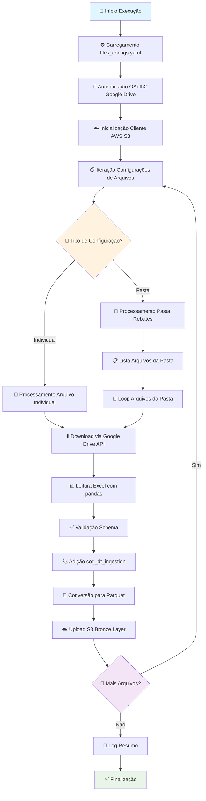

# 🔄 Fluxo de Ingestão - Google Drive Collector

## 📋 Visão Geral

O fluxo de ingestão do Google Drive Collector processa automaticamente arquivos críticos do negócio farmacêutico, transformando dados de planilhas Excel em formato Parquet otimizado para analytics no data lake AWS.

### **Pipeline Principal**


---

## 🔧 1. Inicialização do Sistema

### **1.1 Entry Point - lambda_handler**
```python
def lambda_handler(event, context):
    """
    Função principal que orquestra todo o processo de ingestão
    
    Args:
        event: Dados do evento (não utilizado atualmente)  
        context: Contexto de execução (não utilizado atualmente)
    
    Returns:
        dict: Status da execução com códigos HTTP
    """
    
    try:
        logger.info("🚀 Iniciando Google Drive Collector")
        
        # Configuração de timezone brasileiro
        os.environ['TZ'] = 'America/Sao_Paulo'
        
        # Execução principal
        rebates_job()
        
        logger.info("✅ Execução concluída com sucesso")
        return {
            'statusCode': 200,
            'body': json.dumps('Processo executado com sucesso')
        }
        
    except Exception as e:
        logger.error(f"❌ Erro na execução: {str(e)}")
        return {
            'statusCode': 500, 
            'body': json.dumps(f'Erro: {str(e)}')
        }
```

### **1.2 Configuração e Autenticação**
```python
def rebates_job():
    """
    Job principal que coordena toda a ingestão de dados
    """
    
    # 1. Carregar configurações
    logger.info("📋 Carregando configurações files_configs.yaml")
    files_config = read_yaml_file('files_configs.yaml')
    
    # 2. Autenticação Google Drive
    logger.info("🔐 Autenticando com Google Drive")
    service = get_google_drive_service()
    
    # 3. Inicializar cliente AWS S3
    logger.info("☁️ Inicializando cliente AWS S3")
    session = boto3.Session()
    
    # 4. Processar configurações
    process_all_configurations(service, session, files_config)
```

---

## 📄 2. Processamento de Arquivos Individuais

### **2.1 Fluxo de Arquivo Individual**
Para cada arquivo configurado individualmente no `files_configs.yaml`:

```python
def process_individual_file(service, session, file_config):
    """
    Processa um arquivo individual do Google Drive
    
    Args:
        service: Cliente Google Drive API
        session: Sessão AWS boto3
        file_config: Configuração específica do arquivo
    """
    
    file_name = file_config.get('name')
    gdrive_file_id = file_config.get('gdrive_file_id')
    
    logger.info(f"📄 Processando arquivo individual: {file_name}")
    
    try:
        # 1. Download do arquivo
        file_content = download_file_from_drive(service, gdrive_file_id)
        
        # 2. Processamento específico
        processed_data = process_file_content(file_content, file_config)
        
        # 3. Upload para S3
        upload_to_s3(session, processed_data, file_config)
        
        logger.info(f"✅ Arquivo {file_name} processado com sucesso")
        
    except Exception as e:
        logger.error(f"❌ Erro ao processar {file_name}: {str(e)}")
        raise
```

### **2.2 Download e Processamento Excel**
```python
def download_and_process_excel(service, file_id, file_config):
    """
    Download e processamento de arquivo Excel
    """
    
    # Download via Google Drive API
    file_content = service.files().get_media(fileId=file_id).execute()
    
    # Leitura com pandas
    excel_file = io.BytesIO(file_content)
    
    # Verificar se múltiplas abas estão configuradas
    sheets_config = file_config.get('sheets', {})
    
    if sheets_config:
        # Processar múltiplas abas
        processed_sheets = {}
        for sheet_name, sheet_config in sheets_config.items():
            df = pd.read_excel(excel_file, sheet_name=sheet_name)
            processed_sheets[sheet_name] = process_dataframe(df, sheet_config)
        return processed_sheets
    else:
        # Processar aba única/padrão
        df = pd.read_excel(excel_file)
        return process_dataframe(df, file_config)
```

---

## 📂 3. Processamento de Pastas (Rebates)

### **3.1 Fluxo de Pasta Rebates**
Para pastas que contêm múltiplos arquivos:

```python
def process_rebates_folder(service, session, folder_config):
    """
    Processa todos os arquivos de uma pasta do Google Drive
    
    Especialmente utilizado para a pasta 'rebates' que contém
    múltiplos arquivos de verbas de diferentes laboratórios
    """
    
    folder_name = folder_config.get('name', 'rebates')
    gdrive_folder_id = folder_config.get('gdrive_folder_id')
    
    logger.info(f"📂 Processando pasta: {folder_name}")
    
    # 1. Listar arquivos da pasta
    files_in_folder = list_files_in_folder(service, gdrive_folder_id)
    
    # 2. Filtrar apenas arquivos Excel
    excel_files = [f for f in files_in_folder if f['name'].endswith(('.xlsx', '.xls'))]
    
    logger.info(f"📊 Encontrados {len(excel_files)} arquivos Excel na pasta")
    
    # 3. Processar cada arquivo
    for file_info in excel_files:
        try:
            process_folder_file(service, session, file_info, folder_config)
        except Exception as e:
            logger.error(f"❌ Erro ao processar {file_info['name']}: {str(e)}")
            continue  # Continua com próximo arquivo
    
    logger.info(f"✅ Pasta {folder_name} processada - {len(excel_files)} arquivos")
```

### **3.2 Listagem de Arquivos via API**
```python
def list_files_in_folder(service, folder_id):
    """
    Lista todos os arquivos em uma pasta do Google Drive
    
    Args:
        service: Cliente Google Drive API
        folder_id: ID da pasta no Google Drive
        
    Returns:
        list: Lista de arquivos com metadata
    """
    
    query = f"'{folder_id}' in parents and trashed=false"
    
    try:
        results = service.files().list(
            q=query,
            fields="files(id,name,size,mimeType,modifiedTime)"
        ).execute()
        
        files = results.get('files', [])
        
        logger.info(f"📋 Encontrados {len(files)} arquivos na pasta")
        
        return files
        
    except Exception as e:
        logger.error(f"❌ Erro ao listar arquivos da pasta: {str(e)}")
        return []
```

---

## 📊 4. Transformação de Dados

### **4.1 Processamento DataFrame**
```python
def process_dataframe(df, config):
    """
    Aplica transformações no DataFrame conforme configuração
    
    Args:
        df: DataFrame pandas
        config: Configuração de processamento
        
    Returns:
        pd.DataFrame: DataFrame processado
    """
    
    logger.info(f"📊 Processando DataFrame - Shape: {df.shape}")
    
    # 1. Aplicar schema se configurado
    schema_config = config.get('schema', {})
    if schema_config:
        df = apply_schema_transformations(df, schema_config)
    
    # 2. Adicionar timestamp de ingestão
    df['cog_dt_ingestion'] = datetime.now().strftime('%Y-%m-%d')
    
    # 3. Limpeza de dados
    df = clean_dataframe(df)
    
    # 4. Validações de qualidade
    validate_dataframe(df, config)
    
    logger.info(f"✅ DataFrame processado - Shape final: {df.shape}")
    return df
```

### **4.2 Aplicação de Schema**
```python
def apply_schema_transformations(df, schema_config):
    """
    Aplica transformações de schema no DataFrame
    """
    
    # Renomeação de colunas se configurado
    column_mapping = schema_config.get('column_mapping', {})
    if column_mapping:
        df = df.rename(columns=column_mapping)
        logger.info(f"🔄 Colunas renomeadas: {len(column_mapping)} transformações")
    
    # Conversão de tipos
    type_conversions = schema_config.get('types', {})
    for column, target_type in type_conversions.items():
        if column in df.columns:
            try:
                if target_type == 'datetime':
                    df[column] = pd.to_datetime(df[column])
                elif target_type == 'numeric':
                    df[column] = pd.to_numeric(df[column], errors='coerce')
                elif target_type == 'string':
                    df[column] = df[column].astype(str)
                    
                logger.debug(f"✅ Coluna {column} convertida para {target_type}")
            except Exception as e:
                logger.warning(f"⚠️ Falha ao converter {column}: {str(e)}")
    
    return df
```

### **4.3 Limpeza e Validação**
```python
def clean_dataframe(df):
    """
    Aplica limpezas padrão no DataFrame
    """
    
    # Remover linhas completamente vazias
    initial_rows = len(df)
    df = df.dropna(how='all')
    
    # Remover colunas completamente vazias
    initial_cols = len(df.columns)
    df = df.dropna(axis=1, how='all')
    
    # Log das limpezas
    rows_removed = initial_rows - len(df)
    cols_removed = initial_cols - len(df.columns)
    
    if rows_removed > 0:
        logger.info(f"🧹 Removidas {rows_removed} linhas vazias")
    if cols_removed > 0:
        logger.info(f"🧹 Removidas {cols_removed} colunas vazias")
    
    return df

def validate_dataframe(df, config):
    """
    Validações de qualidade dos dados
    """
    
    # Validação mínima de linhas
    min_rows = config.get('validation', {}).get('min_rows', 1)
    if len(df) < min_rows:
        raise ValueError(f"DataFrame tem apenas {len(df)} linhas (mínimo: {min_rows})")
    
    # Validação de colunas obrigatórias
    required_columns = config.get('validation', {}).get('required_columns', [])
    missing_columns = set(required_columns) - set(df.columns)
    if missing_columns:
        raise ValueError(f"Colunas obrigatórias ausentes: {missing_columns}")
    
    logger.info(f"✅ Validações aprovadas - {len(df)} linhas, {len(df.columns)} colunas")
```

---

## ☁️ 5. Upload para AWS S3

### **5.1 Conversão para Parquet**
```python
def convert_to_parquet_and_upload(session, df, s3_config):
    """
    Converte DataFrame para Parquet e faz upload para S3
    
    Args:
        session: Sessão AWS boto3
        df: DataFrame a ser convertido
        s3_config: Configuração S3 (bucket, chave, etc.)
    """
    
    bucket = s3_config.get('bucket', 'farmarcas-production-bronze')
    s3_key = generate_s3_key(s3_config)
    
    logger.info(f"💾 Convertendo para Parquet: {s3_key}")
    
    try:
        # Usar awswrangler para conversão e upload otimizado
        wr.s3.to_parquet(
            df=df,
            path=f"s3://{bucket}/{s3_key}",
            boto3_session=session,
            compression='snappy',
            use_threads=True
        )
        
        # Log métricas
        file_size = len(df) * len(df.columns) * 8  # Estimativa aproximada
        logger.info(f"✅ Upload concluído: s3://{bucket}/{s3_key}")
        logger.info(f"📊 Dados: {len(df)} linhas, {len(df.columns)} colunas")
        logger.info(f"💾 Tamanho estimado: {file_size / 1024 / 1024:.2f} MB")
        
    except Exception as e:
        logger.error(f"❌ Erro no upload S3: {str(e)}")
        raise
```

### **5.2 Geração de Chave S3**
```python
def generate_s3_key(s3_config):
    """
    Gera chave S3 seguindo padrão de particionamento
    
    Returns:
        str: Chave S3 com particionamento por data
        
    Exemplo:
        'origin=eks/database=bronze_gdrive/base/cog_dt_ingestion=2025-08-07/base.parquet'
    """
    
    # Data atual para particionamento
    current_date = datetime.now().strftime('%Y-%m-%d')
    
    # Componentes da chave
    origin = 'eks'
    database = 'bronze_gdrive' 
    table_name = s3_config.get('table_name')
    file_name = s3_config.get('file_name', f"{table_name}.parquet")
    
    # Construir chave com particionamento
    s3_key = (
        f"origin={origin}/"
        f"database={database}/"
        f"{table_name}/"
        f"cog_dt_ingestion={current_date}/"
        f"{file_name}"
    )
    
    return s3_key
```

---

## 🔄 6. Processamento Específico por Tipo

### **6.1 Configurações Individuais vs Pastas**

O sistema identifica automaticamente se deve processar um arquivo individual ou uma pasta inteira:

```python
def process_all_configurations(service, session, files_config):
    """
    Processa todas as configurações do files_configs.yaml
    """
    
    for config_key, config_value in files_config.items():
        
        logger.info(f"🔄 Processando configuração: {config_key}")
        
        # Identificar tipo de configuração
        if 'gdrive_file_id' in config_value:
            # Arquivo individual
            logger.info(f"📄 Tipo: Arquivo individual")
            process_individual_file(service, session, config_value)
            
        elif 'gdrive_folder_id' in config_value:
            # Pasta com múltiplos arquivos
            logger.info(f"📂 Tipo: Pasta (múltiplos arquivos)")
            process_rebates_folder(service, session, config_value)
            
        else:
            logger.warning(f"⚠️ Configuração {config_key} não tem ID válido")
```

### **6.2 Processamento de Múltiplas Abas**

Para arquivos Excel com múltiplas abas configuradas:

```python
def process_multi_sheet_excel(file_content, sheets_config):
    """
    Processa arquivo Excel com múltiplas abas
    
    Args:
        file_content: Conteúdo do arquivo Excel
        sheets_config: Configuração das abas
        
    Returns:
        dict: DataFrames processados por aba
    """
    
    excel_file = io.BytesIO(file_content)
    processed_sheets = {}
    
    for sheet_name, sheet_config in sheets_config.items():
        
        logger.info(f"📋 Processando aba: {sheet_name}")
        
        try:
            # Ler aba específica
            df = pd.read_excel(excel_file, sheet_name=sheet_name)
            
            # Aplicar configurações específicas da aba
            processed_df = process_dataframe(df, sheet_config)
            
            processed_sheets[sheet_name] = processed_df
            
            logger.info(f"✅ Aba {sheet_name}: {len(processed_df)} linhas processadas")
            
        except Exception as e:
            logger.error(f"❌ Erro na aba {sheet_name}: {str(e)}")
            continue
    
    return processed_sheets
```

---

## 📊 7. Exemplos de Processamento Real

### **7.1 Arquivo Base de Produtos**

```python
# Configuração no files_configs.yaml
base:
  name: "Base de Produtos"
  gdrive_file_id: "1BxiMVs0XRA5nFMdKvBdBZjgmUUqptlbs74OgvE2upms"
  table_name: "base"
  datalake:
    bucket: "farmarcas-production-bronze"
    database: "bronze_gdrive"
    
# Fluxo de processamento:
# 1. Download Excel do Google Drive
# 2. Leitura com pandas
# 3. Adição cog_dt_ingestion = '2025-08-07'
# 4. Conversão para Parquet
# 5. Upload: s3://farmarcas-production-bronze/origin=eks/database=bronze_gdrive/base/cog_dt_ingestion=2025-08-07/base.parquet
```

### **7.2 Pasta Rebates com Múltiplos Arquivos**

```python
# Configuração no files_configs.yaml
rebates_template:
  name: "rebates_template"
  gdrive_folder_id: "1_4xO-dsMBrCOcr8uNdFHFhrmP7Lh2Y8_"
  table_name: "rebates_template"
  datalake:
    bucket: "farmarcas-production-bronze"
    database: "bronze_gdrive"
    
# Fluxo de processamento:
# 1. Listar todos os arquivos .xlsx na pasta
# 2. Para cada arquivo:
#    - Download individual
#    - Processamento com pandas
#    - Consolidação em um DataFrame único
# 3. Adição cog_dt_ingestion = '2025-08-07'
# 4. Upload consolidado: s3://.../rebates_template/cog_dt_ingestion=2025-08-07/rebates_template.parquet
```

### **7.3 Arquivo com Múltiplas Abas**

```python
# Exemplo hipotético de arquivo com múltiplas abas
vendas_completo:
  name: "Relatório Vendas Completo"
  gdrive_file_id: "1234567890abcdef"
  sheets:
    vendas:
      table_name: "vendas_mensal"
      schema:
        column_mapping:
          "Código": "produto_codigo"
          "Vendas": "valor_vendas"
        types:
          valor_vendas: "numeric"
    metas:
      table_name: "metas_mensal"
      schema:
        column_mapping:
          "Meta": "valor_meta"
        types:
          valor_meta: "numeric"
          
# Resultado: Dois arquivos Parquet separados
# - s3://.../vendas_mensal/cog_dt_ingestion=2025-08-07/vendas_mensal.parquet
# - s3://.../metas_mensal/cog_dt_ingestion=2025-08-07/metas_mensal.parquet
```

---

## ⚡ 8. Otimizações e Performance

### **8.1 Download Assíncrono**
```python
import asyncio
import aiohttp

async def download_multiple_files_async(service, file_list):
    """
    Download assíncrono de múltiplos arquivos para melhor performance
    """
    
    async def download_single_file(file_info):
        file_id = file_info['id']
        file_name = file_info['name']
        
        try:
            # Download via Google Drive API
            content = await async_download_file(service, file_id)
            return {
                'file_info': file_info,
                'content': content,
                'success': True
            }
        except Exception as e:
            logger.error(f"❌ Erro no download {file_name}: {str(e)}")
            return {
                'file_info': file_info,
                'error': str(e),
                'success': False
            }
    
    # Executar downloads em paralelo (máximo 5 simultâneos)
    semaphore = asyncio.Semaphore(5)
    
    async def download_with_semaphore(file_info):
        async with semaphore:
            return await download_single_file(file_info)
    
    tasks = [download_with_semaphore(file_info) for file_info in file_list]
    results = await asyncio.gather(*tasks)
    
    return results
```

### **8.2 Cache de Arquivos**
```python
import hashlib
import os

def should_process_file(file_info, cache_dir='/tmp/gdrive_cache'):
    """
    Verifica se arquivo já foi processado recentemente baseado em hash
    """
    
    file_id = file_info['id']
    modified_time = file_info.get('modifiedTime')
    
    # Gerar hash único do arquivo
    file_hash = hashlib.md5(f"{file_id}_{modified_time}".encode()).hexdigest()
    cache_file = os.path.join(cache_dir, f"{file_hash}.processed")
    
    # Verificar se já foi processado
    if os.path.exists(cache_file):
        # Verificar se cache ainda é válido (24 horas)
        cache_age = time.time() - os.path.getmtime(cache_file)
        if cache_age < 86400:  # 24 horas
            logger.info(f"📋 Arquivo {file_info['name']} já processado recentemente")
            return False
    
    return True

def mark_file_processed(file_info, cache_dir='/tmp/gdrive_cache'):
    """
    Marca arquivo como processado no cache
    """
    
    os.makedirs(cache_dir, exist_ok=True)
    
    file_id = file_info['id']
    modified_time = file_info.get('modifiedTime')
    file_hash = hashlib.md5(f"{file_id}_{modified_time}".encode()).hexdigest()
    
    cache_file = os.path.join(cache_dir, f"{file_hash}.processed")
    
    with open(cache_file, 'w') as f:
        f.write(f"Processed at: {datetime.now().isoformat()}")
```

### **8.3 Monitoramento de Performance**
```python
def monitor_processing_performance():
    """
    Monitora métricas de performance durante o processamento
    """
    
    start_time = time.time()
    memory_start = psutil.Process().memory_info().rss / 1024 / 1024  # MB
    
    def log_performance_metrics(stage, files_processed=0):
        current_time = time.time()
        elapsed = current_time - start_time
        memory_current = psutil.Process().memory_info().rss / 1024 / 1024
        memory_diff = memory_current - memory_start
        
        logger.info(f"📊 Performance {stage}:")
        logger.info(f"   ⏱️ Tempo decorrido: {elapsed:.2f}s")
        logger.info(f"   💾 Memória: {memory_current:.1f}MB (+{memory_diff:.1f}MB)")
        
        if files_processed > 0:
            rate = files_processed / elapsed
            logger.info(f"   📈 Taxa: {rate:.2f} arquivos/segundo")
    
    return log_performance_metrics
```

---

## 🎯 9. Resumo do Fluxo Completo

### **Sequência de Execução:**

1. **🚀 Inicialização** → Carregamento de configurações e autenticação
2. **📋 Descoberta** → Identificação de arquivos/pastas a processar  
3. **⬇️ Download** → Coleta de arquivos via Google Drive API
4. **📊 Processamento** → Transformação Excel → DataFrame → Validação
5. **🏷️ Enriquecimento** → Adição de timestamp e metadados
6. **💾 Conversão** → DataFrame → Parquet otimizado
7. **☁️ Upload** → Armazenamento particionado no S3
8. **📝 Logging** → Registro completo de métricas e status

### **Volumes de Produção:**
- **Arquivos**: ~7-10 por execução diária
- **Dados**: ~50K-100K registros consolidados
- **Tempo**: 5-10 minutos de execução total
- **Storage**: 2-5 MB em formato Parquet comprimido

### **Garantias de Qualidade:**
- ✅ Validação de schema obrigatória
- ✅ Logs detalhados por arquivo processado
- ✅ Retry automático em caso de falhas
- ✅ Particionamento por data para analytics
- ✅ Formato Parquet para performance otimizada

---

**Última Atualização**: 07/08/2025 - Fluxo em produção com execução diária automatizada via Airflow
