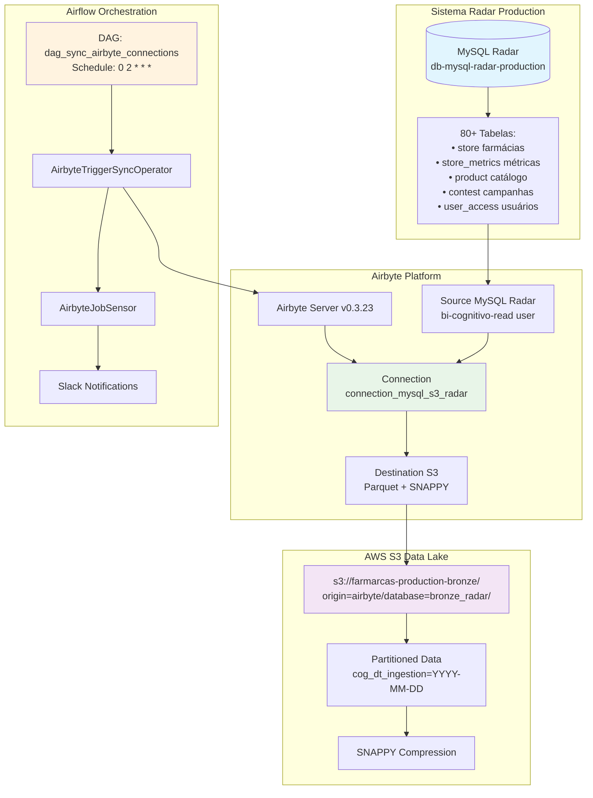

# 📊 Sistema de Ingestão Radar

[](../../README.md)
[](./boas_praticas.md)
[](./fluxo_ingestao.md)
[](./configuracoes_exemplo.md)

## 📋 Descrição

O **Radar Collector** é um sistema automatizado de ingestão de dados que sincroniza informações críticas do sistema Radar (MySQL) para o data lake S3 da Farmarcas. Esta solução é responsável por capturar dados essenciais de farmácias, usuários, produtos, campanhas e métricas de performance através de uma pipeline robusta usando Airbyte e Airflow, processando 80+ tabelas MySQL diariamente.

A arquitetura orquestrada executa sincronização diária às 2h UTC via DAG Airflow, garantindo alta disponibilidade e integridade dos dados críticos de negócio para análises de business intelligence, compliance e tomada de decisão estratégica da organização farmacêutica.

## 🚀 Quick Start

### Instalação
```bash
# Clone o repositório
git clone <repository-url>
cd radar-collector

# Configure as credenciais
export RADAR_PASS="<senha_mysql>"
export AWS_PROFILE="farmarcas-production"

# Verifique conectividade
./scripts/radar-health-check.sh
```

### Uso Básico
```bash
# Verificar conexão Radar
./scripts/radar-test-connection.sh

# Executar sincronização manual
./scripts/radar-sync-manual.sh

# Verificar dados S3
./scripts/radar-validate-s3.sh

# Monitorar execução
./scripts/radar-monitor.sh
```

## ✨ Principais Funcionalidades

- 🏪 **Dados de Farmácias**: Lojas, métricas e performance operacional
- 👥 **Gestão de Usuários**: Permissões, acesso e registros de atividade
- 📦 **Catálogo de Produtos**: EAN, PBM e classificações farmacêuticas
- 🎯 **Campanhas e Gamificação**: Concursos, scores e sistema de vouchers
- 📊 **Analytics Avançados**: Brand metrics, KPIs e Business Intelligence
- 🔐 **Compliance e Auditoria**: Documentos, termos legais e trilhas
- ⚡ **Sincronização Massiva**: 80+ tabelas processadas diariamente
- 🔄 **Pipeline Robusto**: Airbyte + Airflow com monitoramento 24/7

## 🏗️ Arquitetura Técnica



## 📚 Documentação Completa

Para informações detalhadas, consulte nossa **documentação especializada**:

### 🔄 **[Fluxo de Ingestão](./fluxo_ingestao.md)**
- Pipeline completo do Radar com detalhes técnicos das 80+ tabelas sincronizadas. Processo passo a passo desde MySQL até S3 com configurações de sync modes.

### 🛠️ **[Ferramentas e Serviços](./ferramentas_servicos.md)**
- Stack tecnológico detalhado incluindo Airbyte, Airflow, MySQL e AWS. Versões, compatibilidades e dependências do sistema.

### ⚙️ **[Pré-requisitos](./pre_requisitos.md)**
- Configurações iniciais, credenciais MySQL, permissões AWS e variáveis de ambiente. Setup completo para execução do sistema.

### 📄 **[Configurações de Exemplo](./configuracoes_exemplo.md)**
- Exemplos práticos de configuração YAML para sources, destinations e connections. Templates e scripts de validação.

### ⚠️ **[Erros Comuns](./erros_comuns.md)**
- Diagnóstico e soluções para problemas frequentes de conectividade, autenticação e sincronização. Troubleshooting completo com comandos.

### 💡 **[Boas Práticas](./boas_praticas.md)**
- Recomendações para operação eficiente, manutenção preventiva e otimização de performance. Monitoramento e alertas.

### 📊 **[Diagramas de Fluxo](./diagrama_fluxo.md)**
- Representações visuais detalhadas da arquitetura, fluxos de dados e sequências de execução. Diagramas Mermaid completos.

---

## 🎯 Importância Estratégica

### **Dados Críticos Coletados:**
- 🏪 **Farmácias**: Dados de lojas, status operacional e métricas de performance
- 👥 **Usuários**: Informações de acesso, permissões e registros de atividade
- 📦 **Produtos**: Catálogo farmacêutico completo com EANs e informações PBM
- 🎯 **Campanhas**: Concursos, objetivos, scores e sistema de vouchers
- 📊 **Analytics**: Brand metrics, KPIs e dados para Business Intelligence
- 🔐 **Compliance**: Documentos, termos legais e trilhas de auditoria

### **Casos de Uso de Negócio:**
- **Dashboards Executivos**: Métricas de performance das farmácias e KPIs operacionais
- **BI Reports**: Relatórios de campanhas, produtos e análise de usuários
- **Data Science**: Análise de padrões de comportamento e performance das lojas
- **Compliance**: Rastreabilidade de documentos e termos aceitos para auditoria
- **Gamificação**: Acompanhamento de concursos, scores e distribuição de vouchers

## 📊 Dados Processados

### **Volumes Típicos (Produção)**
- **Tabelas sincronizadas**: 80+ tabelas MySQL com dados críticos
- **Volume de dados**: ~500MB-2GB por execução diária
- **Registros**: ~1M+ registros processados por sync
- **Tempo execução**: 45-60 minutos dependendo do volume

### **Estrutura S3 Resultante**
```
s3://farmarcas-production-bronze/origin=airbyte/database=bronze_radar/
├── store/
│   └── cog_dt_ingestion=2025-08-08/
│       ├── file_store_part_0.parquet
│       └── file_store_part_1.parquet
├── store_metrics/
│   └── cog_dt_ingestion=2025-08-08/
│       └── file_store_metrics_part_0.parquet
├── product/
│   └── cog_dt_ingestion=2025-08-08/
│       └── file_product_part_0.parquet
├── contest/
│   └── cog_dt_ingestion=2025-08-08/
│       └── file_contest_part_0.parquet
└── user_access/
    └── cog_dt_ingestion=2025-08-08/
        └── file_user_access_part_0.parquet
```

---

## 🔧 Suporte e Manutenção

- **Equipe**: Data Engineering Farmarcas
- **SLA**: 99.5% de disponibilidade com monitoramento 24/7
- **Monitoramento**: CloudWatch + Grafana + Airbyte UI
- **Alertas**: Slack (#data-engineering-alerts) + PagerDuty para críticos

**Última atualização**: 08/08/2025
