# 📊 Diagrama de Fluxo - Ingestão do Radar

## 📋 Visão Geral

Este documento apresenta diagramas visuais detalhados do processo de ingestão do Radar, incluindo fluxos de dados, arquitetura de sistema, processos de erro e procedimentos de recovery.

## 🏗️ Arquitetura Geral do Sistema

```mermaid
graph TB
    subgraph "Production Environment"
        subgraph "MySQL Radar Database"
            RadarDB[(MySQL RDS<br/>db-mysql-radar-production<br/>:3306)]
            RadarTables[80+ Tables:<br/>• store<br/>• store_metrics<br/>• user_access<br/>• product<br/>• contest<br/>• voucher<br/>• brand_metrics_average]
        end
        
        subgraph "Airbyte Data Platform"
            AirbyteServer[Airbyte Server<br/>v0.3.23<br/>:8001]
            SourceMySQL[Source MySQL<br/>bi-cognitivo-read<br/>SSL enabled]
            DestS3[Destination S3<br/>Parquet + SNAPPY]
            Connection[Connection<br/>6c7fda57-ebdb-...<br/>Manual Schedule]
            Workers[Airbyte Workers<br/>Auto-scaling<br/>2-8 replicas]
        end
        
        subgraph "Airflow Orchestration"
            Scheduler[Airflow Scheduler<br/>dag_sync_airbyte_connections]
            DAGTasks[Tasks:<br/>• trigger_sync_radar<br/>• wait_sync_radar<br/>• validate_data<br/>• notify_success]
            WebServer[Airflow Web UI<br/>:8080]
        end
        
        subgraph "AWS Data Lake"
            S3Bronze[S3 Bronze Layer<br/>farmarcas-production-bronze<br/>origin=airbyte/database=bronze_radar]
            S3Structure[Directory Structure:<br/>table_name/<br/>cog_dt_ingestion=YYYY-MM-DD/<br/>file_table_*.parquet]
            GlueCrawler[AWS Glue Crawlers<br/>Schema Discovery<br/>Daily Updates]
            DataCatalog[AWS Glue Data Catalog<br/>bronze_radar database<br/>80+ tables]
        end
        
        subgraph "Analytics Layer"
            Athena[Amazon Athena<br/>Query Engine<br/>SQL Interface]
            PowerBI[Power BI<br/>Business Dashboards<br/>Executive Reports]
            DataScience[Data Science<br/>ML Pipelines<br/>Advanced Analytics]
        end
    end
    
    subgraph "Monitoring & Alerting"
        CloudWatch[CloudWatch<br/>Metrics & Logs]
        Slack[Slack Notifications<br/>#data-engineering<br/>#alerts]
        Grafana[Grafana Dashboard<br/>Performance Metrics]
    end
    
    %% Data Flow
    RadarDB --> RadarTables
    RadarTables --> SourceMySQL
    SourceMySQL --> Connection
    Connection --> DestS3
    DestS3 --> S3Bronze
    S3Bronze --> S3Structure
    S3Structure --> GlueCrawler
    GlueCrawler --> DataCatalog
    
    %% Orchestration Flow
    Scheduler --> DAGTasks
    DAGTasks --> AirbyteServer
    AirbyteServer --> Connection
    Workers --> Connection
    
    %% Analytics Flow
    DataCatalog --> Athena
    Athena --> PowerBI
    Athena --> DataScience
    
    %% Monitoring Flow
    AirbyteServer --> CloudWatch
    Scheduler --> CloudWatch
    CloudWatch --> Grafana
    DAGTasks --> Slack
    
    %% Styling
    classDef database fill:#e1f5fe,stroke:#01579b,stroke-width:2px
    classDef processing fill:#f3e5f5,stroke:#4a148c,stroke-width:2px
    classDef storage fill:#e8f5e8,stroke:#1b5e20,stroke-width:2px
    classDef orchestration fill:#fff3e0,stroke:#e65100,stroke-width:2px
    classDef analytics fill:#fce4ec,stroke:#880e4f,stroke-width:2px
    classDef monitoring fill:#f1f8e9,stroke:#33691e,stroke-width:2px
    
    class RadarDB,RadarTables database
    class AirbyteServer,SourceMySQL,DestS3,Connection,Workers processing
    class S3Bronze,S3Structure,GlueCrawler,DataCatalog storage
    class Scheduler,DAGTasks,WebServer orchestration
    class Athena,PowerBI,DataScience analytics
    class CloudWatch,Slack,Grafana monitoring
```



## 🔄 Fluxo Detalhado de Sincronização


## ⚠️ Fluxo de Tratamento de Erros


## 🔧 Fluxo de Configuração e Deploy

```mermaid
gitgraph
    commit id: "Initial Config"
    
    branch feature/radar-optimization
    checkout feature/radar-optimization
    commit id: "Update timeouts"
    commit id: "Optimize Parquet settings"
    commit id: "Add new table mapping"
    
    checkout main
    merge feature/radar-optimization
    
    commit id: "Deploy v1.1" type: HIGHLIGHT
    
    branch hotfix/mysql-connection
    checkout hotfix/mysql-connection
    commit id: "Fix SSL configuration"
    
    checkout main
    merge hotfix/mysql-connection
    
    commit id: "Deploy v1.1.1" type: HIGHLIGHT
    
    branch feature/performance-tuning
    checkout feature/performance-tuning
    commit id: "Increase worker resources"
    commit id: "Add compression optimization"
    commit id: "Implement retry logic"
    
    checkout main
    merge feature/performance-tuning
    
    commit id: "Deploy v1.2" type: HIGHLIGHT
```

## 🏥 Disaster Recovery Flow


## 📊 Monitoramento e Alertas


## 🔄 Data Lifecycle Management

```mermaid
timeline
    title Data Lifecycle - Radar Ingestion
    
    section Real-time
        MySQL Production : Active transactions
                         : User interactions
                         : System updates
    
    section Daily Ingestion
        02:00 UTC : Airflow triggers sync
                  : 80+ tables extracted
                  : Data transformed to Parquet
        03:00 UTC : Upload to S3 Bronze
                  : Glue crawler updates schema
                  : Data available for analytics
    
    section Processing
        04:00 UTC : Bronze to Silver transformation
                  : Data quality validation
                  : Business logic application
        06:00 UTC : Silver to Gold aggregation
                  : KPI calculations
                  : Dashboard updates
    
    section Analytics
        08:00 UTC : Reports generation
                  : Executive dashboards refresh
                  : ML pipeline triggers
        
    section Retention
        Day 30    : Move to S3 IA storage class
        Day 90    : Move to Glacier storage
        Day 2555  : Delete per retention policy (7 years)
```

## 🎯 Performance Optimization Flow


---

## 🔍 Troubleshooting Decision Tree


---

**📍 Documentos Relacionados:**
- [README Principal](README.md)
- [Fluxo de Ingestão](fluxo_ingestao.md) 
- [Boas Práticas](boas_praticas.md)
- [Erros Comuns](erros_comuns.md)
