# 🚨 Erros Comuns na Ingestão do Radar

## 📋 Visão Geral

Este documento cataloga os erros mais frequentes na ingestão do Radar, suas causas raiz e soluções práticas. Use este guia como referência rápida para diagnóstico e resolução de problemas.

## 🔍 Metodologia de Diagnóstico

### **1. Fluxo de Investigação**

```mermaid
flowchart TD
    A[Erro Detectado] --> B{Tipo de Erro?}
    B -->|Conectividade| C[Verificar Rede/Credenciais]
    B -->|Performance| D[Verificar Recursos/Timeout]
    B -->|Dados| E[Verificar Schema/Integridade]
    B -->|Configuração| F[Verificar YAMLs/Variáveis]
    
    C --> G[Testar Conexões]
    D --> H[Verificar Logs/Métricas]
    E --> I[Validar Tabelas/Tipos]
    F --> J[Revisar Configurações]
    
    G --> K[Aplicar Correção]
    H --> K
    I --> K
    J --> K
    
    K --> L{Resolvido?}
    L -->|Sim| M[Documentar Solução]
    L -->|Não| N[Escalar para L2]
```


### **2. Logs Principais**
```bash
# Localização dos logs importantes
AIRFLOW_LOGS="/opt/airflow/logs/dag_sync_airbyte_connections"
AIRBYTE_LOGS="/tmp/airbyte_local/logs"
MYSQL_LOGS="/var/log/mysql/error.log"
S3_ACCESS_LOGS="s3://farmarcas-logs/access-logs/"
```

---

## 🔌 Erros de Conectividade

### **ERROR 1: MySQL Connection Timeout**

#### **Sintomas:**
```
[ERROR] MySQLSourceConnector: Connection timeout after 30 seconds
[ERROR] Can't connect to MySQL server on 'db-mysql-radar-production...' (110)
```

#### **Causas Raiz:**
- Security groups não permitem tráfego na porta 3306
- Network latency alto entre Airbyte workers e RDS
- MySQL max_connections atingido
- SSL handshake falhando

#### **Diagnóstico:**
```bash
# 1. Testar conectividade TCP
nc -zv db-mysql-radar-production.cxsfxyp2ge90.us-east-2.rds.amazonaws.com 3306

# 2. Verificar latência
ping db-mysql-radar-production.cxsfxyp2ge90.us-east-2.rds.amazonaws.com

# 3. Testar conexão MySQL com timeout customizado
mysql -h db-mysql-radar-production.cxsfxyp2ge90.us-east-2.rds.amazonaws.com \
      -P 3306 -u bi-cognitivo-read -p radar \
      --connect-timeout=60 \
      --ssl-mode=PREFERRED \
      -e "SELECT 'Connection OK';"

# 4. Verificar conexões ativas no MySQL
mysql -h db-mysql-radar-production.cxsfxyp2ge90.us-east-2.rds.amazonaws.com \
      -P 3306 -u bi-cognitivo-read -p radar \
      -e "SHOW PROCESSLIST; SHOW STATUS LIKE 'Threads_connected';"
```

#### **Soluções:**

**1. Ajustar Timeout (Temporário):**
```yaml
# source_mysql_radar/configuration.yaml
configuration:
  replication_method:
    method: "STANDARD"
    initial_waiting_seconds: 600  # Aumentar para 10 minutos
  jdbc_url_params: "connectTimeout=60000&socketTimeout=60000"
```

**2. Verificar Security Groups:**
```bash
# AWS CLI para verificar security groups
aws ec2 describe-security-groups \
  --group-ids sg-mysql-radar-production \
  --query 'SecurityGroups[0].IpPermissions'
```

**3. Otimizar Configuração MySQL:**
```sql
-- Verificar e ajustar configurações (no RDS)
SHOW VARIABLES LIKE 'max_connections';
SHOW VARIABLES LIKE 'wait_timeout';
SHOW VARIABLES LIKE 'interactive_timeout';

-- Configurações recomendadas para RDS Parameter Group:
-- max_connections = 200
-- wait_timeout = 3600
-- interactive_timeout = 3600
```

---

### **ERROR 2: S3 Access Denied**

#### **Sintomas:**
```
[ERROR] S3DestinationConnector: Access Denied (Service: Amazon S3; Status Code: 403)
[ERROR] User: arn:aws:iam::account:user/airbyte-user is not authorized to perform: s3:PutObject
```

#### **Causas Raiz:**
- Credenciais AWS inválidas ou expiradas
- Política IAM insuficiente
- Bucket policy restritiva
- Região incorreta configurada

#### **Diagnóstico:**
```bash
# 1. Verificar credenciais AWS
aws sts get-caller-identity

# 2. Testar acesso ao bucket
aws s3 ls s3://farmarcas-production-bronze/origin=airbyte/database=bronze_radar/ \
  --region us-east-2

# 3. Testar permissão de escrita
echo "test" | aws s3 cp - s3://farmarcas-production-bronze/origin=airbyte/database=bronze_radar/test.txt \
  --region us-east-2

# 4. Verificar política IAM do usuário
aws iam get-user-policy --user-name airbyte-user --policy-name S3AccessPolicy
```

#### **Soluções:**

**1. Política IAM Correta:**
```json
{
  "Version": "2012-10-17",
  "Statement": [
    {
      "Effect": "Allow",
      "Action": [
        "s3:PutObject",
        "s3:PutObjectAcl",
        "s3:GetObject",
        "s3:GetObjectAcl",
        "s3:DeleteObject",
        "s3:ListBucket",
        "s3:GetBucketLocation"
      ],
      "Resource": [
        "arn:aws:s3:::farmarcas-production-bronze",
        "arn:aws:s3:::farmarcas-production-bronze/origin=airbyte/database=bronze_radar/*"
      ]
    }
  ]
}
```

**2. Verificar Variáveis de Ambiente:**
```bash
# No container Airbyte
echo $FARMARCAS_AWS_ACCESS_KEY_ID
echo $FARMARCAS_AWS_SECRET_ACCESS_KEY
echo $AWS_DEFAULT_REGION
```

**3. Regenerar Credenciais:**
```bash
# AWS CLI para criar novas access keys
aws iam create-access-key --user-name airbyte-user
```

---

### **ERROR 3: Airbyte Server Unreachable**

#### **Sintomas:**
```
[ERROR] AirbyteTriggerSyncOperator: Connection refused to airbyte-server:8001
[ERROR] HTTPConnectionPool(host='airbyte-server', port=8001): Max retries exceeded
```

#### **Causas Raiz:**
- Airbyte server down ou reiniciando
- DNS resolution falhando
- Network policy bloqueando tráfego
- Port forwarding incorreto

#### **Diagnóstico:**
```bash
# 1. Verificar se o serviço está rodando
kubectl get pods -n data-platform | grep airbyte-server

# 2. Verificar logs do server
kubectl logs -n data-platform deployment/airbyte-server --tail=100

# 3. Testar conectividade de rede
nc -zv airbyte-server 8001

# 4. Verificar DNS resolution
nslookup airbyte-server
dig airbyte-server

# 5. Health check direto
curl -f http://airbyte-server:8001/api/v1/health
```

#### **Soluções:**

**1. Restart do Airbyte Server:**
```bash
# Kubernetes
kubectl rollout restart deployment/airbyte-server -n data-platform

# Docker Compose
docker-compose restart airbyte-server
```

**2. Verificar Network Policies:**
```bash
# Kubernetes - verificar network policies
kubectl get networkpolicies -n data-platform
kubectl describe networkpolicy allow-airflow-to-airbyte -n data-platform
```

**3. Verificar Service Discovery:**
```bash
# Kubernetes - verificar services
kubectl get svc -n data-platform | grep airbyte
kubectl describe svc airbyte-server -n data-platform
```

---

## ⚡ Erros de Performance

### **ERROR 4: Sync Timeout**

#### **Sintomas:**
```
[ERROR] AirbyteJobSensor: Job timeout after 3600 seconds
[ERROR] Sync job still running after maximum allowed time
```

#### **Causas Raiz:**
- Volume de dados muito grande
- Query MySQL lenta
- Recursos Airbyte insuficientes
- Network bandwidth limitado

#### **Diagnóstico:**
```bash
# 1. Verificar tamanho das tabelas
mysql -h db-mysql-radar-production.cxsfxyp2ge90.us-east-2.rds.amazonaws.com \
      -P 3306 -u bi-cognitivo-read -p radar \
      -e "
      SELECT 
          table_name,
          table_rows,
          ROUND(data_length/1024/1024, 2) as size_mb,
          ROUND(index_length/1024/1024, 2) as index_mb
      FROM information_schema.tables 
      WHERE table_schema = 'radar'
      ORDER BY data_length DESC
      LIMIT 10;"

# 2. Verificar performance do Airbyte worker
kubectl top pods -n data-platform | grep airbyte-worker

# 3. Verificar logs de sync específica
kubectl logs -n data-platform -l app=airbyte-worker --tail=500 | grep "connection_mysql_s3_radar"
```

#### **Soluções:**

**1. Aumentar Timeout:**
```python
# DAG Airflow - ajustar timeout
trigger_radar_sync = AirbyteTriggerSyncOperator(
    task_id='trigger_sync_radar',
    timeout=7200,  # 2 horas ao invés de 1
    wait_seconds=60,  # Verificar a cada minuto
)

wait_sync_radar = AirbyteJobSensor(
    task_id='wait_sync_radar',
    timeout=7200,  # 2 horas
    poke_interval=120,  # Verificar a cada 2 minutos
)
```

**2. Otimizar Recursos Airbyte:**
```yaml
# connection_mysql_s3_radar/configuration.yaml
resource_requirements:
  cpu_limit: "4000m"     # Aumentar para 4 CPU
  cpu_request: "1000m"   # Aumentar request
  memory_limit: "8Gi"    # Aumentar para 8GB
  memory_request: "2Gi"  # Aumentar request
```

**3. Paralelização de Tabelas:**
```yaml
# Configurar sync paralelo (se suportado)
sync_parallelism: 4  # Sync 4 tabelas simultaneamente
```

---

### **ERROR 5: Out of Memory (OOM)**

#### **Sintomas:**
```
[ERROR] java.lang.OutOfMemoryError: Java heap space
[ERROR] Container killed: OOMKilled
```

#### **Causas Raiz:**
- Tabelas muito grandes sendo processadas
- Configuração JVM inadequada
- Memory leaks no connector
- Parquet block size muito grande

#### **Diagnóstico:**
```bash
# 1. Verificar uso de memória
kubectl top pods -n data-platform | grep airbyte

# 2. Verificar eventos de OOM
kubectl get events -n data-platform | grep OOMKilled

# 3. Verificar logs do worker
kubectl logs -n data-platform -l app=airbyte-worker --previous | grep -i "memory\|oom"

# 4. Verificar tamanho das tabelas problemáticas
mysql -h db-mysql-radar-production.cxsfxyp2ge90.us-east-2.rds.amazonaws.com \
      -P 3306 -u bi-cognitivo-read -p radar \
      -e "
      SELECT 
          table_name,
          table_rows,
          ROUND(data_length/1024/1024/1024, 2) as size_gb
      FROM information_schema.tables 
      WHERE table_schema = 'radar'
        AND data_length > 100*1024*1024  -- Tabelas > 100MB
      ORDER BY data_length DESC;"
```

#### **Soluções:**

**1. Aumentar Memória:**
```yaml
# connection_mysql_s3_radar/configuration.yaml
resource_requirements:
  memory_limit: "16Gi"   # Aumentar limite de memória
  memory_request: "4Gi"  # Aumentar request
```

**2. Otimizar Configuração Parquet:**
```yaml
# destination_s3_radar/configuration.yaml
format:
  format_type: "Parquet"
  block_size_mb: 64      # Reduzir de 128MB para 64MB
  page_size_kb: 512      # Reduzir de 1024KB para 512KB
  max_padding_size_mb: 4 # Reduzir padding
```

**3. Configurar JVM Heap:**
```bash
# Variável de ambiente para Airbyte worker
JAVA_OPTS="-Xmx8g -Xms2g -XX:+UseG1GC -XX:MaxGCPauseMillis=200"
```

---

## 📊 Erros de Dados

### **ERROR 6: Schema Mismatch**

#### **Sintomas:**
```
[ERROR] Schema evolution error: Column 'new_column' not found in destination
[ERROR] Type mismatch: Expected INTEGER, got VARCHAR
```

#### **Causas Raiz:**
- Alterações no schema MySQL não refletidas
- Tipo de dados incompatível
- Coluna adicionada/removida sem reset
- Encoding de caracteres diferentes

#### **Diagnóstico:**
```sql
-- 1. Verificar schema atual no MySQL
DESCRIBE radar.store;
SHOW CREATE TABLE radar.store;

-- 2. Verificar alterações recentes
SELECT 
    TABLE_NAME,
    COLUMN_NAME,
    DATA_TYPE,
    IS_NULLABLE,
    COLUMN_DEFAULT
FROM information_schema.COLUMNS 
WHERE TABLE_SCHEMA = 'radar' 
  AND TABLE_NAME = 'store'
ORDER BY ORDINAL_POSITION;

-- 3. Verificar encoding
SHOW VARIABLES LIKE 'character_set%';
SHOW VARIABLES LIKE 'collation%';
```

```bash
# 4. Verificar schema no S3/Glue
aws glue get-table --database-name bronze_radar --name store --region us-east-2
```

#### **Soluções:**

**1. Reset da Conexão:**
```bash
# Via API Airbyte
curl -X POST "http://airbyte-server:8001/api/v1/connections/6c7fda57-ebdb-4c6b-9bc3-6b5d5cb9e1ad/reset" \
  -H "Content-Type: application/json" \
  -d '{"streams": [{"name": "store", "namespace": "radar"}]}'
```

**2. Atualizar Schema Manualmente:**
```yaml
# connection_mysql_s3_radar/configuration.yaml
# Atualizar json_schema da stream problemática
stream:
  json_schema:
    properties:
      # Adicionar nova coluna
      new_column:
        type: string
        airbyte_type: string
```

**3. Configurar Schema Evolution:**
```yaml
# Configuração para permitir schema changes
configuration:
  skip_reset: false  # Permitir reset automático
  schema_change_policy:
    update_behavior: "UPDATE_IN_DATABASE"
    delete_behavior: "LOG"
```

---

### **ERROR 7: Duplicate Primary Key**

#### **Sintomas:**
```
[ERROR] Duplicate key value violates unique constraint
[ERROR] Primary key constraint violation for table 'store'
```

#### **Causas Raiz:**
- Dados duplicados na fonte MySQL
- Primary key mal definida
- Sync incremental com problema
- Reprocessamento sem reset

#### **Diagnóstico:**
```sql
-- 1. Verificar duplicatas no MySQL
SELECT Id, COUNT(*) as count
FROM radar.store 
GROUP BY Id 
HAVING COUNT(*) > 1;

-- 2. Verificar definição da primary key
SHOW INDEX FROM radar.store WHERE Key_name = 'PRIMARY';

-- 3. Verificar se há registros com PK NULL
SELECT COUNT(*) FROM radar.store WHERE Id IS NULL;
```

```bash
# 4. Verificar configuração da primary key no Airbyte
curl -X GET "http://airbyte-server:8001/api/v1/connections/6c7fda57-ebdb-4c6b-9bc3-6b5d5cb9e1ad" \
  -H "accept: application/json" | jq '.syncCatalog.streams[] | select(.stream.name=="store") | .config.primaryKey'
```

#### **Soluções:**

**1. Limpar Duplicatas na Fonte:**
```sql
-- Identificar e remover duplicatas (se necessário)
DELETE t1 FROM radar.store t1
INNER JOIN radar.store t2
WHERE t1.Id = t2.Id AND t1.created_at < t2.created_at;
```

**2. Corrigir Primary Key:**
```yaml
# connection_mysql_s3_radar/configuration.yaml
streams:
  - config:
      primary_key: [["Id"], ["created_at"]]  # Chave composta se necessário
      sync_mode: full_refresh  # Usar full refresh para evitar duplicatas
```

**3. Reset e Reprocessamento:**
```bash
# Reset completo da tabela
curl -X POST "http://airbyte-server:8001/api/v1/connections/6c7fda57-ebdb-4c6b-9bc3-6b5d5cb9e1ad/reset" \
  -H "Content-Type: application/json"
```

---

## ⚙️ Erros de Configuração

### **ERROR 8: Environment Variable Not Set**

#### **Sintomas:**
```
[ERROR] Environment variable RADAR_PASS not found
[ERROR] Configuration error: Missing required parameter 'password'
```

#### **Causas Raiz:**
- Variável não definida no ambiente
- Typo no nome da variável
- Secret não montado corretamente
- Escopo de variável incorreto

#### **Diagnóstico:**
```bash
# 1. Verificar variáveis no container
kubectl exec -n data-platform deployment/airbyte-worker -- env | grep RADAR

# 2. Verificar secrets montados
kubectl describe pod -n data-platform -l app=airbyte-worker | grep -A 10 "Environment:"

# 3. Verificar configmap
kubectl get configmap radar-ingestion-config -n data-platform -o yaml

# 4. Verificar secret
kubectl get secret radar-ingestion-secrets -n data-platform -o yaml
```

#### **Soluções:**

**1. Verificar e Corrigir Secrets:**
```bash
# Kubernetes - atualizar secret
kubectl create secret generic radar-ingestion-secrets \
  --from-literal=RADAR_PASS='new_password_here' \
  --dry-run=client -o yaml | kubectl apply -f -

# Restart deployment para recarregar
kubectl rollout restart deployment/airbyte-worker -n data-platform
```

**2. Verificar Syntax YAML:**
```yaml
# Verificar se a sintaxe está correta
configuration:
  password: ${RADAR_PASS}  # Correto
  # password: $RADAR_PASS  # Incorreto - faltam chaves
```

**3. Debug de Variáveis:**
```bash
# Script para debug
#!/bin/bash
echo "Checking environment variables..."
env | grep -E "(RADAR|AWS|AIRBYTE)" | sort
```

---

### **ERROR 9: YAML Syntax Error**

#### **Sintomas:**
```
[ERROR] YAML parse error: mapping values are not allowed here
[ERROR] Configuration validation failed: Invalid YAML syntax
```

#### **Causas Raiz:**
- Indentação incorreta
- Caracteres especiais não escapados
- Estrutura YAML inválida
- Encoding de arquivo incorreto

#### **Diagnóstico:**
```bash
# 1. Validar YAML syntax
python -c "import yaml; yaml.safe_load(open('source_mysql_radar/configuration.yaml'))"

# 2. Verificar encoding
file source_mysql_radar/configuration.yaml

# 3. Verificar caracteres especiais
cat -A source_mysql_radar/configuration.yaml | head -20
```

#### **Soluções:**

**1. Validação de YAML:**
```bash
# Usar yamllint para validação
yamllint source_mysql_radar/configuration.yaml

# Ou usar Python
python -c "
import yaml
import sys
try:
    with open('source_mysql_radar/configuration.yaml', 'r') as f:
        yaml.safe_load(f)
    print('YAML is valid')
except yaml.YAMLError as e:
    print(f'YAML error: {e}')
    sys.exit(1)
"
```

**2. Fixar Indentação:**
```yaml
# Sempre usar espaços, não tabs
# Indentação consistente (2 ou 4 espaços)
configuration:
  host: db-mysql-radar-production.cxsfxyp2ge90.us-east-2.rds.amazonaws.com  # 2 espaços
  port: 3306  # 2 espaços
```

**3. Escapar Caracteres Especiais:**
```yaml
# Usar aspas para valores com caracteres especiais
configuration:
  password: "password_with_special_chars!@#$"
  jdbc_url_params: "useSSL=true&requireSSL=true"
```

---

## 🔧 Scripts de Resolução Automática

### **1. Script de Health Check Completo**

```bash
#!/bin/bash
# radar_health_check.sh - Diagnóstico completo

set -e

RED='\033[0;31m'
GREEN='\033[0;32m'
YELLOW='\033[1;33m'
NC='\033[0m' # No Color

log_error() {
    echo -e "${RED}❌ ERROR: $1${NC}"
}

log_success() {
    echo -e "${GREEN}✅ SUCCESS: $1${NC}"
}

log_warning() {
    echo -e "${YELLOW}⚠️  WARNING: $1${NC}"
}

check_mysql() {
    echo "Checking MySQL connectivity..."
    if mysql -h $RADAR_HOST -P 3306 -u $RADAR_USER -p$RADAR_PASS $RADAR_DATABASE \
            --ssl-mode=PREFERRED --connect-timeout=30 \
            -e "SELECT 'OK' as status;" > /dev/null 2>&1; then
        log_success "MySQL connectivity OK"
        return 0
    else
        log_error "MySQL connectivity failed"
        return 1
    fi
}

check_s3() {
    echo "Checking S3 access..."
    if aws s3 ls s3://farmarcas-production-bronze/origin=airbyte/database=bronze_radar/ \
           --region us-east-2 > /dev/null 2>&1; then
        log_success "S3 access OK"
        return 0
    else
        log_error "S3 access failed"
        return 1
    fi
}

check_airbyte() {
    echo "Checking Airbyte server..."
    if curl -f http://airbyte-server:8001/api/v1/health > /dev/null 2>&1; then
        log_success "Airbyte server OK"
        return 0
    else
        log_error "Airbyte server unreachable"
        return 1
    fi
}

fix_common_issues() {
    echo "Attempting to fix common issues..."
    
    # Restart Airbyte worker se necessário
    if ! check_airbyte; then
        echo "Restarting Airbyte worker..."
        kubectl rollout restart deployment/airbyte-worker -n data-platform
        sleep 60
        check_airbyte
    fi
    
    # Verificar e limpar locks MySQL
    mysql -h $RADAR_HOST -P 3306 -u $RADAR_USER -p$RADAR_PASS $RADAR_DATABASE \
          --ssl-mode=PREFERRED \
          -e "SHOW PROCESSLIST; KILL [id_if_stuck];" || true
}

main() {
    echo "============================================"
    echo "RADAR HEALTH CHECK - $(date)"
    echo "============================================"
    
    # Verificar variáveis de ambiente
    if [[ -z "$RADAR_HOST" || -z "$RADAR_USER" || -z "$RADAR_PASS" ]]; then
        log_error "Required environment variables not set"
        exit 1
    fi
    
    # Executar checks
    mysql_ok=$(check_mysql && echo 1 || echo 0)
    s3_ok=$(check_s3 && echo 1 || echo 0)
    airbyte_ok=$(check_airbyte && echo 1 || echo 0)
    
    # Tentar corrigir problemas
    if [[ $mysql_ok -eq 0 || $s3_ok -eq 0 || $airbyte_ok -eq 0 ]]; then
        fix_common_issues
    fi
    
    echo "============================================"
    echo "SUMMARY:"
    [[ $mysql_ok -eq 1 ]] && log_success "MySQL: OK" || log_error "MySQL: FAILED"
    [[ $s3_ok -eq 1 ]] && log_success "S3: OK" || log_error "S3: FAILED"
    [[ $airbyte_ok -eq 1 ]] && log_success "Airbyte: OK" || log_error "Airbyte: FAILED"
    echo "============================================"
}

main "$@"
```

### **2. Script de Recovery Automático**

```bash
#!/bin/bash
# radar_auto_recovery.sh - Recuperação automática

auto_recover_sync() {
    connection_id="6c7fda57-ebdb-4c6b-9bc3-6b5d5cb9e1ad"
    
    echo "Starting auto-recovery for connection $connection_id..."
    
    # 1. Verificar status atual
    response=$(curl -s "http://airbyte-server:8001/api/v1/connections/$connection_id")
    status=$(echo $response | jq -r '.status')
    
    echo "Current connection status: $status"
    
    # 2. Se inativo, tentar reset
    if [[ "$status" != "active" ]]; then
        echo "Resetting connection..."
        curl -X POST "http://airbyte-server:8001/api/v1/connections/$connection_id/reset" \
             -H "Content-Type: application/json"
        sleep 30
    fi
    
    # 3. Trigger nova sync
    echo "Triggering new sync..."
    job_response=$(curl -X POST "http://airbyte-server:8001/api/v1/connections/$connection_id/sync" \
                        -H "Content-Type: application/json")
    job_id=$(echo $job_response | jq -r '.job.id')
    
    echo "Started job: $job_id"
    
    # 4. Monitorar job
    while true; do
        job_status=$(curl -s "http://airbyte-server:8001/api/v1/jobs/$job_id" | jq -r '.job.status')
        echo "Job status: $job_status"
        
        if [[ "$job_status" == "succeeded" ]]; then
            log_success "Sync completed successfully"
            break
        elif [[ "$job_status" == "failed" ]]; then
            log_error "Sync failed"
            exit 1
        fi
        
        sleep 60
    done
}

auto_recover_sync
```

---

**📍 Próximos Passos:**
- [Boas Práticas](boas_praticas.md)
- [Diagrama de Fluxo](diagrama_fluxo.md)
- [README Principal](README.md)
