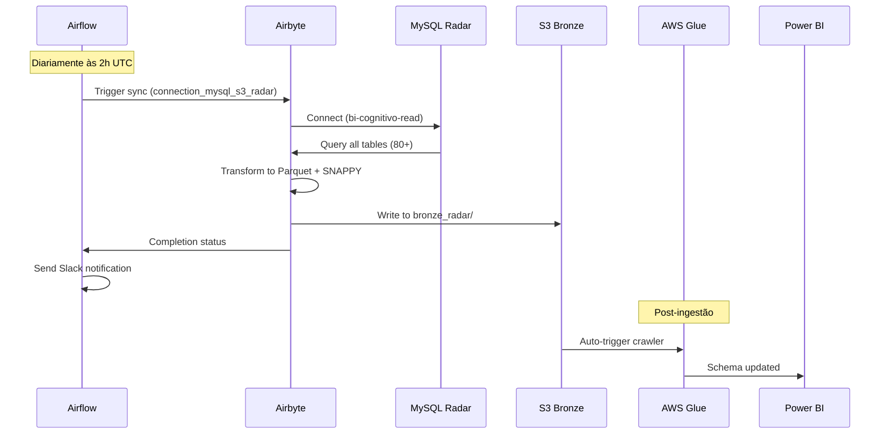

# 🔄 Fluxo de Ingestão do Radar

## 📋 Visão Geral do Pipeline

O fluxo de ingestão do Radar segue um pipeline estruturado que move dados do MySQL para S3, garantindo alta disponibilidade e integridade dos dados.



## 🚀 Etapas Detalhadas

### **1. Preparação e Validação**

#### **1.1 Verificação de Conectividade**
```bash
# Teste de conexão MySQL
mysql -h db-mysql-radar-production.cxsfxyp2ge90.us-east-2.rds.amazonaws.com \
      -P 3306 \
      -u bi-cognitivo-read \
      -p radar \
      --ssl-mode=PREFERRED \
      -e "SELECT COUNT(*) FROM information_schema.tables WHERE table_schema='radar';"
```

#### **1.2 Validação de Credenciais S3**
```bash
# Teste de acesso S3
aws s3 ls s3://farmarcas-production-bronze/origin=airbyte/database=bronze_radar/ \
  --region us-east-2
```

### **2. Início da Sincronização**

#### **2.1 Trigger via Airflow**
```python
# DAG: dag_sync_airbyte_connections
from airflow.providers.airbyte.operators.airbyte import AirbyteTriggerSyncOperator

trigger_radar_sync = AirbyteTriggerSyncOperator(
    task_id='trigger_sync_radar',
    airbyte_conn_id='airbyte_default',
    connection_id='6c7fda57-ebdb-4c6b-9bc3-6b5d5cb9e1ad',  # connection_mysql_s3_radar
    asynchronous=True,
    timeout=3600,
    wait_seconds=30
)
```

#### **2.2 Configuração de Sync**
- **Modo**: Full Refresh
- **Frequência**: Manual (controlado pelo Airflow)
- **Timeout**: 3600 segundos
- **Retry**: 3 tentativas com backoff exponencial

### **3. Extração dos Dados**

#### **3.1 Conexão Source MySQL**
```yaml
# Configuração da fonte
host: db-mysql-radar-production.cxsfxyp2ge90.us-east-2.rds.amazonaws.com
port: 3306
database: radar
username: bi-cognitivo-read
ssl: true
ssl_mode: preferred
replication_method: STANDARD
```

#### **3.2 Tabelas Extraídas (80+ tabelas)**

##### **Principais Categorias:**

**🏪 Farmácias e Lojas**
- `store` - Dados cadastrais das farmácias
- `store_metrics` - Métricas de performance
- `store_general_strategy` - Estratégias comerciais
- `store_document` - Documentação legal
- `store_distributor` - Relacionamento com distribuidores

**👥 Usuários e Acesso**
- `user_access` - Controle de acesso
- `user_store` - Vínculo usuário-farmácia
- `user_document` - Documentos dos usuários
- `user_terms` - Termos aceitos

**📦 Produtos e Catálogo**
- `product` - Catálogo de produtos
- `product_ean` - Códigos EAN
- `product_pbm` - Dados PBM (Pharmacy Benefit Management)
- `product_category` - Categorização

**🎯 Campanhas e Concursos**
- `contest` - Campanhas ativas
- `contest_objective` - Objetivos das campanhas
- `contest_score` - Pontuações
- `voucher` - Vouchers e benefícios

**📊 Analytics e Métricas**
- `brand_metrics_average` - Métricas médias por marca
- `performance_indicators` - KPIs de performance
- `dashboard_data` - Dados para dashboards

### **4. Transformação e Carregamento**

#### **4.1 Processamento Airbyte**
```yaml
# Configuração do processamento
format_type: Parquet
compression_codec: SNAPPY
page_size_kb: 1024
block_size_mb: 128
dictionary_encoding: true
max_padding_size_mb: 8
```

#### **4.2 Estrutura de Destino S3**
```
s3://farmarcas-production-bronze/
└── origin=airbyte/database=bronze_radar/
    ├── store/
    │   └── cog_dt_ingestion=2024-01-15/
    │       ├── file_store_001.parquet
    │       └── file_store_002.parquet
    ├── store_metrics/
    │   └── cog_dt_ingestion=2024-01-15/
    ├── user_access/
    │   └── cog_dt_ingestion=2024-01-15/
    └── [demais_tabelas]/
```

#### **4.3 Metadados e Particionamento**
- **Partição Principal**: `cog_dt_ingestion` (data de ingestão)
- **Formato de Data**: YYYY-MM-DD
- **Compressão**: SNAPPY para otimização de performance
- **Schema Evolution**: Suportado via Airbyte

### **5. Validação e Monitoramento**

#### **5.1 Verificações Automáticas**
```python
# Validação pós-ingestão
def validate_radar_ingestion(execution_date):
    """Valida se a ingestão foi bem-sucedida"""
    
    # 1. Verificar se todos os arquivos foram criados
    expected_tables = get_radar_table_list()
    s3_objects = list_s3_objects(
        bucket='farmarcas-production-bronze',
        prefix=f'origin=airbyte/database=bronze_radar/',
        date=execution_date
    )
    
    # 2. Validar contagem de registros
    for table in expected_tables:
        record_count = count_parquet_records(s3_objects[table])
        if record_count == 0:
            raise ValueError(f"Tabela {table} sem registros")
    
    # 3. Verificar integridade dos arquivos
    validate_parquet_integrity(s3_objects)
    
    return True
```

#### **5.2 Métricas de Monitoramento**
- **Duração da Sync**: Tempo total de sincronização
- **Volume de Dados**: Número de registros por tabela
- **Tamanho dos Arquivos**: Volume em MB/GB transferido
- **Taxa de Erro**: Percentual de falhas por execução

### **6. Notificações e Alertas**

#### **6.1 Sucesso**
```python
# Notificação de sucesso
slack_success = SlackWebhookOperator(
    task_id='notify_success',
    http_conn_id='slack_webhook',
    message="""
    ✅ *Radar Sync Completed*
    
    • Duration: {{ ti.duration }}
    • Tables: 80+ synchronized
    • Records: {{ ti.xcom_pull('count_records') }}
    • S3 Path: s3://farmarcas-production-bronze/origin=airbyte/database=bronze_radar/
    • Date: {{ ds }}
    """,
    channel='#data-engineering'
)
```

#### **6.2 Falha**
```python
# Notificação de falha
def task_fail_slack_alert(context):
    slack_msg = f"""
    🚨 *Radar Sync Failed*
    
    • Task: {context.get('task_instance').task_id}
    • DAG: {context.get('task_instance').dag_id}
    • Execution Time: {context.get('execution_date')}
    • Error: {context.get('exception')}
    • Log: {context.get('task_instance').log_url}
    """
    send_slack_notification(slack_msg)
```

## ⏱️ Cronograma e Frequência

### **Agenda de Execução**
- **Horário**: 2:00 UTC (23:00 BRT / 22:00 BRT no horário de verão)
- **Frequência**: Diária
- **Duração Média**: 45-60 minutos
- **Janela de Manutenção**: 1:00-3:00 UTC

### **SLA e Disponibilidade**
- **SLA de Conclusão**: 3:00 UTC
- **Disponibilidade**: 99.5% mensal
- **RTO**: 4 horas para restauração
- **RPO**: 24 horas (última sincronização bem-sucedida)

## 🔄 Processo de Recovery

### **Em Caso de Falha**

#### **1. Diagnóstico Inicial**
```bash
# Verificar status da conexão Airbyte
curl -X GET "http://airbyte-server:8001/api/v1/connections/6c7fda57-ebdb-4c6b-9bc3-6b5d5cb9e1ad" \
  -H "accept: application/json"

# Verificar logs do Airflow
airflow logs dag_sync_airbyte_connections trigger_sync_radar 2024-01-15
```

#### **2. Reprocessamento**
```python
# Trigger manual via Airflow CLI
airflow dags trigger dag_sync_airbyte_connections \
  --conf '{"connection_id": "6c7fda57-ebdb-4c6b-9bc3-6b5d5cb9e1ad"}'
```

#### **3. Validação Pós-Recovery**
```bash
# Verificar dados no S3
aws s3 ls s3://farmarcas-production-bronze/origin=airbyte/database=bronze_radar/ \
  --recursive --human-readable --summarize
```

## 📈 Otimizações e Melhorias

### **Performance**
- **Paralelização**: Múltiplas tabelas sincronizadas simultaneamente
- **Compressão**: SNAPPY para balance entre compressão e velocidade
- **Batch Size**: Otimizado para tabelas de diferentes tamanhos

### **Confiabilidade**
- **Health Checks**: Validação contínua de conectividade
- **Retry Logic**: Tentativas automáticas em caso de falha temporária
- **Circuit Breaker**: Parada automática em caso de falhas consecutivas

### **Escalabilidade**
- **Resource Management**: Alocação dinâmica de recursos Airbyte
- **Auto-scaling**: Ajuste automático baseado no volume de dados
- **Load Balancing**: Distribuição de carga entre workers

---

**📍 Próximos Passos:**
- [Ferramentas e Serviços](ferramentas_servicos.md)
- [Pré-requisitos](pre_requisitos.md)
- [Configurações de Exemplo](configuracoes_exemplo.md)
